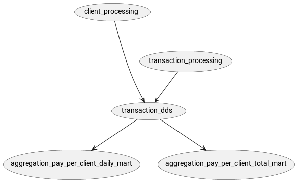
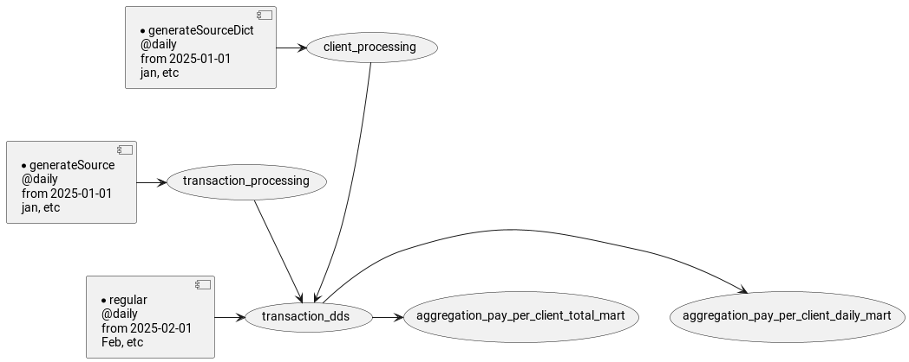
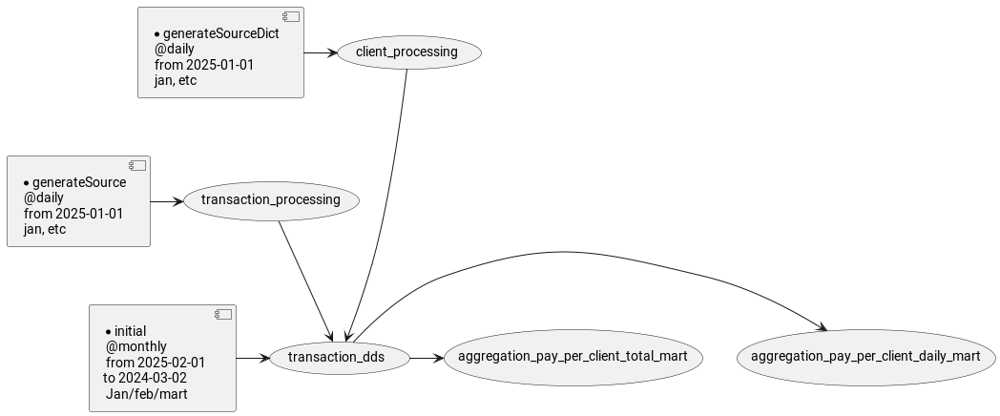
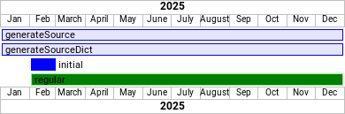
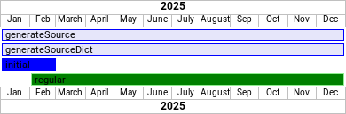
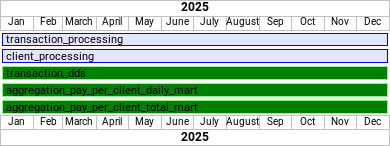

# Сценарий демонстрации
Предположим есть 
- два источника
- объединяющая источники детальная трансформация 
- две разные агрегации на основе детальной трансформации

Наполнение данными источников, производится в одном том же расписании, что и трансформация по какой-то, нужной кому-то логике. 
Конфигурация содержит описания
-  двух мест хранения данных бд Postgres и файловая система [datastores](conf/datastores).
-  пяти датасетов [datasets](conf/datasets) и скриптов описывающих трансформацию данных [dataset-sql-model](conf/dataset-sql-model) 
- двух шаблонов сценариев [scenario-act-templates](conf/scenario-act-templates):
  - [default](conf/scenario-act-templates/default.json) применяется в расписаниях [regular](conf/schedules/regular.json) и [initial](conf/schedules/initial.json). Обслуживает логику Spark задач
  - [source.json](conf/scenario-act-templates/source.json) применяется в расписаниях [generateSource](conf/schedules/generateSource.json) и [generateSourceDict](conf/schedules/generateSourceDict.json). Обслуживает логику jdbc задач
- расписаний, сценарий которого применяет шаблоны последовательностей задач. :
  - [generateSource](conf/schedules/generateSource.json) формирует данные в таблице платежных транзакций [transaction_processing](conf/datasets/transaction_processing.json) в postgres [processingdb](conf/datastores/processingdb.json)
  - [generateSourceDict](conf/schedules/generateSourceDict.json) просто перезаписывает справочник клиентов [client_processing](conf/datasets/client_processing.json) в postgres [processingdb](conf/datastores/processingdb.json)
  - [regular](conf/schedules/regular.json) имитирует ежедневное соединение двух таблиц [transaction_dds.sql](conf/dataset-sql-model/transaction_dds.sql) из расписаний выше в одну на spark [transaction_dds](conf/datasets/transaction_dds.json) сохраняя на диск [lakehousestorage](conf/datastores/lakehousestorage.json)
    - transaction_dds послужит источником [aggregation_pay_per_client_total_mart.sql](conf/dataset-sql-model/aggregation_pay_per_client_total_mart.sql) для витрины [aggregation_pay_per_client_total_mart.json](conf/datasets/aggregation_pay_per_client_total_mart.json) которая будет сохранена в [lakehousestorage](conf/datastores/lakehousestorage.json)
    - transaction_dds послужит источником [aggregation_pay_per_client_daily_mart.sql](conf/dataset-sql-model/aggregation_pay_per_client_daily_mart.sql) для витрины [aggregation_pay_per_client_daily_mart.json](conf/datasets/aggregation_pay_per_client_daily_mart.json) которая будет сохранена в [lakehousestorage](conf/datastores/lakehousestorage.json)
  - [initial](conf/schedules/initial.json) ежемесячная версия [regular](conf/schedules/regular.json). Будет заблокирована сбором generateSource и generateSourceDict до тех пор, пока они не будут собраны за первый месяц 
- проекта (пространства имен, он один [demo](conf/projects/demo.json))
-  двух групп исполнителей [taskexecutionservicegroups](conf/taskexecutionservicegroups)
   - [state-exe](conf/taskexecutionservicegroups/state-exe.json) для работы с задачами "состояний" 1 экземпляр
   - [default](conf/taskexecutionservicegroups/default.json) обрабатывает задачи с данными 2 конкурирующих экземпляра

> Датасеты transaction_processing и client_processing имеют отличительную особенность - тк они являются источником, в их сценариях расписаний [source.json](conf/scenario-act-templates/source.json)  нет шага проверки зависимостей

### Источники собираются каждый день, трансформации тоже каждый день

### Источники собираются каждый день, трансформации каждый месяц

### Диаграмма относительно расписаний

generateSource и generateSourceDict отрабатывают каждый день

initial отработает 2 раза. В начале февраля за весь январь и в начале марта за весь февраль

regular тоже начнет работать в феврале, но он суточный, поэтому начнет собирать данные за февраль
это специально сделанная настройка, цель которой продемонстрировать работу при пересечении.
Обычно нет необходимости устраивать пересечение. Инициализацию можно ограничить датой начала регулярной работы.

### Диаграмма относительно инкрементов данных
Расписания запускают задачи, которые просматривают данные "назад"
так как запуск идет задним числом

### Диаграмма относительно данных

Несмотря на путаницу в расписаниях, мы получаем строго полный год данных на всех датасетах

Для наблюдения за происходящим можно использовать запросы:
[task_work_view.sql](../Scripts/task_work_view.sql) - задачи активных сценариев расписаний. Фильтр по сценариям наиболее информативный.

[data_set_status_view.sql](../Scripts/data_set_status_view.sql) - статусы инкрементов. LOCKED предшествует началу трансформации. SUCCESS - по завершении трансформации

