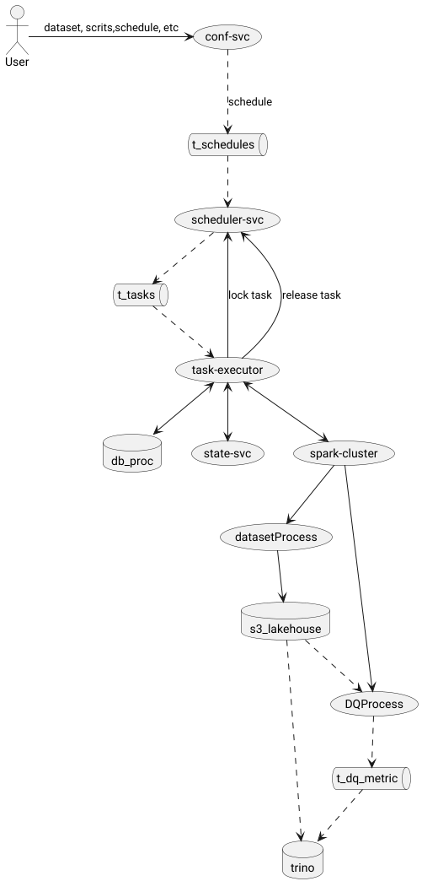

# Сборка

[Описание сборки образов](../../docker/readme.md)

# Запуск сервисов

Перейти в терминале в корне проекта в каталог demo/compose. Там расположен файл docker-compose.yml
Выполнить команду

```
docker compose down; docker compose up
```
### Совпадения имен
Возможны ошибки о том, что контейнеры которые должны быть запущены уже существуют. Это либо контейнеры от предыдущих попыток запуска, либо одноименные контейнеры. Нужно убедиться, что они
действительно не нужны и удалить их.

> Error response from daemon: Conflict. The container name "/broker" is already in use by container "
> 47230bbef2717dc571455f72bec3b4e3be2636d340e8dffac4c2d7e1cd4c1f5a". You have to remove (or rename) that container to be
> able to reuse that name.

``` 
docker container rm broker 
docker container rm conf-svc 
docker container rm db-dev
docker container rm demo-trino-1
docker container rm hive-metastore
docker container rm minio-dev 
docker container rm scheduler-svc
docker container rm spark-history
docker container rm spark-master
docker container rm spark-worker-1
docker container rm state-svc
docker container rm task-executor-svc-1
docker container rm task-executor-svc-2 
docker container rm task-executor-svc-3 
docker container rm task-executor-svc-4 
```
#### Сеть
В конфигурации определена сеть
```yaml
networks:
  lakehouse_net:
    driver: bridge
    ipam:
      config:
        - subnet: 172.20.193.0/24
```
Многие файлы конфигурации могут использовать IP адрес для указания сервера.

# Загрузка демонстрационной конфигурации

Перейти в терминале в корне проекта в каталог demo/compose/conf.
Выполнить файл load.bash
Он загрузит демонстрационные данные в сервис конфигурации. Через несколько секунд после этого сервис исполнитель начнет
выполнять демонстрационные задачи

Если сервис конфигураций еще не доступен, скрипт "подождет" готовности сервиса 
```commandline
server is 127.0.0.1:8080/v1_0/configs
pwd is /home/dm2/IdeaProjects/lakehouse/demo/conf
Waiting Config-SVC: The request failed. Sleeping...zzZ
Retry Config-SVC
Waiting Config-SVC: The request failed. Sleeping...zzZ

```
и загрузит конфигурацию. В конце должно появиться сообщение 
```commandline
All configurations loaded
```

### Зависимость ключей в конфигурациях


## Ссылки
[minio](http://localhost:9001/login)  

[spark-master](http://192.1.193.40:8400/)

[spark-worker](http://192.1.193.50:8401/)

[spark-history](http://localhost:18080/)


## Поток управления



# Удаление 

Выполнить удаление контейнеров 

```shell
docker compose down
```

Очистить данные хранилища minio. Потребуются root привилегии тк сервис работает в контейнере под root  
```shell
su_cleanup.bash
```