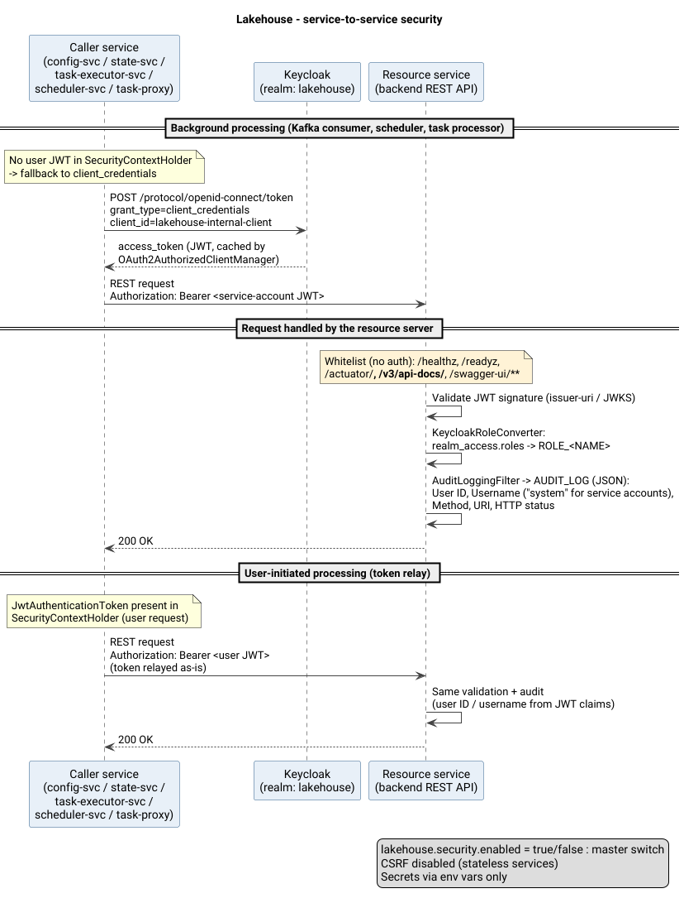
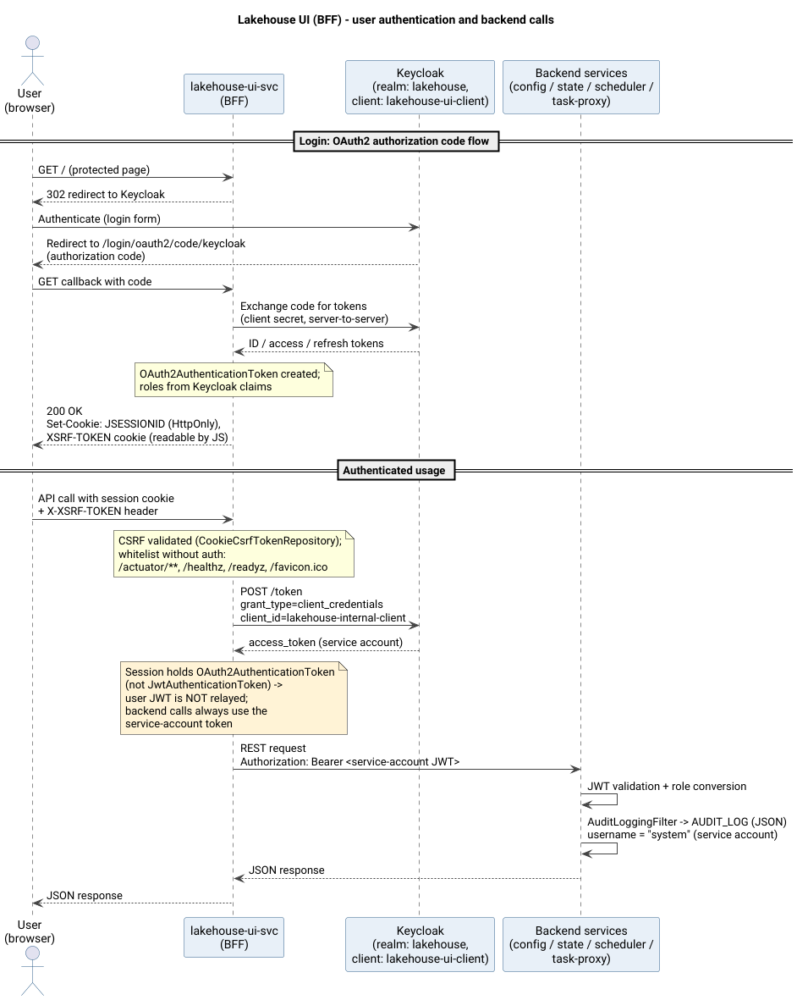
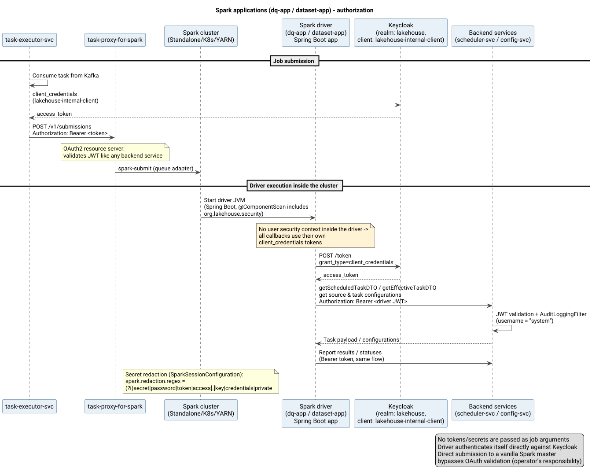

# Безопасность

Как организована безопасность в экосистеме lakehouse. Все сервисы используют [Keycloak](https://www.keycloak.org/) в качестве единого провайдера идентификации (OAuth 2.0 / OpenID Connect, JWT-токены).

## Обзор

Модель безопасности состоит из четырёх областей:

| Модель | Компоненты | Механизм |
|:-------|:-----------|:---------|
| Между сервисами | lakehouse-config-svc, lakehouse-state-svc, lakehouse-task-executor-svc, lakehouse-task-proxy-for-spark, lakehouse-scheduler-svc | OAuth2 Resource Server (проверка JWT) + `client_credentials` / ретрансляция токена для исходящих вызовов |
| Для пользователей | lakehouse-ui-svc (BFF) | OAuth2 Login (authorization code flow) + HTTP-сессия + CSRF |
| Spark-приложения | lakehouse-task-executor-spark-dq-app, lakehouse-task-executor-spark-dataset-app | OAuth2 Client (`client_credentials`) для обратных вызовов в бэкенд-сервисы |
| Учётные данные источников данных | lakehouse-task-executor-svc (JDBC-путь), Spark-драйверы/исполнители | Динамическое разрешение секретов из OpenBao/Vault или Yandex Cloud Lockbox (credential providers) — нет паролей в открытом виде в конфигурации |

Realm Keycloak: **`lakehouse`** (файл импорта realm: `demo/compose/conf_infra/security/realms/lakehouse-realm.json`).

Секретный материал (пароли БД, ключи S3) вообще не хранится в конфигурационных файлах — он резолвится в рантайме
из хранилищ секретов (OpenBao/Vault или Yandex Cloud Lockbox), см. [раздел 4](#4-секреты-подключения-к-источникам-данных-credential-providers).

---

## 1. Безопасность между сервисами

Пять бэкенд-сервисов настроены одинаково как **OAuth2 Resource Server**:

- lakehouse-config-svc
- lakehouse-state-svc
- lakehouse-task-executor-svc
- lakehouse-task-proxy-for-spark
- lakehouse-scheduler-svc

В каждом сервисе есть свой `SecurityConfig` (`@EnableWebSecurity`, `@EnableMethodSecurity`) с одинаковой логикой цепочки фильтров.

### Входящие запросы

1. Каждый запрос должен содержать валидный JWT, выпущенный Keycloak realm'ом: `Authorization: Bearer <token>`.
2. Подпись токена проверяется по JWKS-эндпоинту Keycloak; издатель (issuer) берётся из свойства
   `spring.security.oauth2.resourceserver.jwt.issuer-uri`.
3. Роли извлекаются из клейма JWT `realm_access.roles` конвертером `KeycloakRoleConverter`
   (модуль `lakehouse-common-health`, пакет `org.lakehouse.security`): каждая роль становится Spring-авторитетом
   `ROLE_<ИМЯ>` (например, `ADMIN` -> `ROLE_ADMIN`). Стандартные scope отображаются в авторитеты `SCOPE_*`.
4. CSRF отключён — сервисы являются stateless resource server'ами.
5. Безопасность можно полностью отключить свойством `lakehouse.security.enabled=false`
   (все запросы становятся анонимными). По умолчанию: `true`.

Пути из белого списка (токен не требуется):

| Путь | Назначение |
|:-----|:-----------|
| `/healthz`, `/readyz` | Kubernetes liveness/readiness-пробы |
| `/actuator/**` | Эндпоинты мониторинга |
| `/v3/api-docs/**`, `/swagger-ui/**`, `/swagger-ui.html`, `/swagger-resources/**`, `/webjars/**` | Документация OpenAPI |

Все остальные пути требуют аутентификации.

### Исходящие вызовы

Каждый бэкенд-сервис одновременно выступает и OAuth2-**клиентом**, когда обращается к другим сервисам.
Общая конфигурация `RestClientSecurityConfiguration` из модуля `lakehouse-common-health` регистрирует
перехватчик `BearerTokenClientHttpRequestInterceptor` на автоконфигурируемом Spring `RestClient.Builder`,
поэтому все REST-клиенты проекта (модули config/state/scheduler/spark-proxy rest-client) защищены прозрачным образом.

Выбор токена для каждого исходящего запроса (`BearerTokenClientHttpRequestInterceptor.resolveToken()`):

| Ситуация | Используемый токен |
|:---------|:-------------------|
| Текущий поток обрабатывает пользовательский запрос, аутентифицированный JWT (`JwtAuthenticationToken` в `SecurityContextHolder`) | JWT пользователя ретранслируется «как есть» (**token relay**) |
| Фоновая обработка без пользовательского контекста (Kafka-консьюмеры, планировщики, обработчики задач) | Свежий токен **`client_credentials`** получается у Keycloak для сервисного аккаунта клиента `lakehouse-internal-client`; токены кэшируются и обновляются автоматически через `OAuth2AuthorizedClientManager` |

ID регистрации внутреннего клиента настраивается свойством `lakehouse.security.oauth2.client-registration-id`
(по умолчанию `keycloak-internal`).

### Роль Keycloak

Keycloak выпускает и проверяет все идентичности в едином realm `lakehouse`:

| Объект | Значение | Примечания |
|:-------|:---------|:-----------|
| Realm | `lakehouse` | Импортируется при старте в demo-compose |
| Клиент | `lakehouse-ui-client` | Конфиденциальный клиент для UI BFF, только standard flow |
| Клиент | `lakehouse-internal-client` | Конфиденциальный клиент с включёнными **сервисными аккаунтами**, используется всеми сервисами и Spark-драйверами для `client_credentials` |
| Realm-роли | `USER`, `ADMIN` | Отображаются в `ROLE_USER`, `ROLE_ADMIN` |

Демо-пользователи (только для локальной среды — в реальных развёртываниях меняйте пароли/секреты через переменные окружения):

| Пользователь | Пароль | Роли |
|:-------------|:-------|:-----|
| `de_view` | `de_view` | USER |
| `de_editor` | `de_editor` | ADMIN |

> Предупреждение: секреты клиентов по умолчанию из файлов `application.yml` (`super-secret-bff-key-*`,
> `super-secret-internal-key-*`) предназначены только для разработки. В продакшене всегда переопределяйте их
> переменными окружения `KEYCLOAK_UI_CLIENT_SECRET` / `KEYCLOAK_INTERNAL_CLIENT_SECRET`.

### Аудит

Аудит реализован общим сервлетным фильтром `AuditLoggingFilter`
(`lakehouse-common-health`, `org.lakehouse.security`). Он регистрируется в каждом бэкенд-сервисе
после фильтра авторизации (`http.addFilterAfter(auditLoggingFilter, AuthorizationFilter.class)`),
поэтому видит итоговый статус ответа.

На каждый входящий запрос записывается ровно одна структурированная строка в логгер **`AUDIT_LOG`**:

```text
User ID: <jwt.sub>, Username: <jwt.preferred_username>, Method: <HTTP-метод>, URI: <путь>, HTTP status: <статус>
```

Детали:

- `User ID` — клейм JWT `sub`; `Username` — клейм `preferred_username`.
- Если токен является **сервисным аккаунтом** (клейм `preferred_username` начинается с `service-account-`
  или клейм `azp` совпадает с настроенным id внутреннего клиента), имя пользователя заменяется на настроенное
  имя системного аккаунта (`lakehouse.security.audit.service-account-name`, по умолчанию `system`).
- Анонимные запросы и запросы из белого списка логируются с прочерками `-`.
- Конфигурация logback каждого сервиса направляет логгер `AUDIT_LOG` в JSON-консольный аппендер
  (logstash encoder) с дополнительными полями `log_type=audit` и `service=<имя сервиса>`:

```xml
<appender name="AUDIT_CONSOLE_JSON" class="ch.qos.logback.core.ConsoleAppender">
    <encoder class="net.logstash.logback.encoder.LogstashEncoder">
        <customFields>{"log_type":"audit", "service":"lakehouse-config-svc"}</customFields>
    </encoder>
</appender>
<logger name="AUDIT_LOG" level="INFO" additivity="false">
    <appender-ref ref="AUDIT_CONSOLE_JSON"/>
</logger>
```

Аудит основан на логах: события не сохраняются в базу данных и не отправляются во внешние системы —
предполагается, что система сбора логов (ELK/Loki и т. п.) захватывает их.

### Диаграмма

 (исходник: [interservice-security.puml](../../doc/security/interservice-security.puml))

---

## 2. Безопасность для пользователей (lakehouse-ui-svc)

UI-сервис — это **Backend-for-Frontend (BFF)**. Сам он не проверяет входящие JWT — вместо этого
он аутентифицирует пользователей интерактивно через Keycloak.

### Процесс входа

1. Неаутентифицированный пользователь открывает любую страницу — BFF перенаправляет его в Keycloak
   (Spring Security `oauth2Login()`, **OAuth2 authorization code flow**).
2. Пользователь аутентифицируется в Keycloak; ввод учётных данных происходит целиком на стороне Keycloak.
3. Keycloak перенаправляет обратно на `{baseUrl}/login/oauth2/code/keycloak`; BFF обменивает код на токены
   на стороне сервера (клиентский секрет не покидает бэкенд).
4. Spring создаёт `OAuth2AuthenticationToken` с авторитетами, полученными из клеймов Keycloak;
   браузер получает cookie HTTP-сессии **`JSESSIONID`** (`HttpOnly`; `Secure` в профиле `prod`).
5. После входа пользователь попадает на default success URL `/`.

Регистрация клиента: `lakehouse-ui-client` со scope `openid, profile, email`;
шаблон redirect URI `{baseUrl}/login/oauth2/code/{registrationId}`
(переопределяется переменной `LAKEHOUSE_UI_REDIRECT_URI` за прокси/балансировщиком).

### Сессия и CSRF

- Сессии создаются по необходимости (`IF_REQUIRED`); имя cookie сессии — `JSESSIONID` (см. `server.servlet.session.cookie.*`).
- В отличие от бэкенд-сервисов, **защита CSRF включена**: токен хранится в cookie
  `XSRF-TOKEN`, доступной для чтения JavaScript'у фронтенда (`CookieCsrfTokenRepository.withHttpOnlyFalse()`).
  Специальный фильтр eagerly загружает токен, чтобы cookie всегда записывалась в ответ.
  Запросы, изменяющие состояние, SPA должен отправлять с заголовком `X-XSRF-TOKEN`.

Белый список путей: `/actuator/**`, `/healthz`, `/readyz`, `/favicon.ico`. Всё остальное требует аутентифицированной сессии.

### Вызовы бэкенд-сервисов

BFF обращается к REST API config/state/scheduler/task-proxy через тот же защищённый `RestClient.Builder`.
Поскольку в сессии пользователя хранится `OAuth2AuthenticationToken` (а не `JwtAuthenticationToken`),
`BearerTokenClientHttpRequestInterceptor` всегда переключается на токен **сервисного аккаунта**
`client_credentials` клиента `lakehouse-internal-client`. Поэтому бэкенд-сервисы авторизуют эти вызовы
как внутренний технический клиент, а не от имени конкретного человека.

### Роль Keycloak

- Единая точка интерактивного входа (standard flow конфиденциального клиента `lakehouse-ui-client`);
- Выпускает ID/access/refresh токены в ходе authorization code flow;
- Хранит пользователей, роли (`USER`/`ADMIN`) и их атрибуты;
- Также выпускает токены сервисных аккаунтов, которые BFF использует для вызовов бэкенда.

### Аудит

BFF сам не пишет аудит-записи. Все операции пользователей, доходящие до бэкенд-сервисов,
аудируются там фильтром `AuditLoggingFilter` (раздел 1); поскольку BFF использует токен сервисного аккаунта,
в таких записях фигурирует настроенное имя системного пользователя (`system`), а не логин человека.
Запросы, обслуженные самим BFF (статические ресурсы, страницы входа), покрываются обычными логами приложения.

### Диаграмма

 (исходник: [ui-security.puml](../../doc/security/ui-security.puml))

---

## 3. Авторизация Spark-приложений

Относится к приложениям-драйверам:

- lakehouse-task-executor-spark-dq-app
- lakehouse-task-executor-spark-dataset-app

### Отправка задач

1. `lakehouse-task-executor-svc` получает задачи из Kafka и отправляет Spark-задачи через Spark REST API
   (`POST /v1/submissions`) — напрямую в кластер или через **task-proxy-for-spark**.
2. При отправке через task-proxy-for-spark вызов содержит bearer-токен, полученный стандартным перехватчиком
   (`client_credentials` клиента `lakehouse-internal-client`); прокси проверяет его так же, как любой другой бэкенд-сервис.
3. Spark-драйвер запускается как обычное Spring Boot-приложение внутри кластера.

> Ограничение: vanilla REST-эндпоинт мастера Apache Spark Standalone не поддерживает OAuth. При отправке задач
> напрямую в кластер (в обход прокси) защита на транспортном уровне — зона ответственности оператора
> (сетевая изоляция, штатные механизмы аутентификации Spark).

### Обратные вызовы драйвера

Оба приложения-драйвера включают `org.lakehouse.security` в сканирование компонентов, поэтому получают ту же
связку `RestClientSecurityConfiguration` + `BearerTokenClientHttpRequestInterceptor`. Внутри JVM драйвера нет
пользовательского контекста безопасности, поэтому все обратные вызовы получают собственные токены
**`client_credentials`**:

- получение описания запланированной задачи из scheduler-svc (`SchedulerRestClientApi`);
- получение конфигураций источников/задач из config-svc (`ConfigRestClientApi`);
- отправка результатов/статусов обратно в бэкенд-сервисы.

Бэкенд-сервисы проверяют эти токены точно так же, как любой другой запрос (проверка issuer/JWKS +
`AuditLoggingFilter`, который пишет их под именем сервисного аккаунта).

Секреты и токены не передаются аргументами Spark-задачи — драйвер аутентифицируется в Keycloak
напрямую со своими учётными данными клиента (`KEYCLOAK_ISSUER_URI`, `KEYCLOAK_INTERNAL_CLIENT_SECRET`).

### Маскирование секретов

`SparkSessionConfiguration` (модуль `lakehouse-task-executor-spark-api`) задаёт regex-выражения маскирования
логов Spark `spark.redaction.regex` и `spark.sql.redaction.string.regex` (по умолчанию:
`(?i)secret|password|token|access[.]key|credentials|private`), чтобы учётные данные не попадали
в логи драйверов/исполнителей и Spark UI.

### Диаграмма

 (исходник: [spark-apps-security.puml](../../doc/security/spark-apps-security.puml))

---

## 4. Секреты подключения к источникам данных (credential providers)

Пароли БД и ключи доступа к S3 **не хранятся** в конфигурационных файлах. Они резолвятся в рантайме
двумя опциональными модулями:

| Модуль | Содержимое |
|:-------|:-----------|
| `lakehouse-credential-providers-jdbc` | Независимая от Spark библиотека: SPI `SecretProvider`, хелпер `SecretResolver`, HTTP-клиенты `VaultHttp` / `LockboxHttp`, in-memory кэш `SecretCache` (TTL 5 минут на JVM), JDBC-провайдеры `BaoJdbcSecretProvider` (OpenBao/Vault KV v2) и `YcLockboxJdbcSecretProvider` (Yandex Cloud Lockbox) |
| `lakehouse-credential-providers-spark` | Специфичное для Spark: `LakehouseSecureJDBCTableCatalog` — безопасная замена Spark `JDBCTableCatalog` (разрешение пароля на Driver и Executors) и S3-провайдеры для Spark S3A |

Обе точки, открывающие JDBC-подключение, теперь проходят через `SecretResolver`:

- сервисы lakehouse — `JdbcConnectionFactory.getConnection(...)` (`lakehouse-task-executor-api`);
- Spark-драйверы — `LakehouseSecureJDBCTableCatalog.initialize(...)`.

### Контракт опций провайдера

| Опция | Провайдер | Обязательно | Описание |
|:------|:----------|:------------|:---------|
| `secretProvider` | оба | да | Полное имя класса реализации `SecretProvider` |
| `secret-key` | оба | да | Комбинированная координата `path:key`: OpenBao — `secretPath:key` (например `kv/data/lakehouse/database:password`); Lockbox — `secretId:key` (например `e4ta...:password`) |
| `vault-url` | OpenBao/Vault | да | Базовый URL HTTP API Vault, например `http://openbao:8200` |
| `vault-role` | OpenBao/Vault | нет | Kubernetes auth role (по умолчанию `lakehouse`) |
| `vault-k8s-auth-path` | OpenBao/Vault | нет | Путь точки монтирования Kubernetes auth (по умолчанию `kubernetes`) |
| `secret-id` | Lockbox | да | Идентификатор секрета Yandex Cloud Lockbox |
| `secret-version` | Lockbox | нет | Конкретная версия секрета (по умолчанию `latest`) |

Разрешённое значение инжектируется в опции подключения под ключом `password`, а все перечисленные опции
безопасности **удаляются** до передачи карты JDBC-драйверу или Spark-каталогу. Если `secretProvider` отсутствует,
опции передаются без изменений (обратная совместимость).

### Где настраивается

- **Spark (глобальные значения по умолчанию, `spark-defaults.conf`)** — опции каталога с префиксом; пароль запрашивается на драйвере:

  ```
  spark.sql.catalog.processingdb                org.lakehouse.security.catalog.LakehouseSecureJDBCTableCatalog
  spark.sql.catalog.processingdb.url            jdbc:postgresql://db-host:5432/db
  spark.sql.catalog.processingdb.user           app_user
  spark.sql.catalog.processingdb.secretProvider org.lakehouse.security.jdbc.BaoJdbcSecretProvider
  spark.sql.catalog.processingdb.vault-url      http://openbao:8200
  spark.sql.catalog.processingdb.secret-key     kv/data/lakehouse/database:password
  ```

  Реальный пример: `demo/compose/conf_infra/spark-defaults.conf`.

- **Spark (для конкретного datasource)** — те же ключи с полным префиксом `spark.sql.catalog.<name>.` в
  `service.properties` datasource. `SparkStandAloneClusterTaskProcessor` передаёт все ключи `spark.*` драйверу;
  если `spark.sql.catalog.<name>.url` отсутствует, он строится из `host`/`port`/`urn` datasource.

- **Сервисы lakehouse (JDBC-задачи)** — `service.properties` datasource (`ServiceDTO.properties`); URL строится
  из `host`/`port`/`urn`, если явный `url` не задан:

  ```json
  "properties": {
    "user": "app_user",
    "secretProvider": "org.lakehouse.security.jdbc.BaoJdbcSecretProvider",
    "secret-key": "kv/data/lakehouse/database:password",
    "vault-url": "http://openbao:8200"
  }
  ```

  Реальный пример: `demo/compose/conf/datasources/processingdb.json`.

### Настройка OpenBao / Vault

1. Включите движок секретов KV v2 и запишите секрет, например `bao kv put kv/lakehouse/database password=<value>`.
2. Создайте read-only политику для путей, которые читают сервисы (`kv/data/lakehouse/database`, `kv/data/infrastructure/minio`),
   и выпустите scoped-токен для потребляющих компонентов. Эталонный скрипт: `demo/compose/conf_infra/openbao/init.sh`.
3. Токен передаётся процессу переменной окружения `VAULT_TOKEN` или — внутри Kubernetes — через Service Account
   (опции `vault-role` / `vault-k8s-auth-path`). Переменные docker-compose демо-стенда:
   `BAO_DEV_ROOT_TOKEN_ID`, `BAO_TOKEN`, `LAKEHOUSE_DB_PASSWORD` (сидирование) и `VAULT_TOKEN` (потребители).
4. В Kubernetes сервис OpenBao доступен как `http://<release>-openbao:8200` (зонтичный чарт `lakehouse-management`).

### Настройка Yandex Cloud Lockbox

1. Секрет Lockbox, содержащий нужные ключи (например `password`, `access_key`, `secret_key`).
2. Каждая VM/воркер, открывающая подключения, должна иметь Service Account с ролью `lockbox.payloadViewer`.
   IAM-токен берётся из Instance Metadata Service либо из файла авторизованного ключа, заданного переменной
   `YC_AUTH_KEY_PATH`.

### Гарантии безопасности

- Паролей в открытом виде нет ни в YAML/JSON-конфигурации, ни в аргументах задач, ни в аргументах Spark-задач.
- Секреты никогда не логируются: при ошибках логируются только HTTP-статусы, сообщения об ошибках маскируются
  (`SecurityException`, `RuntimeException("Catalog access blocked...")`).
- Маскирование логов Spark (`spark.redaction.regex`, раздел 3) дополнительно защищает логи драйверов/исполнителей.
- Разрешённые секреты кэшируются в памяти на каждую JVM с TTL 5 минут.

---

## Справочник настроек

Переменные окружения (со значениями по умолчанию из `demo/compose`, переопределяйте в реальных развёртываниях):

| Переменная | Кто использует | Значение |
|:-----------|:---------------|:---------|
| `KEYCLOAK_ISSUER_URI` | все модули | Issuer URI realm'а, например `http://keycloak.lakehouse:8085/realms/lakehouse` |
| `KEYCLOAK_UI_CLIENT_SECRET` | lakehouse-ui-svc | Секрет клиента `lakehouse-ui-client` |
| `KEYCLOAK_INTERNAL_CLIENT_SECRET` | все бэкенд-сервисы, Spark-приложения | Секрет клиента `lakehouse-internal-client` |
| `LAKEHOUSE_UI_REDIRECT_URI` | lakehouse-ui-svc | Шаблон redirect URI для колбэка authorization code |
| `VAULT_TOKEN` | lakehouse-task-executor-svc, Spark-драйверы/исполнители | Токен OpenBao/Vault для `BaoJdbcSecretProvider` и S3-провайдеров (раздел 4) |
| `YC_AUTH_KEY_PATH` | lakehouse-task-executor-svc, Spark-драйверы/исполнители | Путь к файлу авторизованного ключа для IAM-токена Lockbox (альтернатива Instance Metadata, раздел 4) |

Свойства приложения:

| Свойство | По умолчанию | Значение |
|:---------|:-------------|:---------|
| `lakehouse.security.enabled` | `true` | Главный выключатель цепочек фильтров бэкенда (`false` = разрешить всё) |
| `lakehouse.security.audit.service-account-name` | `system` | Имя пользователя в строках аудита для токенов сервисных аккаунтов |
| `lakehouse.security.oauth2.internal-client-id` | `lakehouse-internal-client` | Значение `azp`, которое фильтр аудита считает «сервисным аккаунтом» |
| `lakehouse.security.oauth2.client-registration-id` | `keycloak-internal` | Регистрация клиента, используемая перехватчиком исходящих вызовов |

Документация смежных модулей: [config-svc](../../lakehouse-config-svc/doc-ru/readme.md),
[state-svc](../../lakehouse-state-svc/doc-ru/readme.md),
[scheduler-svc](../../lakehouse-scheduler-svc/doc-ru/readme.md),
[task-executor-svc](../../lakehouse-task-executor-svc/doc-ru/readme.md),
[task-proxy-for-spark](../../lakehouse-task-proxy-for-spark/doc-ru/readme.md),
[ui-svc](../../lakehouse-ui-svc/doc-ru/readme.md).
