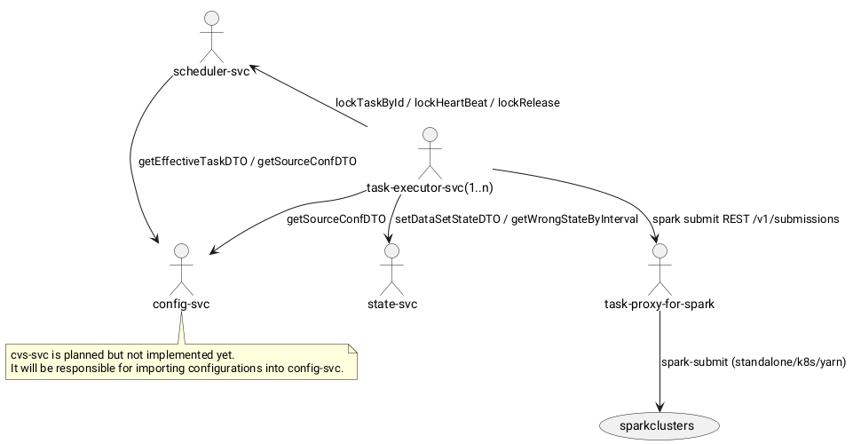
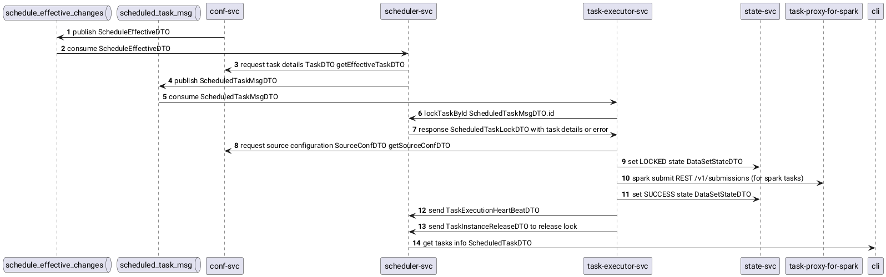
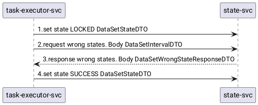

# System design

Общий системный дизайн lakehouse: набор сервисов, управляющих изменениями данных на основе метаданных (metadata-driven approach).

## Сервисы

| Сервис | Порт | Назначение | Документация |
|:-------|:----:|:-----------|:-------------|
| lakehouse-config-svc | 8080 | Хранение конфигураций (метаданных): источники данных, датасеты, расписания, сценарии, драйверы. REST API для чтения/записи конфигураций, публикация изменений расписаний в Kafka | [doc](../../lakehouse-config-svc/doc-ru/readme.md) |
| lakehouse-scheduler-svc | 8081 | Планировщик: получает изменения расписаний из Kafka, формирует экземпляры расписаний/задач, разрешает зависимости, ставит задачи в очередь и передает их исполнителям, управляет блокировками (lock/heartbeat/release) | [doc](../../lakehouse-scheduler-svc/doc-ru/readme.md) |
| lakehouse-state-svc | 8082 | Хранение состояний интервалов датасетов (LOCKED/SUCCESS), поиск «дыр» (интервалов без SUCCESS) | [doc](../../lakehouse-state-svc/doc-ru/readme.md) |
| lakehouse-task-executor-svc | 8089 | Исполнитель задач: получает задачи из Kafka, блокирует их в scheduler-svc, выполняет TaskProcessor'ы (JDBC, state, spark), уведомляет о heartbeat и освобождает блокировку с результатом | [doc](../../lakehouse-task-executor-svc/readme.md) |
| lakehouse-task-proxy-for-spark | 8090 | Прокси для Spark: принимает spark-submit по REST `/v1/submissions`, ведет очередь в PostgreSQL, отправляет задачи в кластеры (Standalone/K8s/YARN) через адаптеры | [doc](../../lakehouse-task-proxy-for-spark/README_ru.md) |

> Сервис **vcs-svc** в текущей версии не существует. Он упомянут в схемах как планируемый: будет отвечать за импорт конфигураций в config-svc. Разработка запланирована на будущее.

## Взаимодействие сервисов

- **config-svc** — источник конфигураций. Расписания публикуются в Kafka (topic `schedule_effective_changes`), остальное отдается через REST.
- **scheduler-svc** — потребляет изменения расписаний из Kafka, при построении задач запрашивает у config-svc эффективные конфигурации задач (`getEffectiveTaskDTO`) и источник (`getSourceConfDTO`). Готовые к выполнению задачи публикует в Kafka (topic `scheduled_task_msg`). Предоставляет REST для блокировок.
- **task-executor-svc** — потребляет `scheduled_task_msg`, блокирует задачу в scheduler-svc (`lockTaskById`), получает конфигурацию источника из config-svc, ведет состояния интервалов в state-svc, для spark-задач отправляет задание через spark REST `/v1/submissions` (напрямую или через task-proxy-for-spark). По завершении возвращает результат (release) и уведомляет heartbeat'ом.
- **state-svc** — хранит состояния интервалов датасетов; используется task-executor-svc для установки LOCKED/SUCCESS и проверки «дыр».
- **task-proxy-for-spark** — точка входа spark-задач: принимает POST/GET/KILL по `/v1/submissions`, сохраняет в очередь PostgreSQL, отправляет в выбранный кластер и отслеживает статусы.

## Путь «конфигурация → задача»

1. config-svc публикует изменения расписаний в Kafka (topic `schedule_effective_changes`) как `ScheduleEffectiveDTO`.
2. scheduler-svc потребляет `ScheduleEffectiveDTO`, при построении экземпляра задачи запрашивает у config-svc эффективную конфигурацию задачи (`TaskDTO`) и формирует `ScheduleTaskInstance`.
3. scheduler-svc публикует `ScheduledTaskMsgDTO` в Kafka (topic `scheduled_task_msg`).
4. task-executor-svc потребляет `ScheduledTaskMsgDTO`, блокирует задачу в scheduler-svc (`lockTaskById`), получая полное описание задачи (`ScheduledTaskLockDTO`).
5. task-executor-svc получает конфигурацию источника (`SourceConfDTO`) из config-svc, переводит интервал датасета в состояние LOCKED в state-svc.
6. task-executor-svc выполняет задачу (для spark-задач — через spark REST `/v1/submissions`, часто через task-proxy-for-spark).
7. По завершении: переводит интервал в SUCCESS, шлет heartbeat, освобождает блокировку (`TaskInstanceReleaseDTO`).

## Состояние датасетов

task-executor-svc работает с state-svc через REST:

- `setDataSetStateDTO` — установка состояния интервала датасета (LOCKED при старте, SUCCESS по завершении);
- `getDataSetStateResponseDTO` — запрос «дыр» (интервалов без SUCCESS) в заданном окне; используется для проверки готовности зависимостей и исключения конфликтов блокировок.

Подробнее о сервисах и их внутреннем устройстве см. ссылки в таблице «Сервисы», а также:

- конфигурации (метаданные): [content_configuration](../../lakehouse-config-svc/doc-ru/content_configuration/content_configuration.md);
- работа расписаний и статусные модели: [scheduling](../../lakehouse-scheduler-svc/doc-ru/scheduling/Scheduling.md);
- процессоры задач: [processors](../../lakehouse-task-executor-svc/doc-ru/processors.md);
- модель состояний интервалов: [state model](../../lakehouse-state-svc/doc-ru/state_model/state-models.MD);
- прокси для spark: [README](../../lakehouse-task-proxy-for-spark/README_ru.md).