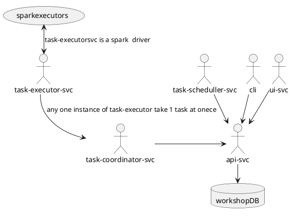

# Compatible keywords
Domain Driven Design (DDD)
Data mesh
Data vault
Data governance
Scheduling
Custom code
SQL 
Data engineer tool
United namespace
# System design


# Entities design

```plantuml
!pragma layout smetana

Project --|{ DataEndPoint
DataStoreEndPoint --|{ DataEndPoint
DataEndPoint --|{ Schedule
Scenario --|{ Schedule
Scenario --|{ Task
DataEndPoint }|-- DataEndPoint
taskExecutionServiceGroup  --|{ Scenario
taskExecutionServiceGroup --|{ TaskExecutorService 
```

# Configuration files example
## system-repo
```

    dataStoreEndpoints
        |--mydb.yml
        |--someelsedb.yml
    projects
        |--mysecondproject.yml
        |--myfirstproject.yml     
    scenarios 
        |--default-scenario.yml
    taskExecutionServiceGroups
        |--UtilityGroup.yml
        |--QualityGroup.yml
        |--HeavyGroup.yml
        |--SuperHeavyGroup.yml
        |--HeavyTransformGroup.yml
        |--DeafaultGroup.yml
```  
## user-project-repo-myfirstproject
``` 

    dataStoreEndpoints
      |--otherTable.yml
      |--anotherTable.yml
    schedules
       
``` 
## user-project-repo-mysecondproject
``` 
user-project-repo-mysecondproject
    dataStoreEndpoint
      |--mytableDataEndPoint.yml
    schedules
      |--mytableRegularSchedule.yaml


```


# Project is a hight level definition. Main namespace

```yaml
configtype: project
name: myfirstproject
comment: 
```
```yaml
configtype: project
name: mysecondproject
comment: 
```
# data stores - database, file/object storage or else some things
```yaml
configtype: dataStoreEndpoint
name: mydb
interfaceType: jdbc
vendor: postgres
properties:
  url: jdbc:postgres:@localhost
  user: user1
  password: "****"
comment: 
```
```yaml
configtype: dataStoreEndpoint
name: someelsedb
interfaceType: file #http/jdbc/file etc
vendor: s3
properties:
  url: s3://somepath
  user: user1
  password: ${token}
```
# Public endpoints = user table declaration

```yaml
configtype: dataEndPoint
name: otherTable
dataStoreEndpointKey: mydb
endPoint: mytabs.otherTable
project: myfirstproject
```
```yaml
configtype: dataEndPoint
name: anotherTable
catalogSchema: mytabs
dataStoreEndpoint: mydb
endPoint: mytabs.anotherTable
project: myfirstproject
```

```plantuml
!pragma layout smetana
(otherTable) --> (mytableDataEndPoint)
(anotherTable) --> (mytableDataEndPoint)
(myfirstproject)-->(mysecondproject)
(mydb)-->(mydb)
```
```yaml
configtype: dataEndPoint
name: mytableDataEndPoint
dataStoreEndpoint: mydb
endPoint: mytabs.mytable
project: mysecondproject
dependencies:
 - name: otherTable
 - name: anotherTable
description: "my first example mart"
columnSchema: 
  - name: id
    type: bigint
    nullable: true
    comment:  
  - name: tab_value
    type: string
    nullable: true
    comment:
keys:
  - name: mytable_pk
    type: primary
    runtimeLevelCheck: false
    constructLevelCheck: true
```
# increment query
```sql
select id, o.tab_value
  from otherTable o
  join anotherTable a
       using(id)
```

# Scenario is a combination of dataendpoint, tasks and their execution dag
## 
## A single dataset configured as dataEndPoint can be served by multiple scenarios.
```yaml
configtype: scenario
scenarioType: dateEndPointScenario

name: scenario1
    # private  endpoint = temporary tables 
internalEndPoints:
  - name: stageEndpoint
    dataStoreEndpointKey: mydb
    endPoint: mytabs.mytable_stage
  - name: mergeareaEndpoint
    dataStoreEndpointKey: mydb
    endPoint: mytabs.mytable_merge

tasks:
  - name: ${dataEndPoint.name}_transformation
    sources: ${mytableDataEndPoint.dependencies}
    endPoint: stageEndpoint
    class: SQLTransformationDataFrameTask #inherited Task
    importance: critical # abort when error
    taskExecutionServiceGroup: HeavyTransformGroup
  - name: ${dataEndPoint.name}_merge
    sources: ${stageEndpoint}
    endPoint: mergeareaEndpoint
    class: MergeDataFrameTask #inherited Task
    taskExecutionServiceGroup: HeavyGroup
    importance: critical
  - name: ${dataEndPoint.name}_dataQualityCheckBefore
    sources: ${mergeareaEndpoint}
    endPoint: mergeareaEndpoint
    importance: critical
    taskExecutionServiceGroup: QualityGroup
    class: DataQualityCheckTask #inherited Task
  - name: ${dataEndPoint.name}_apply
    sources: ${stageEndpoint}
    endPoint: mergeareaEndpoint
    importance: critical
    class: ApplyTask #inherited Task
  - name: ${dataEndPoint.name}_dataQualityCheckAfterCritical
    sources: ${stageEndpoint}
    endPoint: mergeareaEndpoint
    class: DataQualityCheckTask #inherited Task
    taskExecutionServiceGroup: QualityGroup
    importance: critical
  - name: ${dataEndPoint.name}_dataQualityCheckAfterWarn
    sources: ${stageEndpoint}
    endPoint: mergeareaEndpoint
    taskExecutionServiceGroup: UtilityGroup
    class: DataQualityCheckTask #inherited Task
    importance: warn # pass when error
  - name: ${dataEndPoint.name}_finally
    sources: ${stageEndpoint}
    endPoint: mergeareaEndpoint
    taskExecutionServiceGroup: UtilityGroup
    class: FinallyTask #inherited Task
    importance: warn # pass when error
dag:
  - ${dataEndPoint.name}_transformation: ${dataEndPoint.name}_merge
  - ${dataEndPoint.name}_merge: ${dataEndPoint.name}_dataQualityCheckBefore
  - ${dataEndPoint.name}_dataQualityCheckBefore: ${dataEndPoint.name}_apply
  - ${dataEndPoint.name}_apply: ${dataEndPoint.name}_dataQualityCheckAfterCritical
  - ${dataEndPoint.name}_apply: ${dataEndPoint.name}_dataQualityCheckAfterWarn
  - ${dataEndPoint.name}_dataQualityCheckAfterCritical: ${dataEndPoint.name}_finally
  - ${dataEndPoint.name}_dataQualityCheckAfterWarn: ${dataEndPoint.name}_finally

```
```
scenario1
         \ internalEndPoints
                             \ stageEndpoint
                             | mergearea
         \ task1 (take delta and save to stage)
         | task2 (quality check for delta)
         | task3 
         \ dagedges List<String,String> / name,name           
```
Scenario DAG

```plantuml
!pragma layout smetana
(transformation) --> (merge)
(merge) --> (dataQualityCheckBefore)
(dataQualityCheckBefore) --> (apply)
(apply) --> (dataQualityCheckAfterCritical)
(apply) --> (dataQualityCheckAfterWarn)
(dataQualityCheckAfterCritical) --> (finally)
(dataQualityCheckAfterWarn) --> (finally)
```

```
scenarioRegular ---
                    \
                     >-- dataEndPoint
                    /
scenarioInintial ---                
```
# Schedule


```yaml
configtype: schedule
name: mytableRegularSchedule
dataEndPoint: mytableDataEndPoint
scheduleExpr: "*8***"
scenario: scenario1
dependencyIntervalType: Daily #montly/hourly/minutely/
keepDependencyInterval: true #false

```

