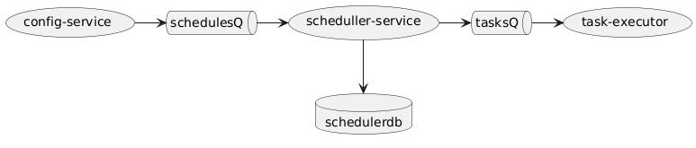
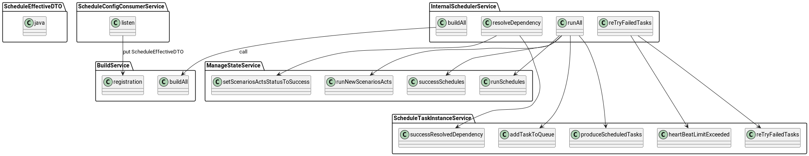
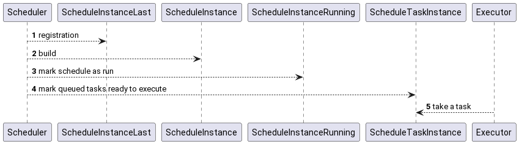
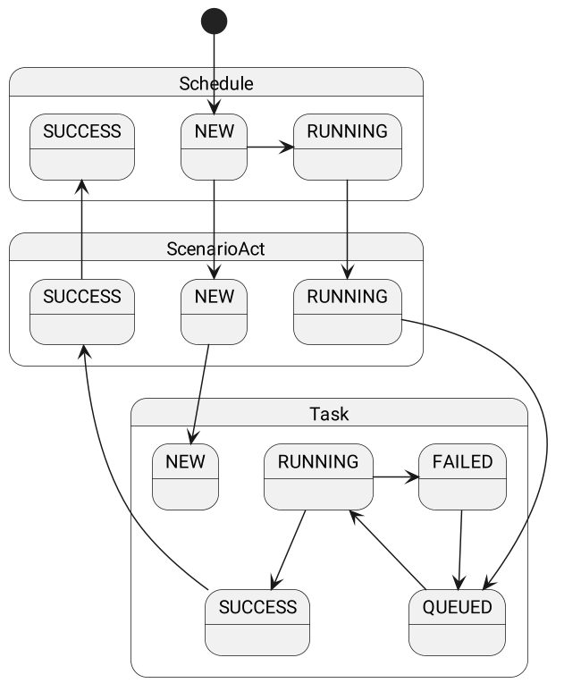

# Работа с расписаниями

## Структура расписания

Конфигурация расписания содержит как простые атрибуты, так и коллекции вложенных конфигураций

- **name** - уникальное ключевое имя расписания
- **description** текстовое описание расписания для документирования
- **intervalExpression** - кодированное выражение описывающее интервальность на пример "@daily"
- **startDateTime** дата, которая служит отправной точкой для расчета первого интервала. Необязательно, что она будет
  равна дате первого расписания тк она рассчитывается с использованием интервального выражения
- **stopDateTime** дата прекращения расчета новых интервалов, может быть пустой , что будет означать бесконечность
- **enabled** включает/выключает процесс расчета новых расписание. Выключение так же приводит к прекращению обработки
  статусов уже работающих расписаний.
- **scenarioActs** - это список вложенных частей сценария(Акты). Части сценария могут быть добавлены без учета порядка
  их выполнения
  состав полей
    - **name** ключевое имя акта. Должно быть уникально.
    - **dataSet** ссылка на уникальное имя датасета
    - **templateScenarioAct** внутреннее устройство задач в акте может быть шаблонизировано, шаблоны используются
      повторно.
    - **intervalStart** строковое выражение метки времени отражающего нижнюю границу окна времени в данных, которое
      будет изменено в датасете. Чаще всего отстает от целевого времени запуска пример "{{ adddays(targetDateTimeTZ,
      -1) }}".
    - **intervalEnd** строковое выражение метки времени отражающего верхнюю границу окна времени в данных, которое будет
      изменено в датасете". Чаще всего может быть равно целевой метке времени "{{ targetDateTimeTZ }}"
    - **tasks** Список вложенных объектов - описаний задач. Может быть пустым, но тогда должен быть задан шаблон. Этот
      список сливается со списком из шаблона. При наличии задачи с одинаковым ключем берутся обе и сливаются в одну. Их
      также будут слиты, значения атрибутов из текущего списка заменят значения из шаблона
        - name ключевое имя задачи
        - taskExecutionServiceGroupName тип исполнителя, которому можно брать эту задачу
        - executionModule имя программного класса который должен будет исполнен
        - importance при не успешности выполнения задачи не кричные вернут успех.
        - description текстовое описание для документирования
    - dagEdges - указывается порядок исполнения задач
        - from с какой
        - to какую
    - scenarioActEdges - указывает порядок исполнения актов в сценарии
        - from с какого
        - to какой

## Порядок получения и обработки расписания

При получении и обновлении расписания в сервисе конфигурации формируется сообщение в очередь kafka.
Сервис расписаний подхватывает сообщение и обновляет расписание в оперативном кеше.

### Внутренний планировщик

С момента появления в кеше расписания и его регистрации, жизненным циклом расписаний управляет внутренний шедулер.
Шедулер отвечает за формирование расписаний, запуск, и обслуживание

## Работа расписания

Каждый переход фиксируется изменением статусной модели.

