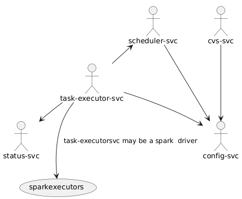
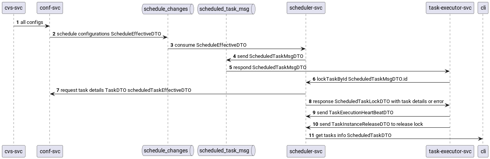
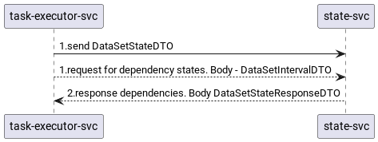

# System design

The overall system design of lakehouse: a set of services managing data changes based on a metadata-driven approach.

## Services

| Service | Port | Purpose | Documentation |
|:--------|:----:|:--------|:--------------|
| lakehouse-config-svc | 8080 | Stores configurations (metadata): data sources, datasets, schedules, scenarios, drivers. REST API for reading/writing configurations, publishing schedule changes to Kafka | [doc](../../lakehouse-config-svc/doc/readme.md) |
| lakehouse-scheduler-svc | 8081 | Scheduler: consumes schedule changes from Kafka, builds schedule/task instances, resolves dependencies, enqueues tasks and passes them to executors, manages locks (lock/heartbeat/release) | [doc](../../lakehouse-scheduler-svc/doc/readme.md) |
| lakehouse-state-svc | 8082 | Stores dataset interval states (LOCKED/SUCCESS), finds "gaps" (intervals without SUCCESS) | [doc](../../lakehouse-state-svc/doc/readme.md) |
| lakehouse-task-executor-svc | 8089 | Task executor: consumes tasks from Kafka, locks them in scheduler-svc, runs TaskProcessors (JDBC, state, spark), sends heartbeats and releases the lock with the result | [doc](../../lakehouse-task-executor-svc/readme.md) |
| lakehouse-task-proxy-for-spark | 8090 | Spark proxy: accepts spark-submit over REST `/v1/submissions`, keeps a queue in PostgreSQL, submits tasks to clusters (Standalone/K8s/YARN) via adapters | [doc](../../lakehouse-task-proxy-for-spark/README.md) |

> The **vcs-svc** service does not exist in the current version. It is mentioned in the diagrams as a planned service: it will be responsible for importing configurations into config-svc. Its development is planned for the future.

## Inter-services communication

- **config-svc** - the source of configurations. Schedules are published to Kafka (topic `schedule_effective_changes`), everything else is exposed via REST.
- **scheduler-svc** - consumes schedule changes from Kafka, requests effective task configurations (`getEffectiveTaskDTO`) and the source (`getSourceConfDTO`) from config-svc when building tasks. Tasks ready to run are published to Kafka (topic `scheduled_task_msg`). Provides the REST API for locks.
- **task-executor-svc** - consumes `scheduled_task_msg`, locks the task in scheduler-svc (`lockTaskById`), gets the source configuration from config-svc, maintains dataset interval states in state-svc, and for spark tasks submits the job via spark REST `/v1/submissions` (directly or through task-proxy-for-spark). On completion it returns the result (release) and sends heartbeats.
- **state-svc** - stores dataset interval states; used by task-executor-svc to set LOCKED/SUCCESS and to check "gaps".
- **task-proxy-for-spark** - entry point for spark tasks: accepts POST/GET/KILL on `/v1/submissions`, keeps the queue in PostgreSQL, submits to the selected cluster and tracks statuses.

## Config-to-task sequence

1. config-svc publishes schedule changes to Kafka (topic `schedule_effective_changes`) as `ScheduleEffectiveDTO`.
2. scheduler-svc consumes `ScheduleEffectiveDTO`; when building a task instance it requests the effective task configuration (`TaskDTO`) from config-svc and creates the `ScheduleTaskInstance`.
3. scheduler-svc publishes `ScheduledTaskMsgDTO` to Kafka (topic `scheduled_task_msg`).
4. task-executor-svc consumes `ScheduledTaskMsgDTO`, locks the task in scheduler-svc (`lockTaskById`) and receives the full task description (`ScheduledTaskLockDTO`).
5. task-executor-svc gets the source configuration (`SourceConfDTO`) from config-svc and moves the dataset interval to LOCKED state in state-svc.
6. task-executor-svc runs the task (for spark tasks - via spark REST `/v1/submissions`, often through task-proxy-for-spark).
7. On completion: moves the interval to SUCCESS, sends a heartbeat, releases the lock (`TaskInstanceReleaseDTO`).

## Dataset states

task-executor-svc works with state-svc over REST:

- `setDataSetStateDTO` - sets a dataset interval state (LOCKED on start, SUCCESS on completion);
- `getDataSetStateResponseDTO` - requests "gaps" (intervals without SUCCESS) in a given window; used to check dependency readiness and to exclude lock conflicts.

For more details about the services and their internal structure, see the links in the "Services" table, as well as:

- configurations (metadata): [content_configuration](../../lakehouse-config-svc/doc/content_configuration/content_configuration.md);
- scheduling and state models: [scheduling](../../lakehouse-scheduler-svc/doc/scheduling/Scheduling.md);
- task processors: [processors](../../lakehouse-task-executor-svc/doc/processors.md);
- interval state model: [state model](../../lakehouse-state-svc/doc/state_model/state-models.MD);
- spark proxy: [README](../../lakehouse-task-proxy-for-spark/README.md).