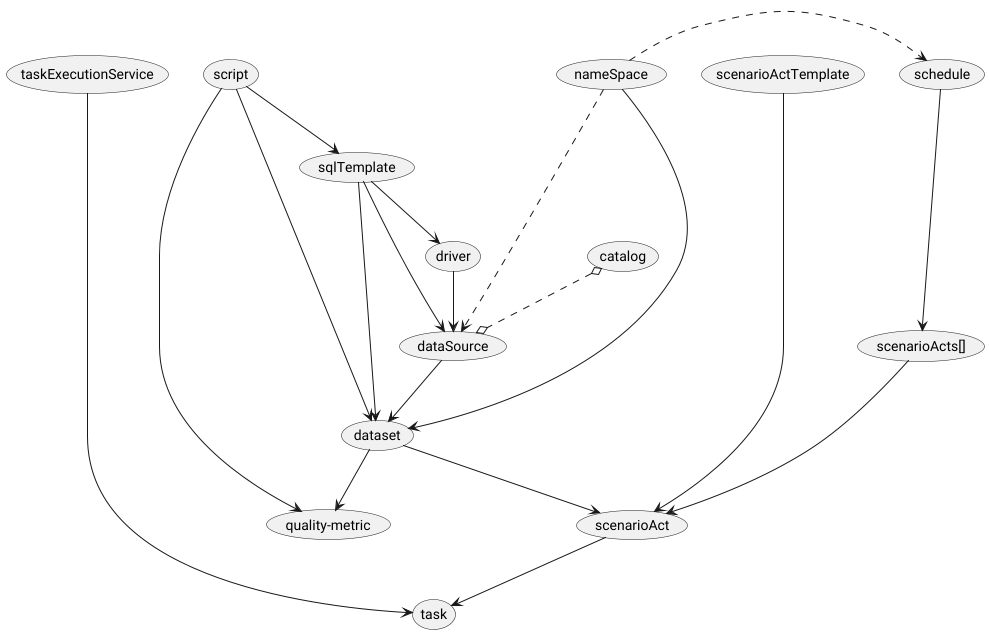
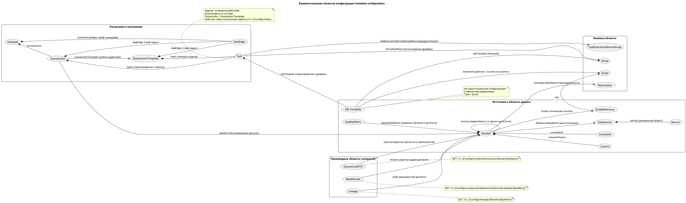

# Common endpoint structure
| Endpoint structure                         | Purpose                                  | GET                              | POST                                  | DELETE                          |
|:-------------------------------------------|:-----------------------------------------|:---------------------------------|:--------------------------------------|:--------------------------------|
| /v1_0                                      | API version                              | -                                | -                                     | -                               |
| /v1_0/configs                              | subset of configurations                 | -                                | -                                     | -                               |
| /v1_0/configs/[object]                     | manages an entity type                   | Returns all objects of the type  | Adds or updates the object by rewrite | -                               |
| /v1_0/configs/[object]/[keyName]           | access to a specific object              | Returns the object by key        | -                                     | Deletes the object by key       |
| /v1_0/configs/compound/[object]/[keyName]  | access to compound, derived objects      | Builds and returns compound object | -                                   | -                               |

# Configuration description
[Namespaces](namespaces.md)

[Drivers](drivers.md)

[Data sources](datasources.md)

[Datasets](datasets.md) 

[Schedules](schedules.md) 

[Data quality metrics](qualityMetric.md)

[Scripts](scripts.md)

[Data lineage](lineage.md)

## Configuration dependency scheme

Upper elements must be loaded before lower ones.
Deleting upper elements is impossible without deleting lower ones, except in cascade cases. 
Cascade-dependent metadata is deleted together with upper elements.
Updating cascade elements is performed by reducing to the new state shape.

The metadata object relationship scheme is also provided as a diagram source:

[metadata_relationships.puml](../diagrams/metadata_relationships.puml)

