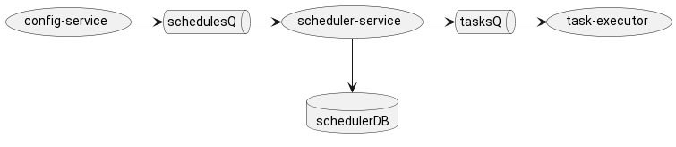
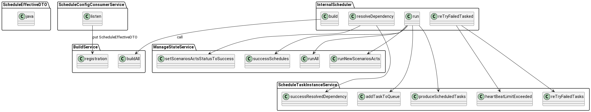
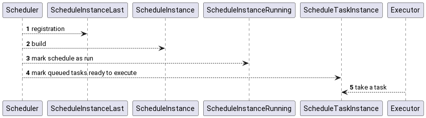
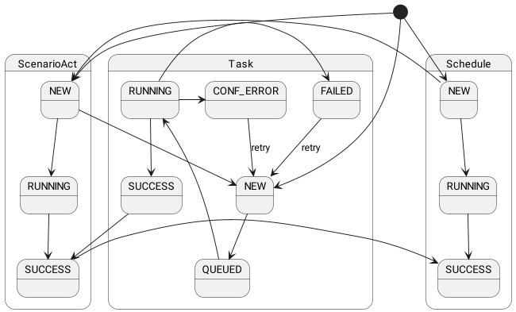

# Working with schedules

## Schedule structure

A schedule configuration contains both simple attributes and collections of nested configurations:

- **keyName** - unique key name of the schedule
- **description** text description of the schedule for documentation
- **intervalExpression** - encoded expression describing the interval, e.g. "@daily"
- **startDateTime** date that serves as the starting point for calculating the first interval. It is not necessarily
  equal to the date of the first schedule, as it is calculated using the interval expression
- **stopDateTime** date when the calculation of new intervals stops; may be empty, meaning infinity
- **enabled** enables/disables the calculation of new schedules. Disabling also stops the processing
  of the statuses of already running schedules.
- **scenarioActEdges** - specifies the execution order of acts within the scenario
    - from from which
    - to to which
- **scenarioActs** - a list of nested scenario parts (Acts). Scenario parts can be added regardless of the order
  of their execution
  field composition
    - **name** key name of the act. Must be unique.
    - **dataSetKeyName** reference to the unique name of the dataset
    - **scenarioActTemplate** the internal structure of tasks in the act can be templated; templates are used
      repeatedly. Reference to the scenario act template (see the [scenario act template](../../../lakehouse-config-svc/doc/content_configuration/scenarioActTemplate.md) configuration).
    - **intervalStart** string expression of a timestamp reflecting the lower bound of the time window in the data that
      will be changed in the dataset. Most often lags behind the target start time, e.g. "{{ adddays(targetDateTimeTZ,
      -1) }}".
    - **intervalEnd** string expression of a timestamp reflecting the upper bound of the time window in the data that will
      be changed in the dataset. Most often can be equal to the target timestamp "{{ targetDateTimeTZ }}"
    - **tasks** a list of nested objects - task descriptions. It may be empty, but then a template must be provided. This
      list is merged with the list from the template. If tasks with the same key exist, both are taken and merged into one.
      Their attribute values from the current list replace the values from the template
        - name key name of the task
        - taskExecutionServiceGroupName the type of executor that can take this task
        - taskProcessor the class name in the execution engine
        - taskProcessorBody the class name in the execution engine, in case it has a modular structure
        - taskProcessorArgs the set of arguments passed to the execution engine
        - driverKeyName points to the driver configuration whose instance is used to execute the task
        - importance if a task is unsuccessful, non-critical failures do not become an obstacle for the execution of the
          next tasks.
        - description text description for documentation
    - dagEdges - specifies the execution order of tasks
        - from from which
        - to to which

## How a schedule is obtained and processed

When a schedule is created or updated in the configuration service, a message is produced to a kafka queue.
The schedule service picks up the message and updates the schedule in its operational cache.

### Internal scheduler

Once a schedule appears in the cache and is registered, its lifecycle is managed by the internal scheduler.
The scheduler is responsible for building schedules, running them, and maintaining them.

## Schedule run

Each transition is recorded by a change in the status model.

