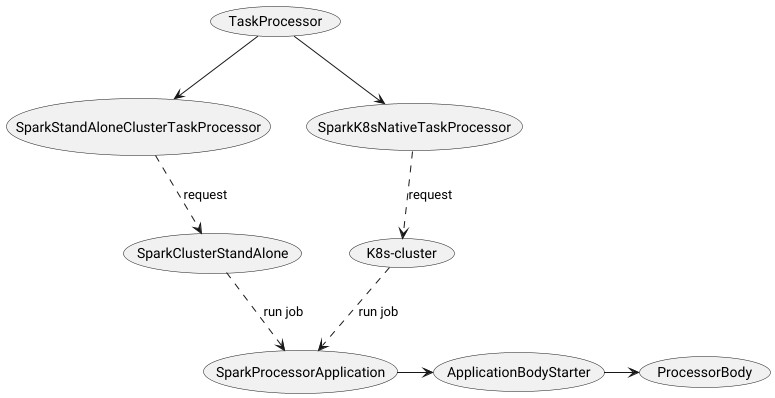

# Как это работает

По сути мы имеем дело с отдельной подгруппой задач(Task/process), которая является распределенной. Распределение диктует разделение самой сущности задачи.
Появляется новая сущность - тело задачи(process body). Тело и используемые им собственные сущности реализуют логику на стороне исполняющего кластера.

# BodyStarter
Задача BodyStarter подобрать и сконфигурировать требуемый ProcessBody

## ProcessBody
Содержит переиспользуемую логику

