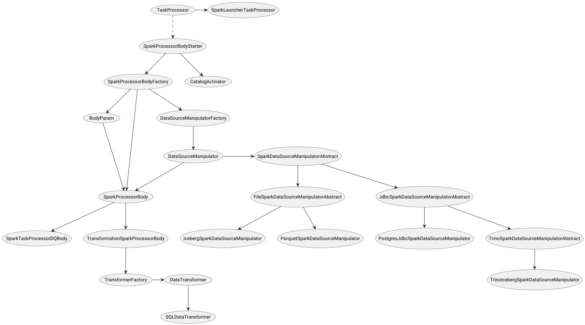
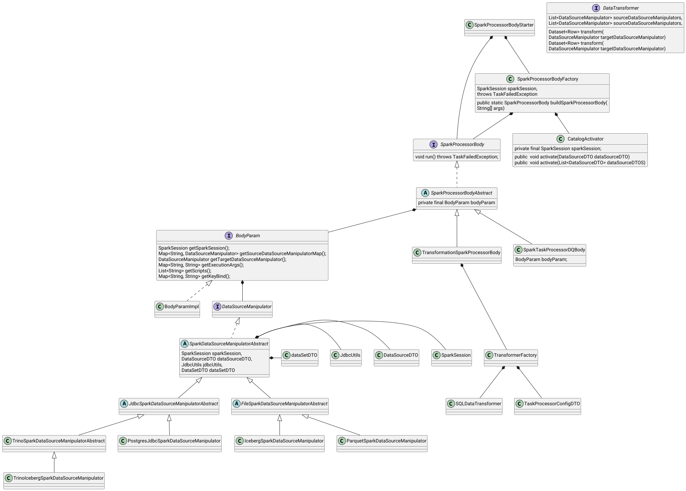

# Как это работает

По сути мы имеем дело с отдельной подгруппой задач(Task/process), которая является распределенной. Распределение диктует разделение самой сущности задачи.
Появляется новая сущность - тело задачи(process body). Тело и используемые им собственные сущности реализуют логику на стороне исполняющего кластера.

# BodyStarter
Задача BodyStarter подобрать и сконфигурировать требуемый ProcessBody

## ProcessBody
Каждый ProcessBody оперирует коллекцией объектов типа [DataSourceManipulator.java](../src/main/java/org/lakehouse/taskexecutor/api/processor/datasourcemanipulator/DataSourceManipulator.java).
Каждый класс [DataSourceManipulator.java](../src/main/java/org/lakehouse/taskexecutor/api/processor/datasourcemanipulator/DataSourceManipulator.java)
является реализацией фасада к функционалу хранилища (DataSource). Каждый экземпляр [DataSourceManipulator.java](../src/main/java/org/lakehouse/taskexecutor/api/processor/datasourcemanipulator/DataSourceManipulator.java) создается на один датасет. Это может быть как целевой датасет, так и его зависимость.
Каждый datasource становится каталогом в Spark. Каждый dataset становится таблицей в соответствующем каталоге. 
[TransformationSparkProcessorBody.java](../src/main/java/org/lakehouse/taskexecutor/spark/dataset/datasourcemanipulator/body/body/TransformationSparkProcessorBody.java) - Цель выполнить единственный запрос модели датасета и сохранить его в хранилище.

