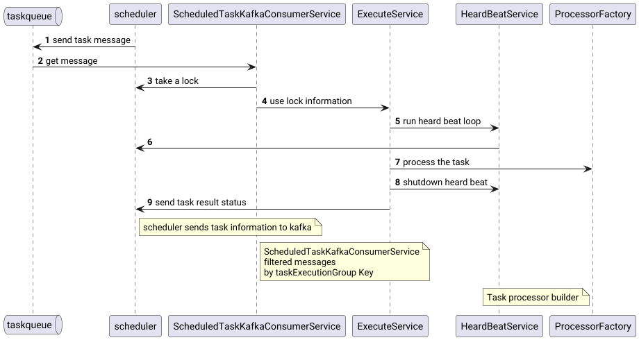
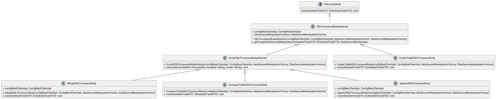

# Взаимодействие с сервисом расписаний

Сервис расписаний публикует в kafka описание задач [ScheduledTaskMsgDTO.java](../../lakehouse-common/src/main/java/org/lakehouse/client/api/dto/scheduler/tasks/ScheduledTaskMsgDTO.java)
которое содержит идентификатор задачи и ключ группы.
Экземпляры [lakehouse-task-executor-svc](..)  содержат в настройках параметр 

# TaskProcessor
То что исполняет процесс задачи.

* Spark-задачи
  * [SparkLauncherTaskProcessor.java](../src/main/java/org/lakehouse/taskexecutor/processor/spark/SparkLauncherTaskProcessor.java) запускает тело задачи на удаленном кластере в виде spark-job. [Подробнее тут](../../lakehouse-task-spark-apps/doc/devguide.md)
* Работа со статусной моделью датасета
  * [LockedStateTaskProcessor.java](../src/main/java/org/lakehouse/taskexecutor/processor/state/LockedStateTaskProcessor.java) Переводит инкремент датасета в статус - Locked - заблокирован. Это показывает другим процессам, что они НЕ могут работать с интервалом данных датасета.
  * [SuccessStateTaskProcessor.java](../src/main/java/org/lakehouse/taskexecutor/processor/state/SuccessStateTaskProcessor.java) Переводит инкремент датасета в статус - Success  - успешен.  Это показывает другим процессам, что они могут работать с интервалом данных датасета.
  * [DependencyCheckStateTaskProcessor.java](../src/main/java/org/lakehouse/taskexecutor/processor/state/DependencyCheckStateTaskProcessor.java) Проверяет статус датасета. Применяется для проверки состояния зависимостей и текущего датасета.
* Работа с базами данных(JDBC) 
  * [JdbcTaskProcessor.java](../src/main/java/org/lakehouse/taskexecutor/processor/jdbc/JdbcTaskProcessor.java)

# TaskProcessorBody
Код, который выносится из TaskProcessor для пере-использования другими TaskProcessor или исполнения вне приложения

TaskProcessorBody использующие шаблоны SQLTemplate совместимы с [SparkLauncherTaskProcessor.java](../src/main/java/org/lakehouse/taskexecutor/processor/spark/SparkLauncherTaskProcessor.java) и [JdbcTaskProcessor.java](../src/main/java/org/lakehouse/taskexecutor/processor/jdbc/JdbcTaskProcessor.java)
* [AppendSQLProcessorBody.java](../../lakehouse-task-executor-api/src/main/java/org/lakehouse/taskexecutor/api/processor/body/sql/AppendSQLProcessorBody.java)
  Помещает модель в insert и выполняет запрос
* [CompactTableSQLProcessorBody.java](../../lakehouse-task-executor-api/src/main/java/org/lakehouse/taskexecutor/api/processor/body/sql/CompactTableSQLProcessorBody.java)
  Выполняет команду из шаблона tableDDLCompact
* [CreateTableSQLProcessorBody.java](../../lakehouse-task-executor-api/src/main/java/org/lakehouse/taskexecutor/api/processor/body/sql/CreateTableSQLProcessorBody.java)
  Выполняет команду из шаблона tableDDLCreate схему тоже создаст из шаблона схемы
* [MergeSQLProcessorBody.java](../../lakehouse-task-executor-api/src/main/java/org/lakehouse/taskexecutor/api/processor/body/sql/MergeSQLProcessorBody.java)
  Помещает модель в merge и выполняет запрос

[SparkTaskProcessorDQBody.java](../../lakehouse-task-executor-spark-dq-app/src/main/java/org/lakehouse/taskexecutor/spark/dq/service/SparkTaskProcessorDQBody.java)
совместим только [SparkLauncherTaskProcessor.java](../src/main/java/org/lakehouse/taskexecutor/processor/spark/SparkLauncherTaskProcessor.java)

