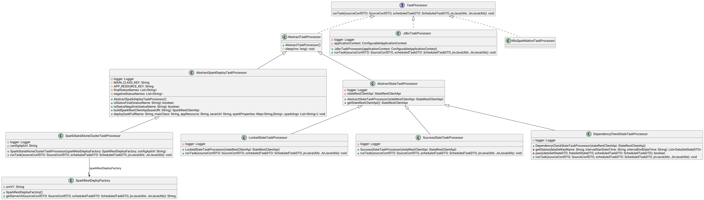

# TaskProcessor
То что исполняет процесс задачи.

* Spark-задачи
  * [SparkLauncherTaskProcessor.java](../src/main/java/org/lakehouse/taskexecutor/processor/SparkLauncherTaskProcessor.java) запускает тело задачи на удаленном кластере в виде spark-job. [Подробнее тут](../../lakehouse-task-spark-apps/doc/devguide.md)
* Работа со статусной моделью датасета
  * [LockedStateTaskProcessor.java](../src/main/java/org/lakehouse/taskexecutor/processor/state/LockedStateTaskProcessor.java) Переводит инкремент датасета в статус - Locked - заблокирован. Это показывает другим процессам, что они НЕ могут работать с интервалом данных датасета.
  * [SuccessStateTaskProcessor.java](../src/main/java/org/lakehouse/taskexecutor/processor/state/SuccessStateTaskProcessor.java) Переводит инкремент датасета в статус - Success  - успешен.  Это показывает другим процессам, что они могут работать с интервалом данных датасета.
  * [DependencyCheckStateTaskProcessor.java](../src/main/java/org/lakehouse/taskexecutor/processor/state/DependencyCheckStateTaskProcessor.java) Проверяет статус датасета. Применяется для проверки состояния зависимостей и текущего датасета.
* Работа с базами данных(JDBC) 
  * [JdbcDDLTaskProcessor.java](../src/main/java/org/lakehouse/taskexecutor/processor/jdbc/JdbcDDLTaskProcessor.java) создает целевую таблицу
  * [JdbcAppendTaskProcessor.java](../src/main/java/org/lakehouse/taskexecutor/processor/jdbc/JdbcAppendTaskProcessor.java) Выполняет запрос модели и дописывает результат