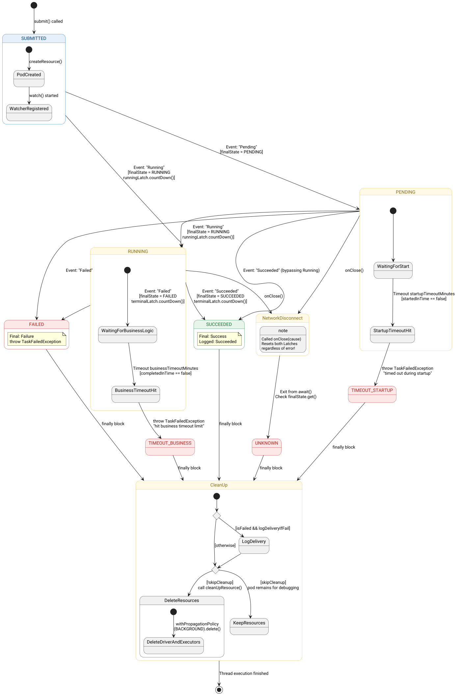

# K8sSparkNativeTaskProcessor
Отвечает за запуск sparkJob оформленной по шаблону [ProcessorBody.java](../../../lakehouse-task-executor-api/src/main/java/org/lakehouse/taskexecutor/api/processor/body/ProcessorBody.java)
обслуживает задачу на протяжении всего цикла работы от запуска до завершения.
Класс [K8sSparkNativeTaskProcessor.java](../../src/main/java/org/lakehouse/taskexecutor/processor/spark/K8sSparkNativeTaskProcessor.java)



Вне зависимости от финального статуса, K8sSparkNativeTaskProcessor, удалит spark-driver контейнер. 
В случае статуса failed. Выполнит операцию получения логов с драйвера, если под еще доступен. 


> Функция перехвата лога экспериментальная и скорее для удобной отладки. В продуктовой среде поды должны быть оснащены внешней системой сбора логов 
> на пример ELK 

# Конфигурация
Структура параметров
k8s.spark-native - префикс по которому sparkK8sNativeProcessor находит свои параметры
k8s.spark-native.manifest - 

| Наименование | Описание                                                                | Пример                                                                                                             | По умолчанию   |
|--------------|-------------------------------------------------------------------------|--------------------------------------------------------------------------------------------------------------------|----------------|
|k8s.spark-native.appResource| Путь к jar  в котором находится mainClass.                              | "local:///opt/lakehouse-task-spark-apps/lakehouse-task-executor-spark-dataset-app-0.5.0-jar-with-dependencies.jar" | spark-internal |
|k8s.spark-native.mainClass| Класс который должен запустить spark-submit                             |                                                                                                                    |
|k8s.spark-native.startupTimeoutMinutes| Количество минут которое выделяется на мастеру k8s на запуск pod        | "2"                                                                                                                | "2"            |               |
|k8s.spark-native.businessTimeoutMinutes| Количество минут которое выделяется на мастеру k8s на выполнение задачи | "200"| "180"          |
|k8s.spark-native.manifest  |доступ к полям манифеста в "плоском виде". Из этих параметров будет сформирован первичный шаблон манифеста.затем, манифест будет скорректирован на параметры [spark.kubernetes](##Трансляция_настроек_spark_в_k8s). На последнем этапе манифест будет обработан как jinja template, где в качестве входных данных будут предоставлены конфиг датасета и конфиг задачи| |                |


Общие параметры среды выполнения удобно вынести в datasource
```json
{
  "keyName": "lakehousestorage",
  "catalogKeyName":"lakehouse",
  "driverKeyName":"spark_iceberg",
  "service":
  {
    "host": "kubernetes.default.svc",
    "port": "443",
    "urn": "",
    "properties": {
      "datasource.service.protocol": "https",
      "k8s.spark-native.appResource": "local:///opt/lakehouse-task-spark-apps/lakehouse-task-executor-spark-dataset-app-0.5.0-jar-with-dependencies.jar",
      "k8s.spark-native.businessTimeoutMinutes": "200",
      "k8s.spark-native.startupTimeoutMinutes": "2",
      "k8s.spark-native.command": "/opt/spark/bin/spark-submit", # можно менять расположение spark-submit,
      "k8s.spark-native.mainClass": "org.lakehouse.taskexecutor.spark.dataset.SparkProcessorApplication",       # "запускатель body"
      # настройки манифеста
      "k8s.spark-native.manifest.metadata.namespace": "lakehouse-management",
      # тоже что и spark.kubernetes.authenticate.driver.serviceAccountName, spark.kubernetes.authenticate.executor.serviceAccountName укажите чтонибудь одно
      "k8s.spark-native.manifest.spec.serviceAccountName" : "spark-driver-sa", 
      "spark.driver.bindAddress": "0.0.0.0",
      "spark.driver.extraJavaOptions": "--add-exports=java.base/sun.nio.ch=ALL-UNNAMED --add-opens=java.base/java.io=ALL-UNNAMED --add-opens=java.base/java.lang.invoke=ALL-UNNAMED --add-opens=java.base/java.lang.reflect=ALL-UNNAMED --add-opens=java.base/java.lang=ALL-UNNAMED --add-opens=java.base/java.net=ALL-UNNAMED --add-opens=java.base/java.nio=ALL-UNNAMED --add-opens=java.base/java.sql=ALL-UNNAMED --add-opens=java.sql/java.sql=ALL-UNNAMED --add-opens=java.base/java.util.concurrent.atomic=ALL-UNNAMED --add-opens=java.base/java.util.concurrent=ALL-UNNAMED --add-opens=java.base/java.util=ALL-UNNAMED --add-opens=java.base/jdk.internal.ref=ALL-UNNAMED --add-opens=java.base/sun.nio.ch=ALL-UNNAMED --add-opens=java.base/sun.security.action=ALL-UNNAMED --add-opens=java.base/sun.util.calendar=ALL-UNNAMED --add-opens=java.security.jgss/sun.security.krb5=ALL-UNNAMED --add-opens=jdk.unsupported/sun.misc=ALL-UNNAMED -Djdk.reflect.useDirectMethodHandle=false -XX:+IgnoreUnrecognizedVMOptions",
      "spark.driver.host": "$(POD_IP)",
      "spark.eventLog.dir": "s3a://sparklogs/eventlog/",
      "spark.eventLog.enabled": "true",
      "spark.executor.extraJavaOptions": "--add-exports=java.base/sun.nio.ch=ALL-UNNAMED --add-opens=java.base/java.io=ALL-UNNAMED --add-opens=java.base/java.lang.invoke=ALL-UNNAMED --add-opens=java.base/java.lang.reflect=ALL-UNNAMED --add-opens=java.base/java.lang=ALL-UNNAMED --add-opens=java.base/java.net=ALL-UNNAMED --add-opens=java.base/java.nio=ALL-UNNAMED --add-opens=java.base/java.sql=ALL-UNNAMED --add-opens=java.sql/java.sql=ALL-UNNAMED --add-opens=java.base/java.util.concurrent.atomic=ALL-UNNAMED --add-opens=java.base/java.util.concurrent=ALL-UNNAMED --add-opens=java.base/java.util=ALL-UNNAMED --add-opens=java.base/jdk.internal.ref=ALL-UNNAMED --add-opens=java.base/sun.nio.ch=ALL-UNNAMED --add-opens=java.base/sun.security.action=ALL-UNNAMED --add-opens=java.base/sun.util.calendar=ALL-UNNAMED --add-opens=java.security.jgss/sun.security.krb5=ALL-UNNAMED --add-opens=jdk.unsupported/sun.misc=ALL-UNNAMED -Djdk.reflect.useDirectMethodHandle=false -XX:+IgnoreUnrecognizedVMOptions",
      "spark.hadoop.fs.s3a.access.key": "spark_user",
      "spark.hadoop.fs.s3a.endpoint": "http://minio:9000",
      "spark.hadoop.fs.s3a.impl": "org.apache.hadoop.fs.s3a.S3AFileSystem",
      "spark.hadoop.fs.s3a.path.style.access": "true",
      "spark.hadoop.fs.s3a.secret.key": "spark_pwd",
      "spark.hive.s3.endpoint": "http://minio:9000",
       # Тоже что и k8s.spark-native.manifest.spec.serviceAccountName, укажите чтонибудь одно
      "spark.kubernetes.authenticate.driver.serviceAccountName": "spark-driver-sa",
      "spark.kubernetes.authenticate.executor.serviceAccountName": "spark-driver-sa",
      "spark.kubernetes.container.image": "lakehouse-spark-aws:0.5.0",
      "spark.kubernetes.executor.deleteOnTermination": "true",
      "spark.kubernetes.namespace": "lakehouse-management",
      "spark.sql.catalog.lakehouse": "org.apache.iceberg.spark.SparkCatalog",
      "spark.sql.catalog.lakehouse.type": "hive",
      "spark.sql.catalog.lakehouse.uri": "thrift://hive-metastore:9083",
      "spark.sql.catalog.spark_catalog.warehouse": "s3a://data/warehouse/",
      "spark.sql.catalogImplementation": "hive",
      "spark.sql.extensions": "org.apache.iceberg.spark.extensions.IcebergSparkSessionExtensions"
    }
  }
,

  "description": "Local datastore",
  "sqlTemplate" : {
    "tableDDLCompact" : "sql-template-spark_iceberg.tableDDLCompact.sql"
  }
}


```

Для конкретного типа запуска на уровне шаблона [сценария задач](../../../lakehouse-config-svc/doc/content_configuration/scenarioActTemplate.md)

```json
{
  "keyName": "spark",
  "description": "Spark job scenario",
  "tasks": [
    {
      "name": "check",
      "taskExecutionServiceGroupName": "default",
      "taskProcessor": "dependencyCheckStateTaskProcessor",
      "importance": "critical",
      "description": "Dependency check"
    },
    {
      "name": "begin",
      "taskExecutionServiceGroupName": "default",
      "taskProcessor": "lockedStateTaskProcessor",
      "importance": "critical",
      "description": "Made interval status RUNNING"
    },
    {
      "name": "prepare",
      "taskExecutionServiceGroupName": "default",
      "taskProcessor": "K8sSparkNativeTaskProcessor",
      "taskProcessorBody": "createTableSQLProcessorBody",
      "importance": "critical",
      "description": "load from remote datastore",
      "taskProcessorArgs": {
        # Spark параметры войдут в структуру манифеста, но не в формате Json. Это особенности работы Sparkoperator
        "spark.ui.enabled": "true",
        "spark.executor.memory": "1g",
        "spark.driver.memory": "1g",
        "datasource.service.protocol": "https", # параметр который не известен в основном коде, но используется в шаблоне driver
        # В зависимости от типа задач может поменяться стартовый класс и файл jar c body
        "k8s.spark-native.mainClass": "org.lakehouse.taskexecutor.spark.dataset.SparkProcessorApplication",
        # appResource  можно не использовать если файл уже добавлен в classpath. Будет подставлен специальный текст "spark-internal"
        "k8s.spark-native.appResource": "local:///opt/lakehouse-task-spark-apps/lakehouse-task-executor-spark-dataset-app-0.5.0-jar-with-dependencies.jar"
      }
    },
  
    
    
    ...........остальной текст
}

```


Для конкретного расписания и конкретной задачи также можно еще более тонко  добавить переопределение 

```json
{
  "keyName": "regular",
  "description": "regular schedule for client transactions",
  "intervalExpression": "@daily",
  "startDateTime": "2025-01-01T00:00:00.0+00:00",
  "stopDateTime": null,
  "enabled": true,
  "scenarioActs": [
    {
      "name": "transaction_dds",
      "dataSet": "transaction_dds",
      "scenarioActTemplate": "spark",
      "intervalStart": "{{ adddays(targetDateTime, -1) }}",
      "intervalEnd": "{{ targetDateTime }}",
      "tasks": [
        {
          "name": "ext",
          "taskExecutionServiceGroupName": "default",
          "taskProcessor": "lockedStateTaskProcessor",
          "importance": "critical",
          "description": "Extended task",
          "taskProcessorArgs": { # допишет и перезапишет в момент выполнения этой задачи  параметры на указанные ниже
            # Подняли ресурсы, а не так как указано в шаблоне задач
              "spark.ui.enabled": "false", # запретили в отличии от шаблонного разрешенного 
              "spark.executor.memory": "2g", # Дали больше памяти в отличии от общего шаблона
              "spark.driver.memory": "2g", # Дали больше памяти в отличии от общего шаблона
              # Понизили версию образа и jar только для этой задачи , а не так как в datasource
              "spark.kubernetes.container.image": "lakehouse-spark-aws:0.3.0",
              "k8s.spark-native.mainClass": "org.lakehouse.taskexecutor.spark.dataset.SparkProcessorApplication",
              "k8s.spark-native.appResource": "local:///opt/lakehouse-task-spark-apps/lakehouse-task-executor-spark-dataset-app-0.3.0-jar-with-dependencies.jar"
              
          }
        }
      ],
  .... остальной текст
```

# Параметры, которые добавит сам Task-executor-service
Для того чтобы taskProcessorBody, запускаемый удаленно мог выполнить свою работу ему нужно иметь все метаданные задачи.
Чтобы не перегружать командный интерфейс сложными структурами данных, taskProcessor передает в taskProcessorBody только ключевую информацию и ссылки на источники:

| Описание | Параметр| Пример
|--|---|---|
|Идентификатор задачи scheduler-service | "scheduledTaskId" | "120"| 
||"lakehouse.client.rest.config.server.url"| "http://lakehouse-management-config-service:8080"|
||"lakehouse.client.rest.scheduler.server.url"| "http://lakehouse-management-config-service:8080"|
              
Идентификатор задачи taskProcessor получает из текущей задачи, ссылки на сервисы 
 настраиваются в конфиге самого task-executor-service 

## Трансляция настроек spark в k8s
Настройки, переданные через параметры spark.kubernetes.*, которые требуются на этапе предварительного 
запуска (pre-launch) Spark-контекста, должны быть перенесены в манифест.Эти настройки достаточно указать только в одном месте: либо в манифесте, либо в параметрах spark.kubernetes.*. Если указать их в обоих местах, то настройки из манифеста будут перезаписаны.
 https://spark.apache.org/docs/3.5.8/running-on-kubernetes.html

### Пока не поддерживается
Однако не все трансляции настроек были сделаны. В текущей версии не поддерживаются следующие параметры:

* spark.kubernetes.{driver,executor}.label.*
* spark.kubernetes.{driver,executor}.annotation.*
* spark.kubernetes.{driver,executor}.volumes.[VolumeType].[VolumeName].mount.path

### Имя pod
А такие настройки как имя пода, префикс имени экзекутора будут сформированы автоматически.
> Передавать эти параметры не нужно
spark.kubernetes.driver.pod.name
spark.kubernetes.executor.podNamePrefix

управляются запускающим приложением. Это нужно для контроля жизненного цикла pod 
сейчас имя pod драйвера формируется на основе шаблона  
> task-{scheduledTask.Id}-{scheduledTask.tryNumber}-{OffsetDateTime.new().hascode} 

Далее шаблон приводится в соответствие с
https://kubernetes.io/docs/concepts/overview/working-with-objects/names/

```commandline
kubectl -n lakehouse-management get pods -o custom-columns="NAME:.metadata.name,STATUS:.status.phase,TASK-NAME:.metadata.annotations.lakehouse-management-task"
NAME                                                          STATUS    TASK-NAME
broker-0                                                      Running   <none>
db-dev-77b48df78-msw7h                                        Running   <none>
hive-metastore-7755f8bcfc-68p2h                               Running   <none>
lakehouse-management-config-service-dcc6b868-z8vrd            Running   <none>
lakehouse-management-scheduler-service-695cf9b448-4mnsz       Running   <none>
lakehouse-management-state-service-fb45f4cc6-gc4v8            Running   <none>
lakehouse-management-task-executor-service-57dc469b6d-fbhp9   Running   <none>
lakehouse-release-trino-596d7c9fc7-w2mqv                      Running   <none>
minio-85c9c5576f-s5l44                                        Running   <none>
spark-history-5fbb65759c-2hgx8                                Running   <none>
task-6-0-1209575484                                           Running   regular-aggregation_pay_per_client_daily_mart-prepare-20250102T000000Z
task-6-0-1209575484-exec-1                                    Running   <none>
task-6-0-1209575484-exec-2                                    Running   <none>
```
Вы можете переопределить этот автоматическое именование, но это не рекомендуется.
>Параметр называется k8s.spark-native.manifest.metadata.name (не рекомендуется)
просто не указывайте его если не уверены

Переопределенное имя будет подвергнуто процедуре нормализации имени и в результате может стать не уникальным
### spark.app.name
scheduledTask.buildFullTaskName
Это имя состоящее из Имен Расписания, Сценария, Задачи, обработанной строки целевого времени и номера попытки 
### spark.app.id
Формируется автоматически самим spark


# Пример манифеста для K8s который будет отправлен  

```json
 {
  "apiVersion" : "v1",
  "kind" : "Pod",
  "metadata" : {
    "annotations" : {
      "lakehouse-management-task" : "regular-transaction_dds-compact-20250106T000000Z"
    },
    "name" : "task-230-0-1599821857",
    "namespace" : "lakehouse-management"
  },
  "spec" : {
    "containers" : [ {
      "args" : [ "--master", "k8s://https://kubernetes.default.svc:443", "--name", "regular-transaction_dds-compact-20250106T000000Z", "--conf", "spark.sql.catalog.processing.user=postgresUser", "--conf", "spark.sql.catalogImplementation=hive", "--conf", "spark.hadoop.fs.s3a.endpoint=http://minio:9000", "--conf", "spark.sql.catalog.lakehouse.uri=thrift://hive-metastore:9083", "--conf", "spark.sql.catalog.spark_catalog.warehouse=s3a://data/warehouse/", "--conf", "spark.driver.bindAddress=0.0.0.0", "--conf", "spark.sql.catalog.lakehouse=org.apache.iceberg.spark.SparkCatalog", "--conf", "spark.hadoop.fs.s3a.impl=org.apache.hadoop.fs.s3a.S3AFileSystem", "--conf", "spark.kubernetes.namespace=lakehouse-management", "--conf", "spark.kubernetes.authenticate.executor.serviceAccountName=spark-driver-sa", "--conf", "spark.sql.extensions=org.apache.iceberg.spark.extensions.IcebergSparkSessionExtensions", "--conf", "spark.eventLog.dir=s3a://sparklogs/eventlog/", "--conf", "spark.kubernetes.authenticate.driver.serviceAccountName=spark-driver-sa", "--conf", "spark.kubernetes.executor.deleteOnTermination=true", "--conf", "spark.sql.catalog.processing.password=postgresPW", "--conf", "spark.executor.memory=1g", "--conf", "spark.driver.memory=1g", "--conf", "spark.hadoop.fs.s3a.secret.key=spark_pwd", "--conf", "spark.sql.catalog.lakehouse.type=hive", "--conf", "spark.hadoop.fs.s3a.access.key=spark_user", "--conf", "spark.sql.catalog.processing.type=hive", "--conf", "spark.hadoop.fs.s3a.path.style.access=true", "--conf", "spark.driver.host=$(POD_IP)", "--conf", "spark.sql.catalog.processing.url=jdbc:postgresql://db-dev:5432/postgresDB", "--conf", "spark.hive.s3.endpoint=http://minio:9000", "--conf", "spark.kubernetes.container.image=lakehouse-spark-aws:0.5.0", "--conf", "spark.kubernetes.executor.podNamePrefix=task-230-0-1599821857", "--conf", "spark.eventLog.enabled=true", "--conf", "spark.sql.catalog.processing=org.apache.spark.sql.execution.datasources.v2.jdbc.JDBCTableCatalog", "--conf", "spark.executor.extraJavaOptions=--add-exports=java.base/sun.nio.ch=ALL-UNNAMED --add-opens=java.base/java.io=ALL-UNNAMED --add-opens=java.base/java.lang.invoke=ALL-UNNAMED --add-opens=java.base/java.lang.reflect=ALL-UNNAMED --add-opens=java.base/java.lang=ALL-UNNAMED --add-opens=java.base/java.net=ALL-UNNAMED --add-opens=java.base/java.nio=ALL-UNNAMED --add-opens=java.base/java.sql=ALL-UNNAMED --add-opens=java.sql/java.sql=ALL-UNNAMED --add-opens=java.base/java.util.concurrent.atomic=ALL-UNNAMED --add-opens=java.base/java.util.concurrent=ALL-UNNAMED --add-opens=java.base/java.util=ALL-UNNAMED --add-opens=java.base/jdk.internal.ref=ALL-UNNAMED --add-opens=java.base/sun.nio.ch=ALL-UNNAMED --add-opens=java.base/sun.security.action=ALL-UNNAMED --add-opens=java.base/sun.util.calendar=ALL-UNNAMED --add-opens=java.security.jgss/sun.security.krb5=ALL-UNNAMED --add-opens=jdk.unsupported/sun.misc=ALL-UNNAMED -Djdk.reflect.useDirectMethodHandle=false -XX:+IgnoreUnrecognizedVMOptions", "--conf", "spark.driver.extraJavaOptions=--add-exports=java.base/sun.nio.ch=ALL-UNNAMED --add-opens=java.base/java.io=ALL-UNNAMED --add-opens=java.base/java.lang.invoke=ALL-UNNAMED --add-opens=java.base/java.lang.reflect=ALL-UNNAMED --add-opens=java.base/java.lang=ALL-UNNAMED --add-opens=java.base/java.net=ALL-UNNAMED --add-opens=java.base/java.nio=ALL-UNNAMED --add-opens=java.base/java.sql=ALL-UNNAMED --add-opens=java.sql/java.sql=ALL-UNNAMED --add-opens=java.base/java.util.concurrent.atomic=ALL-UNNAMED --add-opens=java.base/java.util.concurrent=ALL-UNNAMED --add-opens=java.base/java.util=ALL-UNNAMED --add-opens=java.base/jdk.internal.ref=ALL-UNNAMED --add-opens=java.base/sun.nio.ch=ALL-UNNAMED --add-opens=java.base/sun.security.action=ALL-UNNAMED --add-opens=java.base/sun.util.calendar=ALL-UNNAMED --add-opens=java.security.jgss/sun.security.krb5=ALL-UNNAMED --add-opens=jdk.unsupported/sun.misc=ALL-UNNAMED -Djdk.reflect.useDirectMethodHandle=false -XX:+IgnoreUnrecognizedVMOptions", "--conf", "spark.ui.enabled=true", "--class", "org.lakehouse.taskexecutor.spark.dataset.SparkProcessorApplication", "local:///opt/lakehouse-task-spark-apps/lakehouse-task-executor-spark-dataset-app-0.5.0-jar-with-dependencies.jar", "--scheduledTaskId=230", "--datasource.service.protocol=https", "--lakehouse.client.rest.config.server.url=http://lakehouse-management-config-service:8080", "--lakehouse.client.rest.scheduler.server.url=http://lakehouse-management-scheduler-service:8081" ],
      "command" : [ "/opt/spark/bin/spark-submit" ],
      "env" : [ {
        "name" : "POD_IP",
        "valueFrom" : {
          "fieldRef" : {
            "fieldPath" : "status.podIP"
          }
        }
      } ],
      "image" : "lakehouse-spark-aws:0.5.0",
      "name" : "spark-driver",
      "resources" : {
        "limits" : {
          "cpu" : "1",
          "memory" : "1408Mi"
        },
        "requests" : {
          "cpu" : "1",
          "memory" : "1408Mi"
        }
      }
    } ],
    "restartPolicy" : "Never",
    "serviceAccount" : "spark-driver-sa",
    "serviceAccountName" : "spark-driver-sa"
  }
}
```