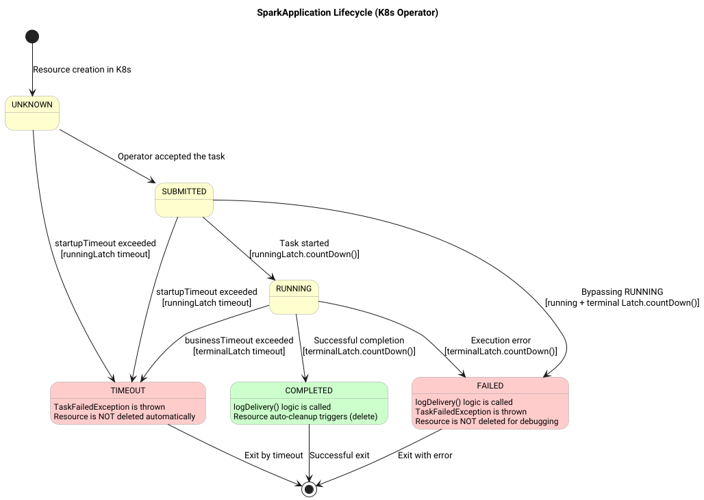

# sparkK8sOperatorTaskProcessor
Отвечает за запуск sparkJob оформленной по шаблону [ProcessorBody.java](../../../lakehouse-task-executor-api/src/main/java/org/lakehouse/taskexecutor/api/processor/body/ProcessorBody.java)
обслуживает задачу на протяжении всего цикла работы от запуска до завершения.
Класс [SparkK8sOperatorTaskProcessor.java](../src/main/java/org/lakehouse/taskexecutor/processor/spark/SparkK8sOperatorTaskProcessor.java)



Вне зависимости от финального статуса, в текущей версии,  sparkK8sOperatorTaskProcessor выполнит операцию получения логов с драйвера, удалит "приложение" и контейнер.
экзекуторы уничтожаются ранее функционалом Spark-Operator

> Функция перехвата лога экспериментальная и скорее для удобной отладки. В продуктовой среде поды должны быть оснащены внешней системой сбора логов 
> на пример ELK 

# Конфигурация
Общие параметры среды выполнения удобно вынести в datasource
```json
{
  "keyName": "lakehousestorage",
  "catalogKeyName":"lakehouse",
  "driverKeyName":"spark_iceberg",
  "service":
    {
      "host": "kubernetes.default.svc", # внутренний адрес управляющего CRD 
      "port": "443",
      "urn": "",
      "properties": {
        # Spark параметры войдут в структуру манифеста, но не в формате Json. Это особенности работы Sparkoperator
        "spark.driver.extraJavaOptions": "--add-exports=java.base/sun.nio.ch=ALL-UNNAMED --add-opens=java.base/java.io=ALL-UNNAMED --add-opens=java.base/java.lang.invoke=ALL-UNNAMED --add-opens=java.base/java.lang.reflect=ALL-UNNAMED --add-opens=java.base/java.lang=ALL-UNNAMED --add-opens=java.base/java.net=ALL-UNNAMED --add-opens=java.base/java.nio=ALL-UNNAMED --add-opens=java.base/java.sql=ALL-UNNAMED --add-opens=java.sql/java.sql=ALL-UNNAMED --add-opens=java.base/java.util.concurrent.atomic=ALL-UNNAMED --add-opens=java.base/java.util.concurrent=ALL-UNNAMED --add-opens=java.base/java.util=ALL-UNNAMED --add-opens=java.base/jdk.internal.ref=ALL-UNNAMED --add-opens=java.base/sun.nio.ch=ALL-UNNAMED --add-opens=java.base/sun.security.action=ALL-UNNAMED --add-opens=java.base/sun.util.calendar=ALL-UNNAMED --add-opens=java.security.jgss/sun.security.krb5=ALL-UNNAMED --add-opens=jdk.unsupported/sun.misc=ALL-UNNAMED -Djdk.reflect.useDirectMethodHandle=false -XX:+IgnoreUnrecognizedVMOptions",
        "spark.executor.extraJavaOptions": "--add-exports=java.base/sun.nio.ch=ALL-UNNAMED --add-opens=java.base/java.io=ALL-UNNAMED --add-opens=java.base/java.lang.invoke=ALL-UNNAMED --add-opens=java.base/java.lang.reflect=ALL-UNNAMED --add-opens=java.base/java.lang=ALL-UNNAMED --add-opens=java.base/java.net=ALL-UNNAMED --add-opens=java.base/java.nio=ALL-UNNAMED --add-opens=java.base/java.sql=ALL-UNNAMED --add-opens=java.sql/java.sql=ALL-UNNAMED --add-opens=java.base/java.util.concurrent.atomic=ALL-UNNAMED --add-opens=java.base/java.util.concurrent=ALL-UNNAMED --add-opens=java.base/java.util=ALL-UNNAMED --add-opens=java.base/jdk.internal.ref=ALL-UNNAMED --add-opens=java.base/sun.nio.ch=ALL-UNNAMED --add-opens=java.base/sun.security.action=ALL-UNNAMED --add-opens=java.base/sun.util.calendar=ALL-UNNAMED --add-opens=java.security.jgss/sun.security.krb5=ALL-UNNAMED --add-opens=jdk.unsupported/sun.misc=ALL-UNNAMED -Djdk.reflect.useDirectMethodHandle=false -XX:+IgnoreUnrecognizedVMOptions",
        # Каталоги iceberg  и по умолчанию
        "spark.sql.extensions": "org.apache.iceberg.spark.extensions.IcebergSparkSessionExtensions",
        "spark.sql.catalog.lakehouse": "org.apache.iceberg.spark.SparkCatalog",
        "spark.sql.catalog.lakehouse.type": "hive",
        "spark.sql.catalog.lakehouse.uri": "thrift://hive-metastore:9083",
        "spark.sql.catalogImplementation": "hive",
        "spark.sql.catalog.spark_catalog.warehouse": "s3a://data/warehouse/",
        # S3
        "spark.hadoop.fs.s3a.endpoint": "http://minio:9000",
        "spark.hive.s3.endpoint": "http://minio:9000",
        "spark.hadoop.fs.s3a.access.key": "spark_user",
        "spark.hadoop.fs.s3a.secret.key": "spark_pwd",
        "spark.hadoop.fs.s3a.path.style.access": "true",
         # для history server 
        "spark.hadoop.fs.s3a.impl": "org.apache.hadoop.fs.s3a.S3AFileSystem",
        "spark.eventLog.enabled": "true",
        "spark.eventLog.dir": "s3a://sparklogs/eventlog/",
        # креды
        "spark.kubernetes.authenticate.driver.serviceAccountName": "spark-driver-sa",
        "spark.kubernetes.authenticate.executor.serviceAccountName": "spark-driver-sa",
        # k8s.spark-operator префикс управляющих параметров процессора
        "k8s.spark-operator.startupTimeoutMinutes": "2",    # время которое отводится на попытку создать задачу
        "k8s.spark-operator.businessTimeoutMinutes": "200", # Лимит времени для задачи которое она может выпоняться после прехода в статус RUNNING
        # k8s.spark-operator.manifest то что хотим прокинуть в манифест 
        "k8s.spark-operator.manifest.metadata.namespace": "lakehouse-management",
        "k8s.spark-operator.manifest.apiVersion": "sparkoperator.k8s.io/v1beta2",
        "k8s.spark-operator.manifest.kind": "SparkApplication",
        "k8s.spark-operator.manifest.spec.type": "Java",
        "k8s.spark-operator.manifest.spec.mode": "cluster",
        "k8s.spark-operator.manifest.spec.image": "lakehouse-spark-aws:0.4.0",
        "k8s.spark-operator.manifest.spec.mainClass": "org.apache.spark.examples.SparkPi",
        "k8s.spark-operator.manifest.spec.sparkVersion": "3.5.0",
        "k8s.spark-operator.manifest.spec.driver.cores": 1,
        "k8s.spark-operator.manifest.spec.driver.memory": "512m", # указывать не меньше чем  spark.driver.memory
        "k8s.spark-operator.manifest.spec.driver.serviceAccount": "spark-driver-sa",
        "k8s.spark-operator.manifest.spec.executor.cores": 1,
        "k8s.spark-operator.manifest.spec.executor.instances": 1,
        "k8s.spark-operator.manifest.spec.executor.memory": "512m" # указывать не меньше чем  spark.executor.memory
        
      }
    }
  ,

  "description": "Local datastore",
  "sqlTemplate" : {
    "tableDDLCompact" : "sql-template-spark_iceberg.tableDDLCompact.sql"
  }
}


```

Для конкретного типа запуска на уровне шаблона [сценария задач](../../../lakehouse-config-svc/doc/content_configuration/scenarioActTemplate.md)

```json
{
  "keyName": "spark",
  "description": "Spark job scenario",
  "tasks": [
    {
      "name": "check",
      "taskExecutionServiceGroupName": "default",
      "taskProcessor": "dependencyCheckStateTaskProcessor",
      "importance": "critical",
      "description": "Dependency check"
    },
    {
      "name": "begin",
      "taskExecutionServiceGroupName": "default",
      "taskProcessor": "lockedStateTaskProcessor",
      "importance": "critical",
      "description": "Made interval status RUNNING"
    },
    {
      "name": "prepare",
      "taskExecutionServiceGroupName": "default",
      "taskProcessor": "sparkK8sOperatorTaskProcessor",
      "taskProcessorBody": "createTableSQLProcessorBody",
      "importance": "critical",
      "description": "load from remote datastore",
      "taskProcessorArgs": {
        # Spark параметры войдут в структуру манифеста, но не в формате Json. Это особенности работы Sparkoperator
        "spark.ui.enabled": "true",
        "spark.executor.memory": "1g",
        "spark.driver.memory": "1g",
        "protocol": "https",
        "lakehouse.client.rest.config.server.url": "http://lakehouse-management-config-service:8080",
        # В зависимости от типа задач может поменяться стартовый класс и файл jar c body
        "k8s.spark-operator.manifest.spec.mainClass": "org.lakehouse.taskexecutor.spark.dataset.SparkProcessorApplication",
        "k8s.spark-operator.manifest.spec.mainApplicationFile": "local:///opt/lakehouse-task-spark-apps/lakehouse-task-executor-spark-dataset-app-0.4.0-jar-with-dependencies.jar"
      }
    },
  
    
    
    ...........остальной текст
}

```


Для конкретного расписани и конкретной задачи также можно еще более тонко  добавить переопределение 

```json
{
  "keyName": "regular",
  "description": "regular schedule for client transactions",
  "intervalExpression": "@daily",
  "startDateTime": "2025-01-01T00:00:00.0+00:00",
  "stopDateTime": null,
  "enabled": true,
  "scenarioActs": [
    {
      "name": "transaction_dds",
      "dataSet": "transaction_dds",
      "scenarioActTemplate": "spark",
      "intervalStart": "{{ adddays(targetDateTime, -1) }}",
      "intervalEnd": "{{ targetDateTime }}",
      "tasks": [
        {
          "name": "ext",
          "taskExecutionServiceGroupName": "default",
          "taskProcessor": "lockedStateTaskProcessor",
          "importance": "critical",
          "description": "Extended task",
          "taskProcessorArgs": { # допишет и перезапишет в момент выполнения этой задачи  параметры на указанные ниже
            # Подняли ресурсы а не так как в шаблоне задач
              "spark.ui.enabled": "false", # запретили в отличии от шаблонного разрешенного 
              "spark.executor.memory": "2g", # Дали больше памяти в отличии от общего шаблона
              "spark.driver.memory": "2g", # Дали больше памяти в отличии от общего шаблона
              "k8s.spark-operator.manifest.spec.driver.memory": "2048m", # указывать не меньше чем  spark.driver.memory
              "k8s.spark-operator.manifest.spec.executor.memory": "2048m"
               # Понизили версию образа и jar только для этой задачи , а не так как в datasource
              "k8s.spark-operator.manifest.spec.image": "lakehouse-spark-aws:0.3.0",
              "k8s.spark-operator.manifest.spec.mainClass": "org.lakehouse.taskexecutor.spark.dataset.SparkProcessorApplication",
              "k8s.spark-operator.manifest.spec.mainApplicationFile": "local:///opt/lakehouse-task-spark-apps/lakehouse-task-executor-spark-dataset-app-0.3.0-jar-with-dependencies.jar",
          
          }
        }
      ],
  .... остальной текст
```