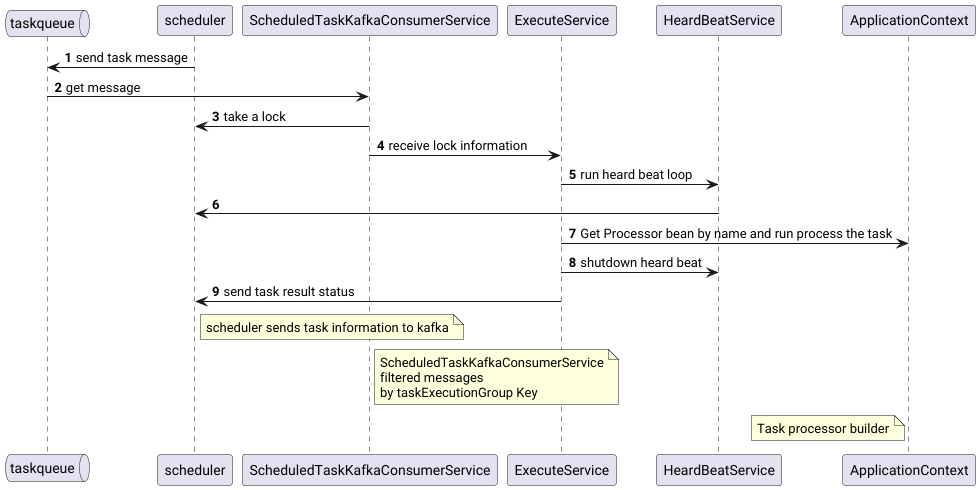
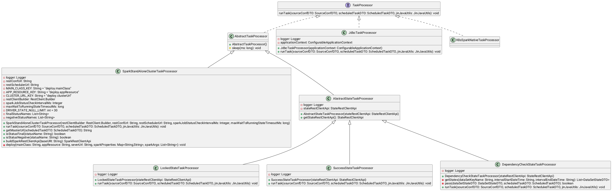
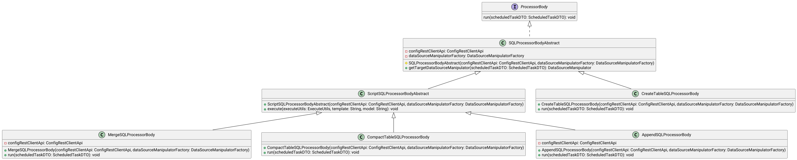

# Task executor service (lakehouse-task-executor-svc)

The task executor is the service that receives tasks scheduled by the scheduler, locks them, runs them through a task processor (TaskProcessor) and reports the result back to the scheduler.

## Overview

`lakehouse-task-executor-svc` is the lakehouse service responsible for actually executing the tasks scheduled by `lakehouse-scheduler-svc`. The service does not know when and which tasks should run — it only consumes tasks ready for execution from Kafka and executes them.

Execution flow:

1. `lakehouse-scheduler-svc` publishes messages about tasks ready for execution to the Kafka topic `scheduled_task_msg`.
2. Instances of `lakehouse-task-executor-svc` consume these messages through `ScheduledTaskKafkaConsumerService`.
3. Messages are filtered by execution group (`taskExecutionServiceGroupName`): an instance processes only those tasks whose group matches the `group.id` of its Kafka consumer.
4. For each task the service locks it in `lakehouse-scheduler-svc` via `lockTaskById`, receiving the full task description (`ScheduledTaskLockDTO`) — a merge of the task template and the overridden values of the specific task.
5. While running, a background heartbeat loop (`HeardBeatService`) periodically confirms to the scheduler that the task is alive.
6. The task is executed by the selected `TaskProcessor` (by the name specified in the task configuration).
7. On completion the heartbeat is stopped and the result (`TaskResultDTO`) is sent to the scheduler via `lockRelease`: `SUCCESS`, `FAILED` or `CONF_ERROR`.

The execution parallelism is limited by the `concurrency` parameter of the Kafka consumer and the service thread pool. Scaling is described in [scaling.md](scaling.md).

## Architecture



The service is the point of task execution parallelization: it receives a job, adapts it for the execution environment and hands it over to that environment, waiting for the result. This is a lightweight but blocking operation.

External interactions:

- **Kafka** — receiving tasks (`scheduled_task_msg`), deserialization of `ScheduledTaskMsgDTO`.
- **lakehouse-scheduler-svc** — locking a task (`lockTaskById`), heartbeat (`lockHeartBeat`), releasing the lock with the result (`lockRelease`).
- **lakehouse-config-svc** — retrieving the source/target configuration (`SourceConfDTO`) by the dataset key name.
- **lakehouse-state-svc** — working with the dataset state model (required by state-model processors).

Task processors:



- **Spark processors** — run the task body on a remote Spark standalone cluster via the REST API `/v1/submissions`.
- **State-model processors** — move the dataset interval to the `Locked`/`Success` status, check dependencies.
- **JDBC processor** — executes a `TaskProcessorBody` through a JDBC driver.

Task bodies (`TaskProcessorBody`):



Processors that use SQLTemplate templates are compatible with both Spark tasks and the JDBC processor. The processors are described in detail in [processors.md](processors.md).

## Modules

### lakehouse-task-executor-svc

The service itself. Contains:

- the entry point `TaskExecutorApplication`;
- the task Kafka consumer `ScheduledTaskKafkaConsumerService`;
- the executor `ExecuteService` — orchestration: locking, Jinja context rendering, running the processor, sending the result;
- `HeardBeatService` — background heartbeat loop for acquired locks;
- task processors (`processor`): Spark, state model, JDBC;
- configurations (`configuration`): Kafka, REST clients, factories, thread pool.

### lakehouse-task-executor-api

The library of execution contracts. Contains:

- `TaskProcessor` — the task processor interface (`runTask`);
- `ProcessorBody` and SQL body implementations (`AppendSQLProcessorBody`, `MergeSQLProcessorBody`, `CreateTableSQLProcessorBody`, `CompactTableSQLProcessorBody`);
- data source abstractions: `DataSourceManipulator`, `DataSourceManipulatorFactory`, JDBC connection and execution factories;
- `SQLTemplateResolver` / `SQLTemplateFactory`.

### lakehouse-task-executor-rest-client

REST client for managing the task executor. Contains:

- `TaskExecutorRestClientApi` (the contract lives in `lakehouse-common-rest-client`);
- `TaskExecutorRestClientApiImpl` — implementation based on `RestClientHelper`;
- `TaskExecutorRestClientConfiguration` — connection configuration via `lakehouse.client.rest.taskexecutor.server.url`.

## API Endpoints

The service REST controller (`TaskProcessorConfigController`) does not expose ready endpoints in the current version. Reserved path of the client contract (`TaskExecutorRestClientApi.getScheduledTaskLockDTO`):

| Method | Path | Description |
|---|---|---|
| GET | `/v1_0/taskexecutor/processor/config/lock/{id}` | Retrieving lock information by `lockId` (reserved) |

Health-check endpoints (from `lakehouse-common-health`):

| Method | Path | Description |
|---|---|---|
| GET | `/healthz` | Liveness check (`{"status":"UP"}`) |
| GET | `/readyz` | Readiness check (`{"status":"READY"}`) |

The health-check paths are configured via the `lakehouse.health.liveness-path` and `lakehouse.health.readiness-path` parameters.

## Configuration

Main parameters (`src/main/resources/application.yml`):

```yaml
server:
  port: 8089
lakehouse:
  client:
    rest:
      state:
        server:
          url: http://127.0.0.1:8082
      config:
        server:
          url: http://127.0.0.1:8080
      scheduler:
        server:
          url: http://127.0.0.1:8081
  task-executor:
    service:
      heart-beat-initial-delaY-ms: 5000
      heart-beat-interval-ms: 5000
      max-lock-retries: 5
      max-lock-retries-duration-ms: 5
      id: first1
    scheduled:
      task:
        kafka:
          consumer:
            concurrency: 1
            properties:
              bootstrap.servers: 192.1.193.20:9092
              group.id: default
              auto.offset.reset: earliest
            topics: scheduled_task_msg
```

| Parameter | Description |
|---|---|
| `server.port` | Service port |
| `lakehouse.client.rest.state.server.url` | URL of `lakehouse-state-svc` |
| `lakehouse.client.rest.config.server.url` | URL of `lakehouse-config-svc` |
| `lakehouse.client.rest.scheduler.server.url` | URL of `lakehouse-scheduler-svc` |
| `lakehouse.task-executor.service.heart-beat-initial-delaY-ms` | Delay before the heartbeat sending starts |
| `lakehouse.task-executor.service.heart-beat-interval-ms` | Heartbeat sending interval. Must be lower than `lakehouse.scheduler.task.retry.delay-ms` in the scheduler |
| `lakehouse.task-executor.service.max-lock-retries` | Number of lock acquisition attempts when the scheduler is temporarily unavailable |
| `lakehouse.task-executor.service.max-lock-retries-duration-ms` | Delay between lock attempts |
| `lakehouse.task-executor.service.id` | Instance identifier within the executor group (pod/host name). Sent to the scheduler on task lock |
| `lakehouse.task-executor.scheduled.task.kafka.consumer.concurrency` | Number of task consumption threads |
| `...consumer.properties.bootstrap.servers` | Kafka broker address |
| `...consumer.properties.group.id` | Executor group. Must match the task's `taskExecutionServiceGroupName`, otherwise the task is ignored |
| `...consumer.properties.auto.offset.reset` | Offset reset strategy when no offset exists |
| `...consumer.topics` | Topic of task receipt (default `scheduled_task_msg`) |

Full description of the parameters with comments: [properties.md](properties.md).

Scaling concerns (vertical, horizontal, segment-based): [scaling.md](scaling.md).