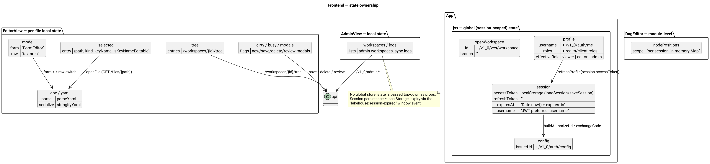

# Lakehouse UI Modeller — обзор архитектуры фронтенда

> Аудит актуального состояния React-фронтенда, расположенного в
> `lakehouse-ui-modeller/src/main/resources/frontend`.
>
> Область: `index.html`, `vite.config.js`, `package.json`, `src/` (JSX-исходники,
> стили, API-клиент, утилиты аутентификации, вспомогательный парсер YAML).
> Назначение: высокоуровневое понимание кодовой базы для системного архитектора
> и формулировка изолированных задач на новые функции.
>
> Диаграммы (исходники PlantUML — в `../diagrams/`):

| Диаграмма | Файл |
|---|---|
| Архитектура модуля (backend + SPA) | `../diagrams/architecture.png` |
| Декомпозиция компонентов | `../diagrams/frontend-components.png` |
| Аутентификация и поток данных | `../diagrams/data-flow.png` |
| Владение состоянием | `../diagrams/state-management.png` |

---

## 1. Архитектурный подход и паттерны

Фронтенд — это **одностраничное приложение (SPA)** на **React 18**, собираемое с
помощью **Vite**. Модель декомпозиции — **плоская, компонентная,
функционально-ориентированная структура** — по духу близко к лёгкому
Feature-Sliced/Layered без формального соблюдения:

- **Корневой / прикладной слой** — `main.jsx` (точка входа, `createRoot`) и
  `App.jsx` (каркас: верхняя панель, переключение представлений
  login/workspaces/editor/admin, глобальная сессия, профиль, уведомления).
- **Главные представления** — по одному компоненту на домен:
  `LoginView`, `WorkspacePicker`, `EditorView`, `AdminView`.
- **Общая инфраструктура** — `api.js` (единственная точка сетевого доступа),
  `auth.js` (утилиты OIDC/PKCE), `yaml.js` (парсер/сериализатор подмножества
  YAML), `index.css` (глобальные стили + дизайн-токены).
- **Внутренности редактора** — `FormEditor` (формы на основе схемы для всего
  редактируемого документа), `DagEditor` (графы React Flow для полей вида `dag`),
  `Modal` (общий оверлей).

Ключевые правила организации кода, которыми руководствовались при генерации:

1. **Один компонент = один файл** в `src/components/`, названный по понятию UI.
2. **Единый источник ввода-вывода** — весь HTTP-доступ идёт через `api.js`;
   компоненты никогда не вызывают `fetch` напрямую (единственное исключение —
   OIDC token-эндпоинт внутри `auth.js`).
3. **Разделение ответственности** — транспорт/аутентификация в `auth.js`,
   доступ к данным в `api.js`, YAML-преобразования в `yaml.js`, рендер +
   взаимодействие в компонентах, оформление в `index.css`.
4. **Props-down, state-up** — межпредставленческие данные передаются сверху вниз
   через props; глобального стора нет.
5. **Сессия хранится в `localStorage`** — access/refresh-токены под одним ключом;
   истечение распространяется через window-событие
   (`lakehouse:session-expired`).
6. **Динамическое редактирование по схеме** — редактор рендерит схемы форм,
   отдаваемые backend'ом (`SchemaService`), вместо захардкоженных списков полей;
   поля вида `dag` получают графический редактор.

## 2. Структура проекта и хранилища

```
src/main/resources/frontend/
├── index.html                # каркас SPA, единственная точка монтирования
├── package.json              # React 18.3.1, @xyflow/react 12.11.2, Vite 6.4.3
├── vite.config.js            # build.outDir = ../static, dev-прокси /v1_0 -> :8094
└── src/
    ├── main.jsx              # точка входа: ReactDOM.createRoot
    ├── App.jsx               # каркас, переключение представлений, сессия/профиль, уведомления
    ├── api.js                # обёртка fetch (Bearer-токен, JSON, обработка 401)
    ├── auth.js               # Keycloak OIDC: authorize URL, обмен кода, декодирование JWT
    ├── yaml.js               # лёгкий парсер/сериализатор подмножества YAML (режим формы)
    ├── index.css             # дизайн-токены + разметка
    └── components/
        ├── LoginView.jsx     # карточка входа, запускает поток Keycloak
        ├── WorkspacePicker.jsx  # ветки, мои воркспейсы, открытие/создание воркспейса
        ├── EditorView.jsx    # дерево воркспейса, режимы форма/сырой YAML, новый/сохранение/удаление/review
        ├── FormEditor.jsx    # универсальный рендер форм по схеме
        ├── DagEditor.jsx     # графический редактор @xyflow/react для полей вида dag
        ├── Modal.jsx         # общий диалог-оверлей
        └── AdminView.jsx     # админ-воркспейсы, TTL очистки, журнал синхронизации
```


Ответственность:

- `main.jsx` / `App.jsx` — запуск и каркас приложения;
- `api.js` — единственный транспорт к backend (`/v1_0`), нормализует ошибки в
  `Error` с сообщением, по 401 инициирует истечение сессии;
- `auth.js` — нативный PKCE в SPA (без cookie и серверных сессий): строит
  authorize URL, обменивает код на токены, декодирует JWT для профиля/ролей;
- `yaml.js` — парсер/сериализатор подмножества YAML, используемого в файлах
  метаданных (понадобился из-за отсутствия YAML-библиотеки в офлайн-окружении);
- `components/` — функциональные и общие компоненты.

## 3. Управление состоянием

**Глобального стора нет** (нет Redux/Zustand/MobX). Все состояния — это React
`useState`, поднятые на тот уровень, где нужны, и передаваемые через props.

- **Глобальное состояние уровня App** (`App.jsx`): `config` (OIDC-параметры из
  `/v1_0/auth/config`), `session` (токены, восстанавливаемые из
  `localStorage`), `profile` (пользователь + эффективная роль из
  `/v1_0/auth/me`), `openWorkspace` (текущий редактируемый воркспейс), `notice`
  (временный баннер). Здесь же сохраняется/восстанавливается сессия и
  обрабатывается событие `lakehouse:session-expired`.
- **Локальное состояние EditorView**: `schemas` (загружаются один раз), `tree`
  (дерево файлов воркспейса), `selected` (активный файл), `doc`/`yaml`
  (объект формы vs сырой текст), `mode` (форма/сырой YAML), `dirty`, `busy` и
  флаги модалок (`newModal`, `reviewModal`, `deleteModal`).
- **Локальное состояние FormEditor / DagEditor**: значения полей; графический
  редактор дополнительно держит позиции узлов в **module-level `Map`**, чтобы
  раскладка переживала повторные рендеры в пределах сессии.
- **Локальное состояние AdminView**: админ-воркспейсы, журнал синхронизации,
  форма TTL.



## 4. Поток данных и интеграция с API

- **Сетевая библиотека**: нативный **Fetch API**, обёрнутый в `api.js`;
  нет Axios/React Query/RTK Query.
- **Аутентификация**: OAuth 2.0 **authorization code + PKCE** против Keycloak,
  выполняемый самим SPA (`auth.js`) — без серверного входа и cookie. JWT
  пробрасывается заголовком `Authorization: Bearer <access_token>` на каждый
  запрос (кроме публичных). При HTTP 401 `api.js` очищает сессию и отправляет
  событие `lakehouse:session-expired`, возвращающее UI на экран входа.
- **Слой интеграции с backend**: `api.js` + публичный эндпоинт
  `/v1_0/auth/config` (issuer, auth/token endpoints, client id, scope).
  Компоненты загружают данные при монтировании или по действию пользователя;
  редактор обновляет дерево файлов после каждого create/save/delete.
- **Схемы форм**: `EditorView` один раз загружает `/v1_0/schema`; `FormEditor`
  рендерит поля типов `string|integer|double|boolean|datetime|map|object|list|dag`
  (тип `dag` делегируется `DagEditor`, который редактирует узлы из соседнего
  list-поля и рёбра из поля вида `dag`).


## 5. Компонентный слой и стилизация

- **Нет библиотеки компонентов / дизайн-системы** — чистый CSS (`index.css`) с
  CSS-переменными (дизайн-токены), семантическими именами классов и классами
  состояния, такими как `badge viewer|editor|admin`, `banner success|error`,
  `spinner`, `muted`, кнопки `primary`/`danger`.
- **Структура переиспользования** — прагматичный компонентный подход: общие
  примитивы (`Modal`), универсальный редактор на базе схемы (`FormEditor`) и
  функциональные компоненты, собранные по представлениям (`WorkspacePicker`,
  `EditorView`, `AdminView`, `DagEditor`). Формы «Новый файл» и «Отправить на
  review» реализованы как локальные модальные компоненты внутри `EditorView`.
- **Рендер графов** использует `@xyflow/react` (React Flow v12) для полей вида
  `dag`; позиции хранятся в памяти и не сохраняются в файл.

## 6. Маршрутизация и навигация

**Роутера нет** (нет React Router). Переключение представлений — **по
состоянию** в `App.jsx`:

- нет `profile` → `LoginView`;
- есть `profile`, нет `openWorkspace` → `WorkspacePicker` (или вкладка
  `AdminView` для роли ADMIN);
- есть `profile` и `openWorkspace` → `EditorView`.

Навигационные действия — обычные переходы состояния: открытие воркспейса
устанавливает `openWorkspace`, «выход» очищает сессию/профиль, «назад» из
редактора сбрасывает `openWorkspace`. Единственные обращения к URL — разбор
OIDC-callback после редиректа и `window.history.replaceState` после обмена кода.
Защищённые представления проверяются клиентски по эффективной роли и повторно
валидируются серверно ресурс-сервером JWT.

## 7. Инструменты сборки и конфигурации

- **Vite 6.4.3** + `@vitejs/plugin-react 4.7.0`. `vite.config.js`: base `/`,
  `build.outDir = ../static` (раздаётся из jar Spring Boot), `emptyOutDir: true`,
  dev-сервер на `:5173` с прокси `/v1_0` в `http://localhost:8094`.
- **package.json** зафиксирован на точных версиях (`react/react-dom 18.3.1`,
  `@xyflow/react 12.11.2`). Скрипты сборки: `npm run dev`, `npm run build`.
- **Линтер/форматтер не настроены** (нет конфигурации ESLint/Prettier) и **нет
  TypeScript** — обычные JSX-модули.
- Backend поставляет собранный фронтенд: Maven исключает `frontend/**` из
  ресурсов, а `static/**` упаковывается в jar (`BOOT-INF/classes/static`).

## 8. Рекомендации по архитектуре (технический долг)

1. **Нет TypeScript, тестов и линтинга для фронтенда** — кодовая база на чистом
   JSX; введите `tsc`/ESLint и минимальное покрытие Vitest для `yaml.js`/
   `auth.js` (чистые функции) и `api.js`, прежде чем редактор будет расти.
2. **Самодельный парсер подмножества YAML** (`yaml.js`) — рукописный, только
   подмножество YAML. Оправдан офлайн-ограничением, но полноценные документы
   (якоря, многострочные скаляры, кастомные теги) не поддерживаются. Как только
   окружение позволит — перейти на сопровождаемую YAML-библиотеку.
3. **Единый переключатель представлений в `App.jsx`** — логика
   login/workspaces/editor/admin запутана в одном компоненте; при росте числа
   представлений ввести роутер (React Router) или реестр представлений.
4. **Истечение сессии не «мягкое»** — токены хранятся клиентски без активного
   обновления; долгая сессия в редакторе может получить 401 посреди правки.
   Рассмотрите продление через refresh-токен и автосохранение «грязного»
   документа.
5. **Позиции в `DagEditor` не сохраняются** — module-level `Map`; приемлемо для
   сессии, но функция «сохранить раскладку» потребует хранения позиций вместе с
   файлом (или в настройках пользователя).
6. **`encodePath` — помощник-одиночка** — дублируется в нескольких компонентах;
   вынести в общий утилитарный модуль.
7. **Схема от backend — единственный источник полей** — при изменении DTO
   `lakehouse-common` нужно синхронизировать `SchemaService`/`ConfigKind`;
   добавьте контрактный тест, что каждый kind разрешается в схему.
8. **Нет i18n** — строки интерфейса захардкожены на английском; документация RU/EN
   ведётся отдельно (см. `doc/` и `doc-ru/`).