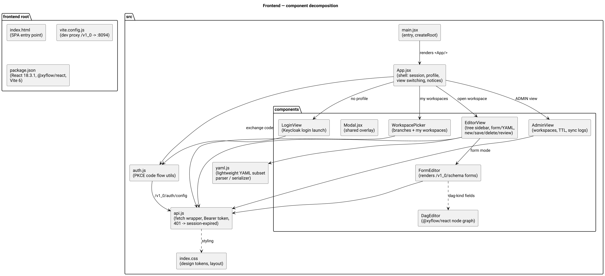
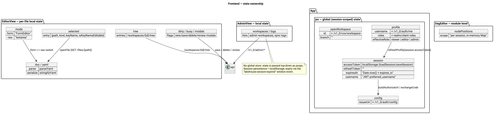
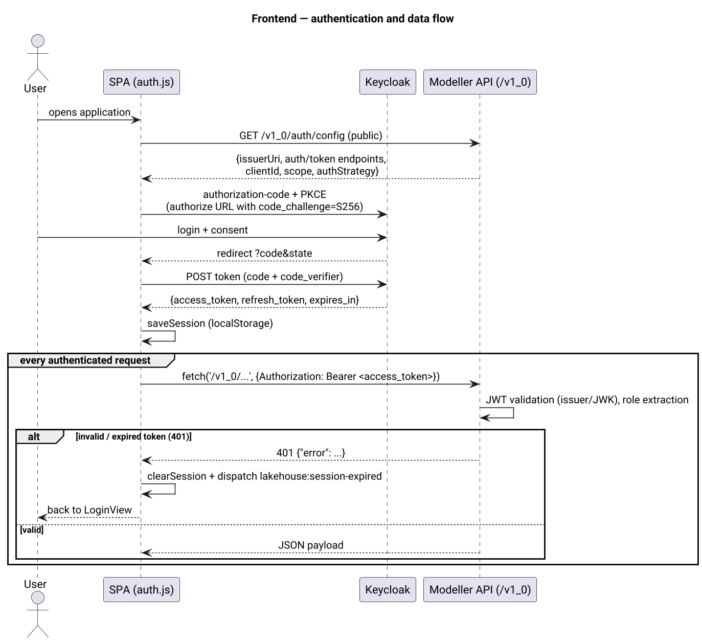

# Lakehouse UI Modeller — Frontend Architecture Review

> Commit-state audit of the React frontend located at
> `lakehouse-ui-modeller/src/main/resources/frontend`.
>
> Scope: `index.html`, `vite.config.js`, `package.json`, `src/` (JSX source,
> styles, API client, auth utilities, YAML subset helpers). Purpose:
> high-level understanding for the system architect and formulation of
> isolated feature tasks.
>
> Diagrams (PlantUML sources in `../diagrams/`):

| Diagram | File |
|---|---|
| Module architecture (backend + SPA) | `../diagrams/architecture.png` |
| Component decomposition | `../diagrams/frontend-components.png` |
| Authentication & data flow | `../diagrams/data-flow.png` |
| State ownership | `../diagrams/state-management.png` |

---

## 1. Architectural Approach & Patterns

The frontend is a **single-page application (SPA)** built with **React 18** and
bundled by **Vite**. The decomposition model is a **flat, component-based,
feature-oriented structure** — close in spirit to a lightweight
Feature-Sliced/Layered pattern without formal enforcement:

- **Root / app layer** — `main.jsx` (entry, `createRoot`) and `App.jsx`
  (shell: top bar, login/workspaces/editor/admin view switching, global
  session, profile, notices).
- **Feature top-level views** — one component per UI domain:
  `LoginView`, `WorkspacePicker`, `EditorView`, `AdminView`.
- **Shared infrastructure** — `api.js` (single network-access point),
  `auth.js` (OIDC/PKCE utilities), `yaml.js` (YAML subset parser/serializer),
  `index.css` (global styles + design tokens).
- **Editor internals** — `FormEditor` (schema-driven forms for the whole
  editable document), `DagEditor` (React Flow graphs for DAG-kind fields),
  `Modal` (shared overlay).

Key code-organization rules that guided the implementation:

1. **One component = one file** in `src/components/`, named after the UI
   concept.
2. **Single source of truth for I/O** — all HTTP access goes through
   `api.js`; components never call `fetch` directly (with the sole exception
   of the OIDC token endpoint inside `auth.js`).
3. **Separation of concerns** — transport/auth in `auth.js`, data access in
   `api.js`, YAML round-tripping in `yaml.js`, rendering + interaction in
   components, presentation in `index.css`.
4. **Props-down, state-up** — cross-view data flows top-down as props; there
   is no global store.
5. **Session persistence in `localStorage`** — the access/refresh tokens are
   stored under one key; expiry is propagated through a window event
   (`lakehouse:session-expired`).
6. **Dynamic, schema-driven editing** — the editor renders backend-provided
   form schemas (from `SchemaService`) instead of hard-coded field lists; DAG
   fields get a graph editor.

## 2. Project & Repository Structure

```
src/main/resources/frontend/
├── index.html                # SPA shell, single mount point
├── package.json              # React 18.3.1, @xyflow/react 12.11.2, Vite 6.4.3
├── vite.config.js            # build.outDir = ../static, dev proxy /v1_0 -> :8094
└── src/
    ├── main.jsx              # entry: ReactDOM.createRoot
    ├── App.jsx               # shell, view switching, session/profile, notices
    ├── api.js                # fetch wrapper (Bearer token, JSON, 401 handling)
    ├── auth.js               # Keycloak OIDC: authorize URL, code exchange, JWT decode
    ├── yaml.js               # lightweight YAML subset parser/serializer (form mode)
    ├── index.css             # design tokens + layout styling
    └── components/
        ├── LoginView.jsx     # login card, launches the Keycloak flow
        ├── WorkspacePicker.jsx  # branches, my workspaces, open/create workspace
        ├── EditorView.jsx    # workspace tree, form/raw YAML modes, new/save/delete/review
        ├── FormEditor.jsx    # generic schema-driven form renderer
        ├── DagEditor.jsx     # @xyflow/react graph editor for DAG-kind fields
        ├── Modal.jsx         # shared overlay dialog
        └── AdminView.jsx     # admin workspaces, cleanup TTL, sync logs
```



Responsibilities:

- `main.jsx` / `App.jsx` — bootstrap and application shell;
- `api.js` — the only backend transport (`/v1_0`), normalizes errors to
  `Error` with a message, triggers session expiry on 401;
- `auth.js` — SPA-native PKCE (no cookies, no server session): builds the
  authorization URL, exchanges the code for tokens, decodes the JWT to derive
  the profile/roles;
- `yaml.js` — parser/serializer for the YAML subset used in the metadata
  files (needed because the offline environment had no YAML library);
- `components/` — feature and shared components.

## 3. State Management

There is **no global store** (no Redux/Zustand/MobX). All state is React state
(`useState`), lifted to the level that needs it and passed down as props.

- **App-level global state** (`App.jsx`): `config` (OIDC parameters from
  `/v1_0/auth/config`), `session` (tokens, restored from `localStorage`),
  `profile` (user + effective role from `/v1_0/auth/me`), `openWorkspace`
  (currently edited workspace), `notice` (transient banner). From here the
  session is persisted/restored and the `lakehouse:session-expired` event is
  handled.
- **EditorView local state**: `schemas` (fetched once), `tree` (workspace file
  tree), `selected` (active file), `doc`/`yaml` (form object vs raw text),
  `mode` (form/raw), `dirty`, `busy`, and the modal flags (`newModal`,
  `reviewModal`, `deleteModal`).
- **FormEditor / DagEditor local state**: per-field values; the DAG editor
  additionally keeps node positions in a **module-level `Map`** so layout
  survives re-renders within the session.
- **AdminView local state**: admin workspaces, sync logs, TTL form.



## 4. Data Flow & API Integration

- **Network library**: the native **Fetch API** wrapped by `api.js`; there is
  no Axios/React Query/RTK Query.
- **Authentication**: OAuth 2.0 **authorization code + PKCE** against
  Keycloak done by the SPA (`auth.js`) — no server-side login, no cookies.
  The JWT is attached as `Authorization: Bearer <access_token>` on every
  request (unless the endpoint is public). On HTTP 401 `api.js` clears the
  session and dispatches `lakehouse:session-expired`, which takes the UI back
  to the login view.
- **Backend integration layer**: `api.js` + the public `/v1_0/auth/config`
  endpoint (issuer, auth/token endpoints, client id, scope). Components fetch
  data on mount or on user action; the editor refreshes the file tree after
  every create/save/delete.
- **Form schemas**: `EditorView` loads `/v1_0/schema` once; `FormEditor`
  renders fields of type `string|integer|double|boolean|datetime|map|object|list|dag`
  (the `dag` type is delegated to `DagEditor`, which edits nodes from a
  sibling list field and edges from a `dag`-typed field).



## 5. Component Layer & Styling

- **No component library / design system** — plain CSS (`index.css`) with CSS
  custom properties (design tokens), semantic class names, and utility-state
  classes such as `badge viewer|editor|admin`, `banner success|error`,
  `spinner`, `muted`, `primary`/`danger` buttons.
- **Reusability structure** — a practical component approach: shared
  primitives (`Modal`), a generic schema-driven editor (`FormEditor`), and
  feature components composed per view (`WorkspacePicker`, `EditorView`,
  `AdminView`, `DagEditor`). A "New file" and "Submit review" form are
  implemented as local modal components inside `EditorView`.
- **Graph rendering** uses `@xyflow/react` (React Flow v12) for the DAG-kind
  fields; positions are managed in-memory and not persisted to the file.

## 6. Routing & Navigation

There is **no router** (no React Router). View switching is **state-driven**
in `App.jsx`:

- no `profile` → `LoginView`;
- `profile` && no `openWorkspace` → `WorkspacePicker` (or `AdminView` tab for
  the ADMIN role);
- `profile` && `openWorkspace` → `EditorView`.

Navigation actions are plain state transitions: opening a workspace sets
`openWorkspace`, "Sign out" clears session/profile, "back" from the editor
clears `openWorkspace`. The only URL touches are the OIDC redirect callback
parsing and `window.history.replaceState` after code exchange. Protected views
are enforced client-side by the effective role and re-validated server-side by
the JWT resource server.

## 7. Build & Configuration Tools

- **Vite 6.4.3** + `@vitejs/plugin-react 4.7.0`. `vite.config.js`: base `/`,
  `build.outDir = ../static` (served by the Spring Boot jar),
  `emptyOutDir: true`, dev server on `:5173` proxying `/v1_0` to
  `http://localhost:8094`.
- **package.json** is pinned to exact versions (`react/react-dom 18.3.1`,
  `@xyflow/react 12.11.2`). Build scripts: `npm run dev`, `npm run build`.
- **No linter/formatter** configured (no ESLint/Prettier config) and **no
  TypeScript** — plain JSX modules.
- The backend ships the built frontend: Maven excludes `frontend/**` from
  resources, `static/**` is packaged into the jar's `BOOT-INF/classes/static`.

## 8. Architectural Recommendations (Technical Debt)

1. **No TypeScript, no tests, no linting for the frontend** — the codebase is
   plain JSX; introduce `tsc`/ESLint and a small Vitest coverage around
   `yaml.js`/`auth.js` (pure functions) and `api.js` before the editor grows.
2. **Custom YAML subset parser** (`yaml.js`) — hand-written, YAML-subset only.
   It serves the offline constraint, but semantically full docs (anchors,
   multi-line scalars, custom tags) are unsupported. Prefer a maintained YAML
   library as soon as the environment allows.
3. **Single `App.jsx` view switcher** — login/workspaces/editor/admin tabs are
   entangled in one component; introduce a router (React Router) or a
   use-case-selected view registry as views multiply.
4. **Session expiry is not graceful** — tokens are stored client-side without
   proactive refresh; a long-lived editor session can hit 401 mid-edit.
   Consider refresh-token renewal and autosave of the dirty document.
5. **`DagEditor` positions are not persisted** — module-level `Map`; acceptable
   for a session, but a "save layout" feature would require storing positions
   with the file (or a per-user preference).
6. **`encodePath` is a single call-site helper** — duplicated in several
   components; extract into a shared utility module.
7. **Backend-served schema is the only field source** — if `lakehouse-common`
   DTOs change, `SchemaService`/`ConfigKind` must be kept in sync; add a
   contract test asserting each kind resolves.
8. **No i18n** — UI strings are hard-coded English; the RU/EN documentation is
   maintained separately (see `doc/` and `doc-ru/`).