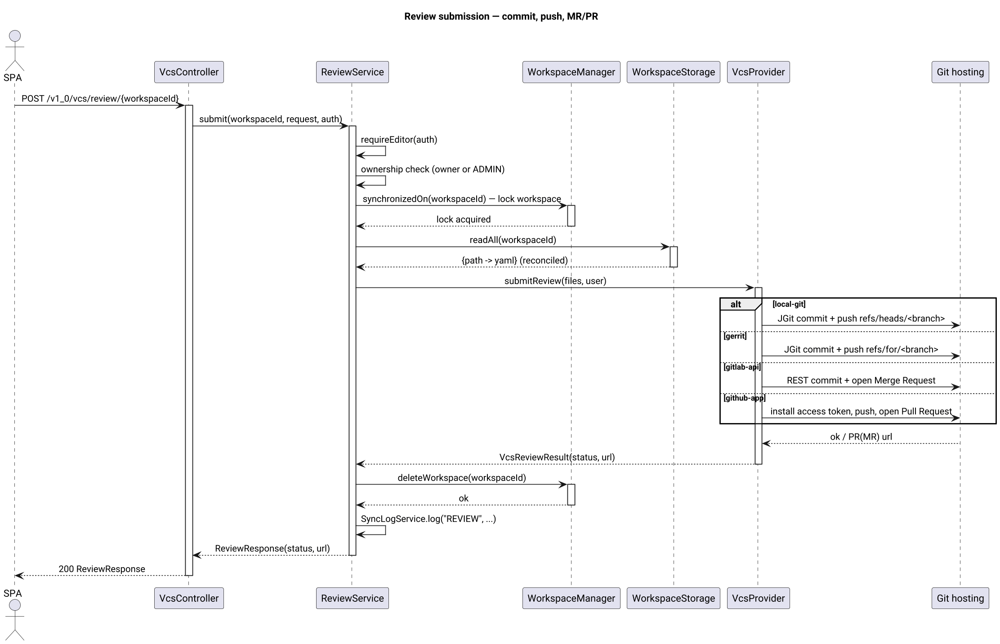
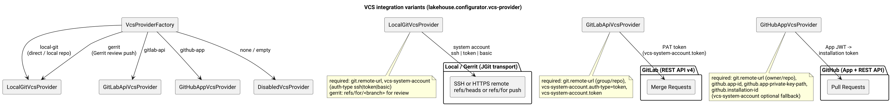

# Lakehouse UI Modeller (lakehouse-ui-modeller)

Сервис **Configurator**: редактор декларативных конфигураций lakehouse в формате YAML, ориентированный на воркспейсы. Предоставляет одностраничное React-приложение, backend на Spring Boot, который владеет серверными воркспейсами (загрузка/seed, редактирование, review/отправка), и интеграцию с VCS, которая возвращает изменения метаданных в центральный репозиторий.

## Обзор

`lakehouse-ui-modeller` — самостоятельный модуль. Сессия редактирования метаданных хранится на сервере (на каждую пару «пользователь × ветка»), а центральный Git-репозиторий является единственным источником истины: воркспейс — это рабочая копия ветки, а процедура review коммитит и пушит изменённые YAML-файлы обратно (напрямую или как Gerrit/GitLab/GitHub review-запрос).

Модуль состоит из двух частей:

- **backend** — приложение Spring Boot 4 / Jackson 3, которое отдаёт REST API `/v1_0`, управляет воркспейсами, хранилищем и учётными данными VCS, а также раздаёт статический фронтенд;
- **frontend** — одностраничное React 18 приложение (Vite, `@xyflow/react` для редактирования DAG), собираемое в `src/main/resources/static` и раздаваемое тем же сервисом.

Разделы UI:

- **Login** — OAuth 2.0 authorization code + PKCE против Keycloak (SPA).
- **Workspaces** — список веток, «мои воркспейсы», открытие/создание воркспейса на ветке.
- **Editor** — дерево файлов воркспейса (сгруппировано по видам конфигурации), редактор на **формах по схеме** и **редактор «сырого» YAML**, редактирование DAG для сценариев расписаний, удаление/сохранение.
- **Submit review** — коммит + push (+ MR/PR) текущего воркспейса с комментарием и сообщением коммита; при успехе воркспейс удаляется.
- **Admin** (роль ADMIN) — все воркспейсы, принудительное удаление, переопределение TTL очистки, просмотр журнала синхронизации.

## Архитектура

Backend устроен как декларативный «коммутатор»: каждая стратегия выбирается через одно дерево конфигурации `lakehouse.configurator.*` (см. *Конфигурация*). SPA аутентифицируется напрямую в Keycloak (PKCE), и каждый запрос `/v1_0` несёт Bearer JWT, проверяемый ресурс-сервером.


Ключевые части:

- **Controller** (`controller`) — тонкий REST-слой под `/v1_0`.
- **Services** (`service`) — `AuthService`, `VcsService` (координация воркспейсов/веток), `ReviewService`, `EditorService` (CRUD файлов + валидация YAML), `SchemaService` (генерация форм по рефлексии DTO `lakehouse-common`), `AdminWorkspaceService`, `SyncLogService` (кольцевой буфер в памяти).
- **Workspaces** (`workspace`) — серверные рабочие копии. Идентификатор воркспейса — `md5(username|branch)`; при первом открытии воркспейс наполняется содержимым ветки, отслеживается файлом метаданных `_workspace.json`, защищён по-воркспейсными блокировками (`WorkspaceLockedException` → HTTP 409) и удаляется сборщиком мусора после простоя TTL (задача выполняется каждые 5 минут).
- **Storage** (`storage`) — `WorkspaceStorage` с двумя взаимозаменяемыми реализациями: локальная файловая система POSIX и S3/MinIO (стриминг, без Git-архивов в памяти).
- **VCS** (`vcs`) — `VcsProviderFactory` создаёт ровно тот провайдер, что выбран конфигурацией: локальный Git / Gerrit поверх JGit, REST API GitLab v4, GitHub App или заглушку `none`. Все операции JGit выполняются на временных клонах.
- **Configuration** (`config`) — `ConfiguratorProperties` (`@ConfigurationProperties(prefix = "lakehouse.configurator")`, обнаруживается через `@ConfigurationPropertiesScan`), `ModellerConfiguration` (бины стратегий: хранилище, VCS, менеджер воркспейсов, сервисы, JWT-декодер, CORS) и `SecurityConfig` (безопасность без состояния, Bearer JWT).
- **Auth** (`auth`) — JWT → `UserContext` (username, имя, email, роли), матрица RBAC и вспомогательный класс обмена токенов Keycloak.

Жизненный цикл воркспейса:


Процедура отправки на review:



Фронтенд собирается с помощью Vite (каталог `frontend`); результат сборки попадает в `src/main/resources/static`. В dev-режиме Vite проксирует `/v1_0` на сервис (`vite.config.js`). Обзор архитектуры — в [`arch/architecture.md`](arch/architecture.md).

## Модули

### lakehouse-ui-modeller

Сам сервис (один Maven-модуль). Содержит:

- точку входа `ModellerApplication` (`@SpringBootApplication @ConfigurationPropertiesScan @EnableScheduling`);
- контроллеры (`controller`): `AuthController`, `VcsController`, `EditorController`, `SchemaController`, `AdminController`, `GlobalExceptionHandler`;
- сервисы (`service`): `AuthService`, `VcsService`, `ReviewService`, `EditorService`, `SchemaService`, `AdminWorkspaceService`, `SyncLogService`, `YamlEditorService`;
- коммутатор `ConfiguratorProperties`, бины `ModellerConfiguration` и `SecurityConfig`;
- DTO (`dto`) — `AuthConfigResponse`, `FileContentResponse`, `KindSchema`/`FieldSchema`, `WorkspaceResponse`, `TreeResponse`, `ReviewRequest`/`ReviewResponse`, `SaveFileRequest`, `CreateFileRequest`, `CreateBranchRequest`, `WorkspaceOpenRequest`, `CleanupTtlRequest`, `SyncLogResponse`, `UserProfileResponse`;
- воркспейсы, хранилище (локальное + S3), провайдеры VCS и слой авторизации (см. *Архитектура*);
- фронтенд (`src/main/resources/frontend`): React + Vite.

Зависит от `lakehouse-common` (DTO, используемые генератором схем/форм), `spring-boot-starter-web`, `spring-boot-starter-oauth2-client`, `spring-boot-starter-oauth2-resource-server`, Jackson 3 YAML (`tools.jackson`) и JGit (`org.eclipse.jgit`, `org.eclipse.jgit.ssh.apache`).

## API Endpoints

| Метод | Путь | Описание | Доступ |
|---|---|---|---|
| GET | `/v1_0/auth/config` | Параметры входа для SPA (issuer, auth/token endpoints, client id, scope, стратегия аутентификации) | публичный |
| GET | `/v1_0/auth/me` | Профиль аутентифицированного пользователя с эффективной ролью | пользователь |
| GET | `/v1_0/vcs/workspaces` | Воркспейсы текущего пользователя | пользователь |
| POST | `/v1_0/vcs/workspace` | Открыть (при необходимости создать + наполнить) воркспейс на ветке | пользователь |
| GET | `/v1_0/vcs/branches` | Список веток из VCS | пользователь |
| POST | `/v1_0/vcs/branch` | Создать ветку от базовой ветки | редактор |
| POST | `/v1_0/vcs/review/{workspaceId}` | Отправить воркспейс на review (коммит + push + MR/PR); при успехе воркспейс удаляется | редактор |
| GET | `/v1_0/workspaces/{workspaceId}/tree` | Дерево файлов воркспейса (path, kind, keyName) | пользователь |
| POST | `/v1_0/workspaces/{workspaceId}/files` | Создать файл метаданных (kind + keyName) | редактор |
| GET | `/v1_0/workspaces/{workspaceId}/files/{path}` | Прочитать файл метаданных (yaml, kind, keyName) | пользователь |
| PUT | `/v1_0/workspaces/{workspaceId}/files/{path}` | Сохранить файл метаданных (валидация YAML и пути) | редактор |
| DELETE | `/v1_0/workspaces/{workspaceId}/files/{path}` | Удалить файл метаданных | редактор |
| GET | `/v1_0/schema` | Схемы форм всех видов конфигураций | пользователь |
| GET | `/v1_0/schema/{kind}` | Схема формы одного вида конфигурации | пользователь |
| GET | `/v1_0/admin/workspaces` | Все воркспейсы | админ |
| DELETE | `/v1_0/admin/workspaces/{workspaceId}` | Принудительно удалить воркспейс | админ |
| GET | `/v1_0/admin/settings/cleanup-ttl-hours` | Текущий TTL простоя (часы) | админ |
| PUT | `/v1_0/admin/settings/cleanup-ttl-hours` | Переопределить TTL простоя (1..8760 часов) | админ |
| GET | `/v1_0/admin/sync-logs?limit=` | Последние записи журнала синхронизации/review | админ |

Редактируемые виды YAML (`kind:` → каталог репозитория, DTO):

`NameSpace` → `config/namespace` · `Driver` → `config/driver` · `DataSet` → `config/dataset` · `Schedule` → `config/schedule` · `MetricDQ` → `config/dq`.

## Конфигурация

Все параметры находятся в одном дереве `lakehouse.configurator.*` (`src/main/resources/application.yml`); каждое значение переопределяется переменной окружения (`LAKEHOUSE_*`) или аргументом командной строки `--lakehouse.configurator.*=`. Связывание декларативное, через `@ConfigurationPropertiesScan`, — сервис стартует только когда выбранные стратегии полностью сконфигурированы (например, отсутствие системной учётной записи останавливает запуск с явной ошибкой).

```yaml
server:
  port: 8093
spring:
  application:
    name: lakehouse-ui-modeller
  servlet:
    multipart:
      max-file-size: 10MB
      max-request-size: 10MB

lakehouse:
  configurator:
    storage:                                    # 1. хранилище воркспейсов
      type: ${LAKEHOUSE_WORKSPACE_STORAGE:local}  # [local, s3 (minio)]
      root-directory: ${LAKEHOUSE_WORKSPACE_ROOT:/tmp/lakehouse-workspaces}
      s3:
        endpoint: ${LAKEHOUSE_S3_ENDPOINT:}
        bucket: ${LAKEHOUSE_S3_BUCKET:lakehouse-metadata-workspaces}
        access-key: ${LAKEHOUSE_S3_ACCESS_KEY:}
        secret-key: ${LAKEHOUSE_S3_SECRET_KEY:}
        region: ${LAKEHOUSE_S3_REGION:us-east-1}
      cleanup-ttl-hours: ${LAKEHOUSE_WORKSPACE_TTL_HOURS:4}
    vcs-provider: ${LAKEHOUSE_VCS_PROVIDER:local-git}  # [local-git, gerrit, gitlab-api, github-app, none]
    git:
      remote-url: ${LAKEHOUSE_GIT_URL:}
      branch-main: ${LAKEHOUSE_GIT_BRANCH:main}
    auth-strategy: ${LAKEHOUSE_AUTH_STRATEGY:jwt-rbac} # [jwt-rbac, token-exchange]
    security:
      oauth2:
        client:
          registration:
            lakehouse:                          # SPA-клиент auth-code (PKCE)
              client-id: ${lakehouse-ui-modeller.client-id:lakehouse-ui-modeller}
              client-secret: ${lakehouse-ui-modeller.client-secret:}
              scope: ${LAKEHOUSE_OAUTH_SCOPE:openid,profile,email}
        resourceserver:
          jwt:
            issuer-uri: ${LAKEHOUSE_ISSUER_URI:}
            jwk-set-uri: ${LAKEHOUSE_JWKS_URI:}
    vcs-system-account:                         # техническая учётная запись для VCS
      auth-type: ${LAKEHOUSE_VCS_AUTH_TYPE:token} # [ssh, token, basic]
      ssh-private-key-path: ${LAKEHOUSE_VCS_SSH_KEY_PATH:}
      username: ${LAKEHOUSE_VCS_USER:}
      token: ${LAKEHOUSE_VCS_TOKEN:}
      password: ${LAKEHOUSE_VCS_PASSWORD:}
    github:                                     # используется при vcs-provider == github-app
      app-id: ${LAKEHOUSE_GITHUB_APP_ID:}
      app-private-key-path: ${LAKEHOUSE_GITHUB_APP_KEY_PATH:}
      installation-id: ${LAKEHOUSE_GITHUB_INSTALLATION_ID:}
    logging:
      sync-log-capacity: ${LAKEHOUSE_SYNC_LOG_CAPACITY:500}
```

### Примеры параметров подключения для каждого Git-провайдера

Провайдер выбирается параметром `vcs-provider` (см. также [Варианты интеграции VCS](diagrams/vcs-variants.png)):



**1. Локальный Git-репозиторий** (`local-git`) — транспорт JGit, push в `refs/heads/<ветка>`.

```bash
java -jar lakehouse-ui-modeller.jar \
  --lakehouse.configurator.vcs-provider=local-git \
  --lakehouse.configurator.git.remote-url=/srv/git/lakehouse-metadata.git \
  --lakehouse.configurator.git.branch-main=main \
  --lakehouse.configurator.auth-strategy=jwt-rbac \
  --lakehouse.configurator.vcs-system-account.auth-type=token \
  --lakehouse.configurator.vcs-system-account.token=<git-pat-или-oauth2-token> \
  --lakehouse.configurator.vcs-system-account.username=<пользователь> \
  --lakehouse.configurator.security.oauth2.resourceserver.jwt.issuer-uri=http://localhost:8080/realms/lakehouse
```

Или через переменные окружения:

```bash
LAKEHOUSE_VCS_PROVIDER=local-git \
LAKEHOUSE_GIT_URL=/srv/git/lakehouse-metadata.git \
LAKEHOUSE_GIT_BRANCH=main \
LAKEHOUSE_VCS_AUTH_TYPE=token \
LAKEHOUSE_VCS_TOKEN=<git-pat-или-oauth2-token> \
LAKEHOUSE_VCS_USER=<пользователь> \
LAKEHOUSE_ISSUER_URI=http://localhost:8080/realms/lakehouse \
java -jar lakehouse-ui-modeller.jar
```

**2. Gerrit по SSH** (`gerrit`) — JGit + Apache SSHD, push в `refs/for/<ветка>` (URL review формируется при push).

```bash
LAKEHOUSE_VCS_PROVIDER=gerrit \
LAKEHOUSE_GIT_URL=ssh://git@gerrit.example.com:29418/lakehouse-metadata.git \
LAKEHOUSE_GIT_BRANCH=main \
LAKEHOUSE_VCS_AUTH_TYPE=ssh \
LAKEHOUSE_VCS_SSH_KEY_PATH=/etc/lakehouse/modeller-bot-rsa \
LAKEHOUSE_VCS_USER=modeller-bot \
LAKEHOUSE_ISSUER_URI=http://localhost:8080/realms/lakehouse \
java -jar lakehouse-ui-modeller.jar
```

> Примечание: для `auth-type: ssh` файл ключа должен содержать приватный ключ в **формате OpenSSH** (Apache Mina SSHD); используется только аутентификация `publickey`.

**3. GitLab** (`gitlab-api`) — REST API GitLab v4. Проект (`group/repo`) и origin разбираются из `git.remote-url`; файлы коммитятся системной учётной записью, а завершение review открывает **merge request**.

```bash
LAKEHOUSE_VCS_PROVIDER=gitlab-api \
LAKEHOUSE_GIT_URL=https://gitlab.example.com/data/lakehouse-metadata.git \
LAKEHOUSE_GIT_BRANCH=main \
LAKEHOUSE_VCS_AUTH_TYPE=token \
LAKEHOUSE_VCS_TOKEN=<gitlab-pat-или-oauth2-token> \
LAKEHOUSE_VCS_USER=<пользователь-gitlab> \
LAKEHOUSE_ISSUER_URI=http://localhost:8080/realms/lakehouse \
java -jar lakehouse-ui-modeller.jar
```

**4. GitHub App** (`github-app`) — сервис формирует кратковременный **App JWT** из приватного ключа, обменивает его на **installation access token** (имя пользователя при push — `x-access-token`) и после review открывает **pull request**. В `git.remote-url` должен присутствовать `owner/repo` на `github.com`.

```bash
LAKEHOUSE_VCS_PROVIDER=github-app \
LAKEHOUSE_GIT_URL=git@github.com:data/lakehouse-metadata.git \
LAKEHOUSE_GIT_BRANCH=main \
LAKEHOUSE_GITHUB_APP_ID=123456 \
LAKEHOUSE_GITHUB_APP_KEY_PATH=/etc/lakehouse/github-app.private-key.pem \
LAKEHOUSE_GITHUB_INSTALLATION_ID=654321 \
LAKEHOUSE_ISSUER_URI=http://localhost:8080/realms/lakehouse \
java -jar lakehouse-ui-modeller.jar
```

> Необязательный запасной вариант для путей чтения/клонирования: настройте также `vcs-system-account` (token/basic/ssh).

**5. Отключено** (`none`) — операции с репозиторием недоступны; каждый VCS-эндпоинт возвращает понятное сообщение.

Каждый вариант требует доступный Keycloak (если `auth-strategy=jwt-rbac`) с настроенным `issuer-uri` (и, при необходимости, `jwk-set-uri`), а также выбранное хранилище воркспейсов (`local` или `s3`).

### Справочник параметров

| Параметр / env | По умолчанию | Описание |
|---|---|---|
| `server.port` | `8093` | Порт сервиса |
| `storage.type` / `LAKEHOUSE_WORKSPACE_STORAGE` | `local` | Хранилище воркспейсов: `local`, `filesystem` или `s3`/`minio` |
| `storage.root-directory` / `LAKEHOUSE_WORKSPACE_ROOT` | `/tmp/lakehouse-workspaces` | Корень локальной ФС (`<root>/workspaces/<id>`) |
| `storage.s3.*` / `LAKEHOUSE_S3_*` | — | S3/MinIO endpoint, bucket, ключи, region |
| `storage.cleanup-ttl-hours` / `LAKEHOUSE_WORKSPACE_TTL_HOURS` | `4` | Время простоя воркспейса до удаления |
| `vcs-provider` / `LAKEHOUSE_VCS_PROVIDER` | `local-git` | `local-git` \| `gerrit` \| `gitlab-api` \| `github-app` \| `none` |
| `git.remote-url` / `LAKEHOUSE_GIT_URL` | — | Центральный репозиторий (локальный путь, ssh:// или https://) |
| `git.branch-main` / `LAKEHOUSE_GIT_BRANCH` | `main` | Ветка по умолчанию |
| `auth-strategy` / `LAKEHOUSE_AUTH_STRATEGY` | `jwt-rbac` | `jwt-rbac` \| `token-exchange` |
| `security.oauth2.client.registration.lakehouse.client-id` (CLI `--lakehouse-ui-modeller.client-id`) | `lakehouse-ui-modeller` | Публичный/конфиденциальный SPA-клиент Keycloak |
| `security.oauth2.client.registration.lakehouse.client-secret` (CLI `--lakehouse-ui-modeller.client-secret`) | — | Секрет клиента (если клиент конфиденциальный) |
| `security.oauth2.client.registration.lakehouse.scope` / `LAKEHOUSE_OAUTH_SCOPE` | `openid,profile,email` | Запрашиваемые scope |
| `security.oauth2.resourceserver.jwt.issuer-uri` / `LAKEHOUSE_ISSUER_URI` | — | URL realm Keycloak |
| `security.oauth2.resourceserver.jwt.jwk-set-uri` / `LAKEHOUSE_JWKS_URI` | issuer + `/protocol/openid-connect/certs` | JWKS-эндпоинт |
| `vcs-system-account.auth-type` / `LAKEHOUSE_VCS_AUTH_TYPE` | `token` | `ssh` \| `token` \| `basic` |
| `vcs-system-account.ssh-private-key-path` / `LAKEHOUSE_VCS_SSH_KEY_PATH` | — | Путь к приватному ключу OpenSSH (auth-type `ssh`) |
| `vcs-system-account.username` / `LAKEHOUSE_VCS_USER` | — | Пользователь Git / GitLab (token) / HTTPS (basic) |
| `vcs-system-account.token` / `LAKEHOUSE_VCS_TOKEN` | — | PAT / OAuth2-токен (auth-type `token`) |
| `vcs-system-account.password` / `LAKEHOUSE_VCS_PASSWORD` | — | Пароль HTTPS (auth-type `basic`) |
| `github.app-id` / `LAKEHOUSE_GITHUB_APP_ID` | — | Идентификатор GitHub App |
| `github.app-private-key-path` / `LAKEHOUSE_GITHUB_APP_KEY_PATH` | — | Приватный ключ GitHub App (PEM) |
| `github.installation-id` / `LAKEHOUSE_GITHUB_INSTALLATION_ID` | — | Идентификатор установки GitHub App |
| `logging.sync-log-capacity` / `LAKEHOUSE_SYNC_LOG_CAPACITY` | `500` | Ёмкость кольцевого буфера журнала синхронизации |
| `LAKEHOUSE_TOKEX_AUDIENCE` | `account` | Audience для token-exchange (auth-strategy `token-exchange`) |

## Безопасность

Безопасность без состояния на основе Bearer-токенов: SPA аутентифицируется напрямую в Keycloak по OAuth 2.0 **authorization code + PKCE** (`auth.js`). Spring Security проверяет Bearer JWT на каждом запросе (`oauth2ResourceServer`); сессии и CSRF отключены, CORS разрешён для origin SPA. Роли читаются из JWT (`realm_access.roles` / роли клиента) и приводятся к матрице RBAC:

- `LAKEHOUSE_MODELLER_VIEWER` — чтение (дерево, файлы, ветки, схемы);
- `LAKEHOUSE_MODELLER_EDITOR` — изменения (создание/сохранение/удаление файлов, создание ветки, отправка на review);
- `LAKEHOUSE_MODELLER_ADMIN` — администрирование (все воркспейсы, принудительное удаление, переопределение TTL, журнал).

Устаревшие псевдонимы `LAKEHOUSE_CONFIG_VIEWER` / `LAKEHOUSE_CONFIG_EDITOR` также принимаются. Без роли modeller API отвечает `403`.

Публичные пути (JWT не требуется): `/`, `/index.html`, `/assets/**`, `/favicon.ico`, `/vite.svg`, `/manifest.json`, `/robots.txt`, `/v1_0/auth/config`, а также любые корневые `*.css`/`*.js`/`*.png`/`*.jpg`/`*.svg`.

При `auth-strategy: token-exchange` backend дополнительно обменивает токен пользователя Keycloak (через `urn:ietf:params:oauth:grant-type:token-exchange`) на токен целевого Git-провайдера; обменённые токены кратко кэшируются на пользователя.

### Требуемая настройка Keycloak

| Пункт | Значение |
|---|---|
| Realm | `lakehouse` |
| SPA-клиент | `lakehouse-ui-modeller` (публичный, PKCE); redirect `{ui_origin}`, web origin `{ui_origin}` |
| JWK для ресурс-сервера | из `LAKEHOUSE_ISSUER_URI` (issuer должен быть доступен backend'у) |
| Realm/client роли | `LAKEHOUSE_MODELLER_VIEWER` (`LAKEHOUSE_CONFIG_VIEWER`), `LAKEHOUSE_MODELLER_EDITOR` (`LAKEHOUSE_CONFIG_EDITOR`), `LAKEHOUSE_MODELLER_ADMIN` |

## Разработка

- Сборка backend: `mvn -o -q -pl lakehouse-ui-modeller -am clean package` (добавьте `-DskipTests`, чтобы пропустить тесты).
- Сборка фронтенда: `cd src/main/resources/frontend && npm install && npm run build` (результат → `src/main/resources/static`).
- Dev-режим: `npm run dev` запускает Vite на `:5173` и проксирует `/v1_0` в `http://localhost:8094`.
- Smoke-запуск: поднимите jar с настроенной системной учётной записью и Keycloak, затем проверьте `/` (200), `/v1_0/auth/config` (200) и защищённый эндпоинт без токена (401).