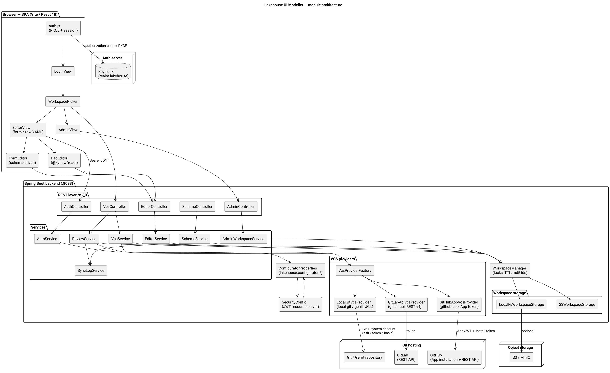
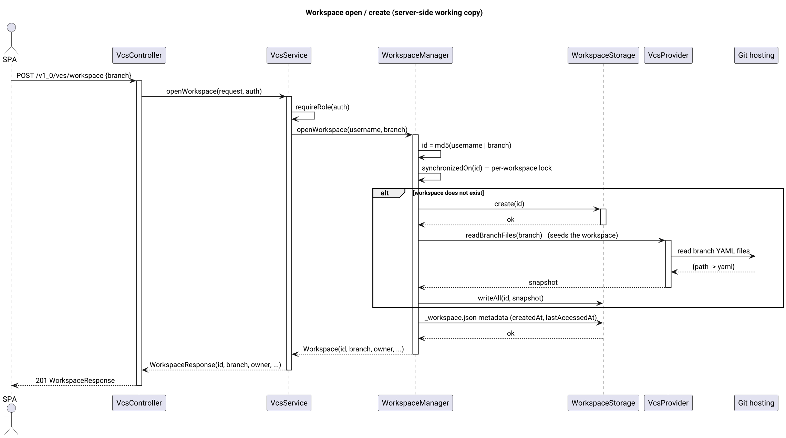

# Lakehouse UI Modeller (lakehouse-ui-modeller)

The **Configurator** service: a workspace-centric **YAML metadata editor** for declarative lakehouse configurations. It provides a single-page React application, a Spring Boot backend that owns the server-side workspaces (checkout/seed, edit, review/submit), and the VCS integration that pushes metadata changes to the central repository.

## Overview

`lakehouse-ui-modeller` is a self-contained module. It holds the metadata edit session server-side (per user per branch) and treats the central Git repository as the single source of truth: a workspace is a working copy of a branch, the review flow commits and pushes the changed YAML files back (directly, or as a Gerrit/GitLab/GitHub review request).

The module consists of two parts:

- **backend** — a Spring Boot 4 / Jackson 3 application that exposes the `/v1_0` REST API, manages workspaces, storage and VCS credentials, and serves the static frontend;
- **frontend** — a single-page React 18 application (Vite, `@xyflow/react` for DAG editing) built into `src/main/resources/static` and served by the same service.

UI sections:

- **Login** — Keycloak OAuth 2.0 authorization code + PKCE flow (SPA).
- **Workspaces** — branch list, "my workspaces", open/create a workspace on a branch.
- **Editor** — the workspace file tree (grouped by configuration kind), schema-driven **form editor** and **raw YAML editor**, DAG editing for schedule scenarios, delete/save.
- **Submit review** — commit + push (+ MR/PR) of the current workspace with a comment and commit message; on success the workspace is deleted.
- **Admin** (ADMIN role) — all workspaces, force delete, clean-up TTL override, sync log viewer.

## Architecture

The backend is a declarative "switchboard": every runtime strategy is selected through one
`lakehouse.configurator.*` configuration tree (see *Configuration*). The SPA authenticates directly
against Keycloak (PKCE), and every `/v1_0` request carries a Bearer JWT validated by the resource
server.



Key pieces:

- **Controllers** (`controller`) — thin REST layer under `/v1_0`.
- **Services** (`service`) — `AuthService`, `VcsService` (workspace/branch coordination), `ReviewService`, `EditorService` (file CRUD + YAML validation), `SchemaService` (reflection-driven form schemas from `lakehouse-common` DTOs), `AdminWorkspaceService`, `SyncLogService` (in-memory ring buffer).
- **Workspaces** (`workspace`) — server-side working copies. A workspace id is `md5(username|branch)`; it is seeded from the branch on first open, tracked by a `_workspace.json` metadata file, guarded by per-workspace locks (`WorkspaceLockedException` → HTTP 409) and garbage-collected after an idle TTL (clean-up task runs every 5 minutes).
- **Storage** (`storage`) — `WorkspaceStorage` with two interchangeable backends: local POSIX filesystem and S3/MinIO (streaming, no Git archives in RAM).
- **VCS** (`vcs`) — `VcsProviderFactory` builds exactly the configured provider: local Git / Gerrit over JGit, GitLab REST API v4, GitHub App, or a disabled stub. All JGit operations run against transient clones.
- **Configuration** (`config`) — `ConfiguratorProperties` (`@ConfigurationProperties(prefix = "lakehouse.configurator")`, discovered via `@ConfigurationPropertiesScan`), `ModellerConfiguration` (strategy beans: storage, VCS, workspace manager, services, JWT decoder, CORS) and `SecurityConfig` (stateless bearer-token security).
- **Auth** (`auth`) — JWT → `UserContext` (username, name, email, roles), RBAC matrix, and the optional Keycloak token-exchange helper.

Workspace lifecycle:



Review submission flow:


The frontend is built with Vite (the `frontend` directory); the build output goes to `src/main/resources/static`. In dev mode Vite proxies `/v1_0` to the service (`vite.config.js`). See the architecture review in [`arch/architecture.md`](arch/architecture.md).

## Modules

### lakehouse-ui-modeller

The service itself (one Maven module). Contains:

- the entry point `ModellerApplication` (`@SpringBootApplication @ConfigurationPropertiesScan @EnableScheduling`);
- controllers (`controller`): `AuthController`, `VcsController`, `EditorController`, `SchemaController`, `AdminController`, `GlobalExceptionHandler`;
- services (`service`): `AuthService`, `VcsService`, `ReviewService`, `EditorService`, `SchemaService`, `AdminWorkspaceService`, `SyncLogService`, `YamlEditorService`;
- the `ConfiguratorProperties` switchboard, `ModellerConfiguration` beans and `SecurityConfig`;
- DTOs (`dto`) — `AuthConfigResponse`, `FileContentResponse`, `KindSchema`/`FieldSchema`, `WorkspaceResponse`, `TreeResponse`, `ReviewRequest`/`ReviewResponse`, `SaveFileRequest`, `CreateFileRequest`, `CreateBranchRequest`, `WorkspaceOpenRequest`, `CleanupTtlRequest`, `SyncLogResponse`, `UserProfileResponse`;
- workspaces, storage (local + S3), VCS providers and the auth layer (see *Architecture*);
- the frontend (`src/main/resources/frontend`): React + Vite.

Depends on `lakehouse-common` (DTO classes used by the schema/form generator), `spring-boot-starter-web`, `spring-boot-starter-oauth2-client`, `spring-boot-starter-oauth2-resource-server`, Jackson 3 YAML (`tools.jackson`) and JGit (`org.eclipse.jgit`, `org.eclipse.jgit.ssh.apache`).

## API Endpoints

| Method | Path | Description | Access |
|---|---|---|---|
| GET | `/v1_0/auth/config` | OIDC login parameters for the SPA (issuer, auth/token endpoints, client id, scope, auth strategy) | public |
| GET | `/v1_0/auth/me` | Profile of the authenticated user incl. effective role | user |
| GET | `/v1_0/vcs/workspaces` | Workspaces of the current user | user |
| POST | `/v1_0/vcs/workspace` | Open (create + seed if needed) a workspace on a branch | user |
| GET | `/v1_0/vcs/branches` | Branch list from the VCS | user |
| POST | `/v1_0/vcs/branch` | Create a branch from a base branch | editor |
| POST | `/v1_0/vcs/review/{workspaceId}` | Submit the workspace as a review (commit + push + MR/PR); deletes the workspace on success | editor |
| GET | `/v1_0/workspaces/{workspaceId}/tree` | File tree of a workspace (path, kind, keyName) | user |
| POST | `/v1_0/workspaces/{workspaceId}/files` | Create a metadata file (kind + keyName) | editor |
| GET | `/v1_0/workspaces/{workspaceId}/files/{path}` | Read a metadata file (yaml, kind, keyName) | user |
| PUT | `/v1_0/workspaces/{workspaceId}/files/{path}` | Save a metadata file (validates YAML + path) | editor |
| DELETE | `/v1_0/workspaces/{workspaceId}/files/{path}` | Delete a metadata file | editor |
| GET | `/v1_0/schema` | Form schemas of all configuration kinds | user |
| GET | `/v1_0/schema/{kind}` | Form schema of one configuration kind | user |
| GET | `/v1_0/admin/workspaces` | All workspaces | admin |
| DELETE | `/v1_0/admin/workspaces/{workspaceId}` | Force-delete a workspace | admin |
| GET | `/v1_0/admin/settings/cleanup-ttl-hours` | Current idle TTL (hours) | admin |
| PUT | `/v1_0/admin/settings/cleanup-ttl-hours` | Override idle TTL (1..8760 hours) | admin |
| GET | `/v1_0/admin/sync-logs?limit=` | Latest sync/review log entries | admin |

Editable YAML kinds (`kind:` value → repository directory, DTO):

`NameSpace` → `config/namespace` · `Driver` → `config/driver` · `DataSet` → `config/dataset` · `Schedule` → `config/schedule` · `MetricDQ` → `config/dq`.

## Configuration

All parameters live in a single `lakehouse.configurator.*` tree (`src/main/resources/application.yml`), every value overridable with an environment variable (`LAKEHOUSE_*`) or a `--lakehouse.configurator.*=` command-line argument. Binding is declarative via `@ConfigurationPropertiesScan` — the service boots only when the selected strategies are fully configured (a missing system account, for example, fails fast at startup).

```yaml
server:
  port: 8093
spring:
  application:
    name: lakehouse-ui-modeller
  servlet:
    multipart:
      max-file-size: 10MB
      max-request-size: 10MB

lakehouse:
  configurator:
    storage:                                    # 1. workspace storage backend
      type: ${LAKEHOUSE_WORKSPACE_STORAGE:local}  # [local, s3 (minio)]
      root-directory: ${LAKEHOUSE_WORKSPACE_ROOT:/tmp/lakehouse-workspaces}
      s3:
        endpoint: ${LAKEHOUSE_S3_ENDPOINT:}
        bucket: ${LAKEHOUSE_S3_BUCKET:lakehouse-metadata-workspaces}
        access-key: ${LAKEHOUSE_S3_ACCESS_KEY:}
        secret-key: ${LAKEHOUSE_S3_SECRET_KEY:}
        region: ${LAKEHOUSE_S3_REGION:us-east-1}
      cleanup-ttl-hours: ${LAKEHOUSE_WORKSPACE_TTL_HOURS:4}
    vcs-provider: ${LAKEHOUSE_VCS_PROVIDER:local-git}  # [local-git, gerrit, gitlab-api, github-app, none]
    git:
      remote-url: ${LAKEHOUSE_GIT_URL:}
      branch-main: ${LAKEHOUSE_GIT_BRANCH:main}
    auth-strategy: ${LAKEHOUSE_AUTH_STRATEGY:jwt-rbac} # [jwt-rbac, token-exchange]
    security:
      oauth2:
        client:
          registration:
            lakehouse:                          # SPA auth-code (PKCE) client
              client-id: ${lakehouse-ui-modeller.client-id:lakehouse-ui-modeller}
              client-secret: ${lakehouse-ui-modeller.client-secret:}
              scope: ${LAKEHOUSE_OAUTH_SCOPE:openid,profile,email}
        resourceserver:
          jwt:
            issuer-uri: ${LAKEHOUSE_ISSUER_URI:}
            jwk-set-uri: ${LAKEHOUSE_JWKS_URI:}
    vcs-system-account:                         # technical account used for VCS I/O
      auth-type: ${LAKEHOUSE_VCS_AUTH_TYPE:token} # [ssh, token, basic]
      ssh-private-key-path: ${LAKEHOUSE_VCS_SSH_KEY_PATH:}
      username: ${LAKEHOUSE_VCS_USER:}
      token: ${LAKEHOUSE_VCS_TOKEN:}
      password: ${LAKEHOUSE_VCS_PASSWORD:}
    github:                                     # used when vcs-provider == github-app
      app-id: ${LAKEHOUSE_GITHUB_APP_ID:}
      app-private-key-path: ${LAKEHOUSE_GITHUB_APP_KEY_PATH:}
      installation-id: ${LAKEHOUSE_GITHUB_INSTALLATION_ID:}
    logging:
      sync-log-capacity: ${LAKEHOUSE_SYNC_LOG_CAPACITY:500}
```

### Connection examples for each Git provider

The provider is selected by `vcs-provider` (see also [VCS integration variants](diagrams/vcs-variants.png)):


**1. Local Git repository** (`local-git`) — JGit transport, push to `refs/heads/<branch>`.

```bash
java -jar lakehouse-ui-modeller.jar \
  --lakehouse.configurator.vcs-provider=local-git \
  --lakehouse.configurator.git.remote-url=/srv/git/lakehouse-metadata.git \
  --lakehouse.configurator.git.branch-main=main \
  --lakehouse.configurator.auth-strategy=jwt-rbac \
  --lakehouse.configurator.vcs-system-account.auth-type=token \
  --lakehouse.configurator.vcs-system-account.token=<git-pat-or-oauth2-token> \
  --lakehouse.configurator.vcs-system-account.username=<user> \
  --lakehouse.configurator.security.oauth2.resourceserver.jwt.issuer-uri=http://localhost:8080/realms/lakehouse
```

Or via environment:

```bash
LAKEHOUSE_VCS_PROVIDER=local-git \
LAKEHOUSE_GIT_URL=/srv/git/lakehouse-metadata.git \
LAKEHOUSE_GIT_BRANCH=main \
LAKEHOUSE_VCS_AUTH_TYPE=token \
LAKEHOUSE_VCS_TOKEN=<git-pat-or-oauth2-token> \
LAKEHOUSE_VCS_USER=<user> \
LAKEHOUSE_ISSUER_URI=http://localhost:8080/realms/lakehouse \
java -jar lakehouse-ui-modeller.jar
```

**2. Gerrit over SSH** (`gerrit`) — JGit + Apache SSHD, push to `refs/for/<branch>` (review url set on the push).

```bash
LAKEHOUSE_VCS_PROVIDER=gerrit \
LAKEHOUSE_GIT_URL=ssh://git@gerrit.example.com:29418/lakehouse-metadata.git \
LAKEHOUSE_GIT_BRANCH=main \
LAKEHOUSE_VCS_AUTH_TYPE=ssh \
LAKEHOUSE_VCS_SSH_KEY_PATH=/etc/lakehouse/modeller-bot-rsa \
LAKEHOUSE_VCS_USER=modeller-bot \
LAKEHOUSE_ISSUER_URI=http://localhost:8080/realms/lakehouse \
java -jar lakehouse-ui-modeller.jar
```

> Note: for `ssh` auth type the key file must contain an **OpenSSH-format private key** (Apache Mina SSHD); only `publickey` authentication is used.

**3. GitLab** (`gitlab-api`) — GitLab REST API v4. The project (`group/repo`) and origin are parsed from `git.remote-url`; files are committed with the system account and review completion opens a **merge request**.

```bash
LAKEHOUSE_VCS_PROVIDER=gitlab-api \
LAKEHOUSE_GIT_URL=https://gitlab.example.com/data/lakehouse-metadata.git \
LAKEHOUSE_GIT_BRANCH=main \
LAKEHOUSE_VCS_AUTH_TYPE=token \
LAKEHOUSE_VCS_TOKEN=<gitlab-pat-or-oauth2-token> \
LAKEHOUSE_VCS_USER=<gitlab-user> \
LAKEHOUSE_ISSUER_URI=http://localhost:8080/realms/lakehouse \
java -jar lakehouse-ui-modeller.jar
```

**4. GitHub App** (`github-app`) — the service builds a short-lived **App JWT** from the private key, exchanges it for an **installation access token** (push username `x-access-token`), and opens a **pull request** after review. `git.remote-url` must contain `owner/repo` on `github.com`.

```bash
LAKEHOUSE_VCS_PROVIDER=github-app \
LAKEHOUSE_GIT_URL=git@github.com:data/lakehouse-metadata.git \
LAKEHOUSE_GIT_BRANCH=main \
LAKEHOUSE_GITHUB_APP_ID=123456 \
LAKEHOUSE_GITHUB_APP_KEY_PATH=/etc/lakehouse/github-app.private-key.pem \
LAKEHOUSE_GITHUB_INSTALLATION_ID=654321 \
LAKEHOUSE_ISSUER_URI=http://localhost:8080/realms/lakehouse \
java -jar lakehouse-ui-modeller.jar
```

> Optional fallback for the read/clone paths: configure `vcs-system-account` (token/basic/ssh) as well.

**5. Disabled** (`none`) — repository operations are unavailable; every VCS endpoint reports a clear message.

Each variant requires a reachable Keycloak (if `auth-strategy=jwt-rbac`) with the `issuer-uri` (and optionally `jwk-set-uri`) configured, plus the storage backend of your choice (`local` or `s3`).

### Parameter reference

| Parameter / env | Default | Description |
|---|---|---|
| `server.port` | `8093` | Service port |
| `storage.type` / `LAKEHOUSE_WORKSPACE_STORAGE` | `local` | Workspace storage: `local`, `filesystem` or `s3`/`minio` |
| `storage.root-directory` / `LAKEHOUSE_WORKSPACE_ROOT` | `/tmp/lakehouse-workspaces` | Local FS root (`<root>/workspaces/<id>`) |
| `storage.s3.*` / `LAKEHOUSE_S3_*` | — | S3/MinIO endpoint, bucket, credentials, region |
| `storage.cleanup-ttl-hours` / `LAKEHOUSE_WORKSPACE_TTL_HOURS` | `4` | Idle lifetime of an inactive workspace |
| `vcs-provider` / `LAKEHOUSE_VCS_PROVIDER` | `local-git` | `local-git` \| `gerrit` \| `gitlab-api` \| `github-app` \| `none` |
| `git.remote-url` / `LAKEHOUSE_GIT_URL` | — | Central repository (local path, ssh:// or https://) |
| `git.branch-main` / `LAKEHOUSE_GIT_BRANCH` | `main` | Default/main branch |
| `auth-strategy` / `LAKEHOUSE_AUTH_STRATEGY` | `jwt-rbac` | `jwt-rbac` \| `token-exchange` |
| `security.oauth2.client.registration.lakehouse.client-id` (CLI `--lakehouse-ui-modeller.client-id`) | `lakehouse-ui-modeller` | Keycloak public/confidential SPA client |
| `security.oauth2.client.registration.lakehouse.client-secret` (CLI `--lakehouse-ui-modeller.client-secret`) | — | Client secret (when a confidential client is used) |
| `security.oauth2.client.registration.lakehouse.scope` / `LAKEHOUSE_OAUTH_SCOPE` | `openid,profile,email` | Requested scopes |
| `security.oauth2.resourceserver.jwt.issuer-uri` / `LAKEHOUSE_ISSUER_URI` | — | Keycloak realm URL |
| `security.oauth2.resourceserver.jwt.jwk-set-uri` / `LAKEHOUSE_JWKS_URI` | issuer + `/protocol/openid-connect/certs` | JWKS endpoint |
| `vcs-system-account.auth-type` / `LAKEHOUSE_VCS_AUTH_TYPE` | `token` | `ssh` \| `token` \| `basic` |
| `vcs-system-account.ssh-private-key-path` / `LAKEHOUSE_VCS_SSH_KEY_PATH` | — | OpenSSH private key path (auth-type `ssh`) |
| `vcs-system-account.username` / `LAKEHOUSE_VCS_USER` | — | Git user / GitLab user (token) / HTTPS user (basic) |
| `vcs-system-account.token` / `LAKEHOUSE_VCS_TOKEN` | — | PAT / OAuth2 token (auth-type `token`) |
| `vcs-system-account.password` / `LAKEHOUSE_VCS_PASSWORD` | — | HTTPS password (auth-type `basic`) |
| `github.app-id` / `LAKEHOUSE_GITHUB_APP_ID` | — | GitHub App id |
| `github.app-private-key-path` / `LAKEHOUSE_GITHUB_APP_KEY_PATH` | — | GitHub App private key (PEM) |
| `github.installation-id` / `LAKEHOUSE_GITHUB_INSTALLATION_ID` | — | GitHub App installation id |
| `logging.sync-log-capacity` / `LAKEHOUSE_SYNC_LOG_CAPACITY` | `500` | Sync/review log ring-buffer capacity |
| `LAKEHOUSE_TOKEX_AUDIENCE` | `account` | Token-exchange audience (auth-strategy `token-exchange`) |

## Security

Stateless bearer-token security: the SPA authenticates directly against Keycloak with the OAuth 2.0 **authorization code + PKCE** flow (`auth.js`). Spring Security validates the Bearer JWT on every request (`oauth2ResourceServer`); sessions and CSRF are disabled, CORS is allowed for SPA origins. Roles are read from the JWT (`realm_access.roles` / `client roles`) and normalized to the RBAC matrix:

- `LAKEHOUSE_MODELLER_VIEWER` — read access (tree, files, branches, schemas);
- `LAKEHOUSE_MODELLER_EDITOR` — mutations (create/save/delete files, create branch, submit review);
- `LAKEHOUSE_MODELLER_ADMIN` — admin surface (all workspaces, force delete, TTL override, sync logs).

Legacy aliases `LAKEHOUSE_CONFIG_VIEWER` / `LAKEHOUSE_CONFIG_EDITOR` are accepted. Without any modeller role the API replies `403`.

Whitelisted paths (no JWT required): `/`, `/index.html`, `/assets/**`, `/favicon.ico`, `/vite.svg`, `/manifest.json`, `/robots.txt`, `/v1_0/auth/config`, and any top-level `*.css`/`*.js`/`*.png`/`*.jpg`/`*.svg`.

Under `auth-strategy: token-exchange` the backend additionally exchanges the user's Keycloak token (via `urn:ietf:params:oauth:grant-type:token-exchange`) for the target Git provider token; exchanged tokens are cached briefly per user.

### Required Keycloak setup

| Item | Value |
|---|---|
| Realm | `lakehouse` |
| SPA client | `lakehouse-ui-modeller` (public, PKCE); redirect `{ui_origin}`, web origin `{ui_origin}` |
| Resource-server JWK | from `LAKEHOUSE_ISSUER_URI` (issuer must be reachable by the backend) |
| Realm/client roles | `LAKEHOUSE_MODELLER_VIEWER` (`LAKEHOUSE_CONFIG_VIEWER`), `LAKEHOUSE_MODELLER_EDITOR` (`LAKEHOUSE_CONFIG_EDITOR`), `LAKEHOUSE_MODELLER_ADMIN` |

## Development

- Build the backend: `mvn -o -q -pl lakehouse-ui-modeller -am clean package` (add `-DskipTests` to skip tests).
- Build the frontend: `cd src/main/resources/frontend && npm install && npm run build` (output → `src/main/resources/static`).
- Dev mode: `npm run dev` runs Vite on `:5173` and proxies `/v1_0` to `http://localhost:8094`.
- Boot smoke test: run the jar with a configured system account and Keycloak, then check `/` (200), `/v1_0/auth/config` (200) and one protected endpoint without a token (401).