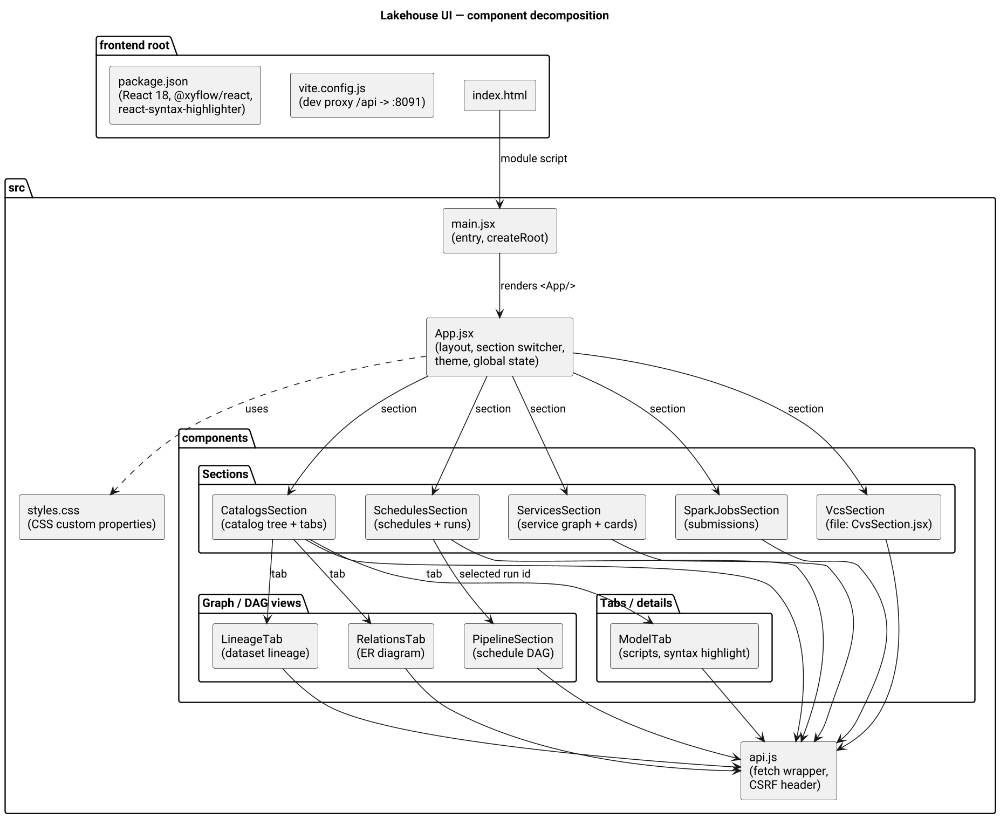
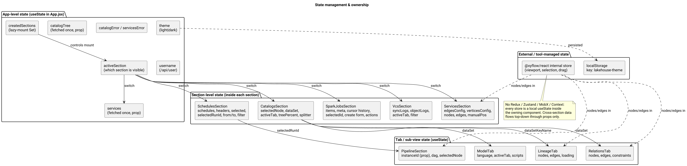
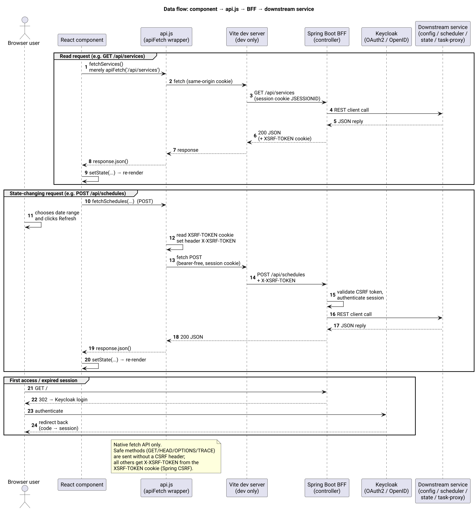
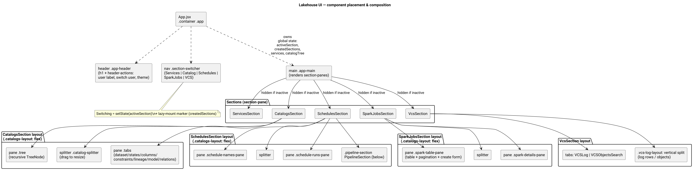
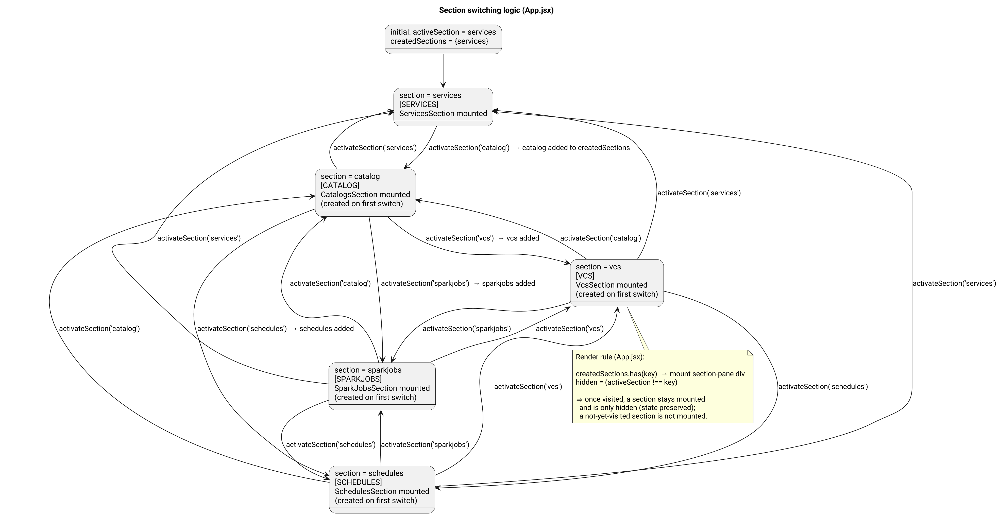

# Lakehouse UI — Frontend Architecture Review

> Commit-state audit of the React frontend located at
> `lakehouse-ui-svc/src/main/resources/frontend`.
>
> Scope: `index.html`, `vite.config.js`, `package.json`, `src/` (JSX source,
> styles, API client). Purpose: high-level understanding for the system
> architect and formulation of isolated feature tasks.
>
> Diagrams (PlantUML sources in `diagrams/`):

| Diagram | File |
|---|---|
| Component decomposition | `diagrams/overview.png` |
| Component placement & composition | `diagrams/placement.png` |
| Section switching logic | `diagrams/section-switching.png` |
| Data flow / API integration | `diagrams/data-flow.png` |
| State ownership | `diagrams/state-management.png` |

---

## 1. Architectural Approach & Patterns

The frontend is a **single-page application (SPA)** built with **React 18**,
bundled by **Vite**. The decomposition model is a **flat, component-based,
feature-oriented structure** — close in spirit to a lightweight Feature-Sliced
/ Layered pattern without formal enforcement:

- **Root / app layer** — `main.jsx` (entry, `createRoot`) and `App.jsx`
  (shell: header, section switcher, theme, shared state).
- **Feature sections** — one top-level component per UI domain
  (`ServicesSection`, `CatalogsSection`, `SchedulesSection`,
  `SparkJobsSection`, `VcsSection`). Each section is self-contained: it owns
  its data fetching, its sub-views and its local state.
- **Shared infrastructure** — `api.js` (single network-access point) and
  `styles.css` (global styles + design tokens).
- **Tab / sub-view components** — smaller components inside a feature section
  (`LineageTab`, `RelationsTab`, `ModelTab`, `PipelineSection`, recursive
  `TreeNode`, table-building helpers).

Key code-organization rules that guided the implementation:

1. **One component = one file** in `src/components/`, named after the UI
   concept; tab/sub-view components live next to the section that owns them.
2. **Single source of truth for I/O** — all HTTP access goes through
   `api.js`; components never call `fetch` directly.
3. **Separation of concerns** — `api.js` (transport/auth/CSRF), components
   (render + interaction state), `styles.css` (presentation), `App.jsx`
   (composition + cross-section coordination). Business logic is deliberately
   *not* extracted into hooks/services/utils — it stays inside sections.
4. **Lazy-mount, keep-alive sections** — sections are mounted on first use and
   kept alive afterwards (see §6): switching preserves per-section state.
5. **Props-down, state-up** — cross-section data flows top-down as props;
   there is no global store.

---


---

## 2. Project & Repository Structure

```
src/main/resources/frontend
├── index.html              # HTML shell, <div id="root">, loads /src/main.jsx
├── package.json            # deps: react, react-dom, @xyflow/react,
│                           #       react-syntax-highlighter; dev: vite
├── package-lock.json
├── vite.config.js          # dev server :5173, /api proxy -> :8091,
│                           # build outDir -> ../static (served by Spring Boot)
└── src
    ├── main.jsx            # entry: createRoot(...).render(<App/>)
    ├── App.jsx             # shell: header, section switcher (nav), main
    │                       #       area; global state (active/created sections,
    │                       #       theme, services, catalog, username, errors)
    ├── api.js              # fetch wrapper (CSRF) + all REST calls
    ├── styles.css          # global CSS: tokens (CSS custom properties),
    │                       #       all component styles
    └── components
        ├── ServicesSection.jsx    # service graph (React Flow) + status cards
        ├── CatalogsSection.jsx    # catalog tree (recursive TreeNode) + tabs
        │                          #   pane (dataset / states / columns /
        │                          #   constraints / lineage / model / relations)
        ├── SchedulesSection.jsx   # schedule names + runs + PipelineSection
        ├── SparkJobsSection.jsx   # Spark submissions list + details + actions
        ├── VcsSection.jsx         # VCS sync log + object log (file CvsSection.jsx)
        ├── PipelineSection.jsx    # schedule-instance DAG (acts + nested tasks)
        ├── LineageTab.jsx         # dataset lineage graph (React Flow)
        ├── ModelTab.jsx           # model scripts w/ syntax highlighting
        └── RelationsTab.jsx       # ER-diagram view (React Flow)
```

Purpose of each folder/file:

- **`components/`** — feature sections and their sub-views; the only directory
  for UI components. No `hooks/`, `context/`, `services/`, `utils/`,
  `types/` folders exist; equivalent logic lives inline in the components.
- **`api.js`** — the backend integration layer (see §4).
- **`styles.css`** — a single global stylesheet; theming via CSS custom
  properties switched with the `data-theme` attribute (`light`/`dark`).
- **`App.jsx`** — orchestrator: tells the browser *which component is
  rendered where* (see §6).

---

## 3. State Management

**Technologies: native `useState` only.** There is **no** Redux Toolkit,
Zustand, MobX or React Context anywhere in the codebase. All state is local,
owned by the component that uses it.

Scopes and responsibilities:

- **App-level** (`App.jsx`, `useState`) — everything shared across sections:
  - `services`, `catalogTree`, `username` — data loaded once at startup and
    passed down as props;
  - `catalogError`, `servicesError` — derived fetch failures;
  - `theme` — `light`/`dark`, read from `localStorage` key `lakehouse-theme`
    and written back on every change (a `useEffect` also sets
    `document.documentElement.dataset.theme`);
  - `activeSection`, `createdSections` — the placement/switching driver (see
    §6): which section is visible and which sections have been mounted.
- **Section-level** — each `*Section` holds its own data, filters and UI
  flags (`selectedNode`, `dataSet`, `activeTab`, `from/to` dates, pagination
  cursor, forms, etc.).
- **Sub-view / tab-level** — `LineageTab`, `RelationsTab`, `ModelTab`,
  `PipelineSection` hold transient view state (loaded graphs, language
  choice, selected DAG node).
- **Tool-managed** — `@xyflow/react` (React Flow) keeps its own internal
  store (viewport, node selection, drag state); nodes/edges themselves are
  owned by the section and synced into the flow via props.

Cross-section communication happens exclusively **top-down through props**
and **bottom-up through the single shared shell** (`App.jsx`). Example:
`SchedulesSection` owns `selectedRunId` and passes it as `instanceId` to
`PipelineSection`; `CatalogsSection` passes `dataSet`/`dataSetKeyName` to its
tabs.



---

## 4. Data Flow & API Integration

**Network library: native Fetch API** (no Axios, no RTK Query, no React
Query). All calls are centralized in `src/api.js`.

**Authentication / token handling.** The UI does not deal with JWT tokens
directly. Authentication is handled server-side by the Spring Boot **BFF**
(`lakehouse-ui-svc`):

- The browser authenticates against **Keycloak** via the OAuth2
  authorization-code flow; on success Spring Security issues a `JSESSIONID`
  session cookie (`HttpOnly`).
- The app runs under the same origin as the BFF, so requests are
  same-origin with credentials sent implicitly.
- **CSRF**: Spring exposes the token in the `XSRF-TOKEN` cookie. The
  `apiFetch` wrapper reads it and, for any non-safe method
  (`POST/PUT/PATCH/DELETE`), adds the `X-XSRF-TOKEN` header. Safe methods
  (`GET/HEAD/OPTIONS/TRACE`) are sent without it.

**Integration layer.** `api.js` exports one `apiFetch(url, options)` wrapper
plus typed convenience functions, one per endpoint — e.g. `fetchCatalogTree`,
`fetchDataSet`, `fetchLineage`, `fetchSchedules`, `fetchScheduleInstanceDAG`,
`fetchSparkSubmissions`, `fetchVcsSyncLogs`, ... Each function performs the
request against the BFF, checks `response.ok`, and returns parsed JSON/text
or throws an `Error` that sections render in `.error-box` blocks.

**How components fetch data.** Sections call the API functions inside
`useEffect`/event handlers and store results with `useState`:
- **Mount-time fetch** — `App.jsx` loads catalog/services/user; section
  components load their own headers/vertices/edges when mounted.
- **User-triggered fetch** — stateless *load* functions bound to buttons
  (dates, filters), e.g. states, schedules, submissions, VCS logs.
- **Drill-down fetch** — selecting a tree node or table row triggers a fetch
  for the detail payload (`fetchDataSet`, `fetchSparkProperties`,
  `fetchScheduleInstanceDAG`).

**Dev-mode proxying.** `vite.config.js` proxies `/api` → `http://localhost:8091`
so the dev server talks to the BFF exactly like production.



Backend endpoints consumed (all relative, proxied by the BFF):

| Area | api.js function | Endpoint |
|---|---|---|
| Catalog | `fetchCatalogTree` | `GET /api/catalog/tree` |
| Catalog | `fetchDataSet` / `fetchDataSource` | `GET /api/catalog/dataset/{key}` / `.../datasource/{key}` |
| Catalog | `fetchLineage`, `fetchConstraints`, `fetchScript`, `fetchDataSetModelScript` | `GET /api/catalog/...` |
| Catalog | `fetchStates` | `POST /api/states` |
| Schedules | `fetchSchedules`, `fetchScheduleHeaders`, `fetchScheduleInstanceDAG` | `/api/schedules*` |
| Services | `fetchServices`, `fetchServiceEdges`, `fetchServiceVertices` | `/api/services*` |
| Spark | `fetchSparkSubmissions`, `createSparkSubmission`, `fetchSparkStatus`, `killSparkSubmission`, `killAllSparkSubmissions`, `clearSparkCompleted`, `fetchSparkProperties` | `/api/spark-proxy/*` |
| VCS | `fetchVcsSyncLogs`, `fetchVcsObjectLogs` | `/api/vcs/logs`, `/api/vcs/objects` |
| User | `fetchCurrentUser`, `logout` | `GET /api/user`, `POST /logout` |

---

## 5. Component Layer & Styling

**Component library / design system: none. Custom components + plain CSS.**
There is no Ant Design / Material UI / Tailwind / styled-components / CSS
Modules. Reusability is a simple **component decomposition**:

- **Feature sections** (`*Section`) — each is a self-contained page-level
  unit rendered inside the shell's `main` area.
- **Tab components** (`.tabs` / `.tab-list` / `.tab` / `.tab-content`) — the
  shared in-page navigation pattern (used in Catalog, Model, VCS).
- **Generic presentational helpers** defined in-module and reused locally:
  `Field`, `ServicePropertiesTable`, `DescriptionList`, `StatesTab`,
  `ColumnsTab`, `ConstraintsTab`, `TreeNode` (recursive tree rendering).
- **Graph/diagram views** — use **React Flow (`@xyflow/react` v12)** with
  custom node types:
  - `ServiceNode` (ServicesSection) — status-colored `UP`/`DOWN` node;
  - `PipelineActNode` / `PipelineTaskNode` (PipelineSection) — activity
    containers with nested task tiles (`parentId` + `extent: 'parent'`);
  - `LineageNode` (LineageTab) — colored center node vs. side nodes;
  - `EntityNode` (RelationsTab) — ER entity card with columns and handles on
    all four sides.

**Styling approach: global `styles.css`.** Layout is driven by CSS flex/grid
utility classes and a consistent set of component classes. Theming is done
exclusively through **CSS custom properties** (tokens): `--bg`, `--panel`,
`--border`, `--text`, `--muted`, `--accent`, `--up`, `--down`, ... Two
palettes are declared under `:root[data-theme='light']` and
`:root[data-theme='dark']`; the `data-theme` attribute is toggled by
`App.jsx`.

---

## 6. Routing & Navigation

### 6.1 Overview

**There is no URL-based router (no React Router).** Navigation is pure
component state. The app is a single page with one interactive feature
visible at a time, switched by a top navigation bar. Two complementary
mechanisms implement navigation:

1. **Section switcher** — the navigation bar in `App.jsx` decides *which
   feature section is placed in the main area* (component placement).
2. **In-section tab state** — `activeTab` in each section decides *which
   sub-view* (tab) is placed inside the section body.

### 6.2 Component placement logic

The shell (`App.jsx`) defines a fixed vertical composition:

```
<div class="app">
  <header class="app-header">
    <h1>Lakehouse</h1>
    <div class="header-actions">   user label · Switch user · theme toggle
  <nav class="section-switcher">   Services | Catalog | Schedules | SparkJobs | VCS
  <main class="app-main">          one section-pane per feature (see below)
```

Inside `main`, the placed sections are:

| Placement key | Button | Rendered component |
|---|---|---|
| `services` | Services | `ServicesSection` (graph + status cards) |
| `catalog` | Catalog | `CatalogsSection` (tree + tabs pane) |
| `schedules` | Schedules | `SchedulesSection` (names + runs + `PipelineSection`) |
| `sparkjobs` | SparkJobs | `SparkJobsSection` (table + details pane) |
| `vcs` | VCS | `VcsSection` (log / objects tabs) |

Each placement key renders as:

```jsx
{createdSections.has(key) && (
  <div className="section-pane" hidden={activeSection !== key}>
    <Section .../>
  </div>
)}
```

Composition rules:

- **Lazy mount**: a section is mounted only after its navigation button has
  been clicked at least once (`createdSections` guards the render).
  `services` is pre-mounted because it is the initial section.
- **Keep-alive**: a mounted section is *never unmounted*. Switching hides it
  with the HTML `hidden` attribute. Per-section `useState` data (filters,
  selection, loaded tables) therefore survives navigation.
- **Nested placement**: inside sections the same two-column + splitter
  pattern (`catalogs-layout`, `catalog-pane`, `catalog-splitter`) is reused
  to place two panels side-by-side (tree ↔ tabs, names ↔ runs, table ↔
  details, graph ↔ details, log ↔ objects). Splitters are draggable and
  resize panels via the `%` width/height; the `PipelineSection` in
  Schedules is rendered *below* the layout, not in a tab.



### 6.3 Switching between sections

State kept in `App.jsx`:

- `activeSection` — the placement key of the visible section
  (initial value `'services'`);
- `createdSections` — `Set` of placement keys that have been mounted
  (initial `new Set(['services'])`).

The single transition function is `activateSection(section)`:

```js
const activateSection = (section) => {
  setActiveSection(section);
  setCreatedSections((current) =>
    current.has(section) ? current : new Set([...current, section])
  );
};
```

Behaviour:

1. Clicking a nav button calls `activateSection(key)`.
2. `activeSection` is set → all `section-pane` divs recompute their `hidden`
   attribute; only the pane matching the key becomes visible.
3. The key is added to `createdSections` if absent → the pane (and its
   component) receives its first mount, preserving the lazy-mount invariant.
4. Any previously mounted pane stays mounted but hidden → its interactive
   state is retained when switching back.



### 6.4 In-section tab switching

Inside sections, `activeTab` (`useState`) drives the same reveal/hide pattern
with `props`/state instead of `hidden`:

- **CatalogsSection** — `TableTabs` switches among Dataset / States / Columns
  / Constraints / Lineage / Model / Relations; the tree selection resets
  `activeTab` to `'dataset'`.
- **ModelTab** — vertical tab rail toggles Scripts / Complete.
- **VcsSection** — VCSLog / VCSObjectsSearch tabs.
- **DataSourcePanel** — DataSource / Service tabs.

### 6.5 "Protected routes"

There are no client-side guards. Access protection is entirely **server-side
in the BFF** (Spring Security): unauthenticated requests are redirected to
the Keycloak login and the session cookie gates every `/api` call. The
frontend just renders the auth state it sees (username label, `logout` →
`POST /logout` + reload).

---

## 7. Build & Configuration Tools

| Concern | Tool / config |
|---|---|
| Bundler / dev server | **Vite 6** (`vite.config.js`) |
| React plugin | **@vitejs/plugin-react** |
| Build output | `build.outDir = '../static'`, `emptyOutDir: true` → produced static bundle is served by Spring Boot from classpath `static/` |
| Dev proxy | `/api` → `http://localhost:8091` (`server.proxy`) |
| Module format / target | ESM (`"type": "module"`), Vite default targets |
| Language | **JavaScript (JSX)** — no TypeScript |
| Linting / formatting | **None configured** (no ESLint, no Prettier, no `lint` script) |
| Tests | **None** (no test framework, no test script) |
| Package manager | npm (`package.json` + `package-lock.json`) |

Scripts: `dev` (`vite`), `build` (`vite build`), `preview` (`vite preview`).

Notable runtime dependencies:

- `react` / `react-dom` `^18.3.1`;
- `@xyflow/react` `^12.11.2` — React Flow: flow graphs in Services (graph),
  Schedules (pipeline DAG), Catalog (lineage, relations);
- `react-syntax-highlighter` `^16.1.1` — PrismLight syntax highlighting for
  SQL / Scala / Python / R / Go / Java model scripts.

---

## 8. Architectural Recommendations (Technical Debt)

Priorities for refactoring before the application scales:

1. **Broken import (build blocker).** `App.jsx` imports
   `./components/VcsSection.jsx`, but the file on disk is `CvsSection.jsx`.
   `vite build` currently fails at bundling. Rename the file to
   `VcsSection.jsx` (or fix the import) and make the build green.
2. **No automated verification.** There is no lint, no type check, no unit
   or e2e test — the only regression net is a manual browser session. Minimum
   viable step: add ESLint + a React Testing Library smoke test; later a
   Playwright suite for the section switcher (this is where most future bugs
   will hide).
3. **No TypeScript.** All state flows through dynamic JS objects and props;
   the API DTO shapes are duplicated by hand in every section. Typing
   `api.js` responses and section props would prevent a whole class of
   "undefined is not a function" regressions.
4. **Single monolithic `styles.css` (1248 lines).** Global className
   coupling makes isolated feature work risky: shared tokens are good, but
   section styles should be co-located (CSS Modules or scoped files) so a
   change in one feature cannot silently break another.
5. **No formal state, routing or data-fetching layer.** The keep-alive +
   `hidden` switcher is simple today, but as sections grow: (a) introduce
   `@tanstack/react-query` (or similar) to dedupe/centralize the ~15 manual
   `fetch`-then-`setState` flows and loading/error handling; (b) consider
   React Router with URL-driven tabs for deep-linking and browser
   back/forward; (c) extract cross-section state (currently props through
   `App`) into a context/selector store only when the coupling becomes
   bidirectional and reusable beyond `App`.
6. **Layout & layout-engine logic is duplicated.** The draggable-splitter
   pattern (mousemove/mouseup window listeners) is re-implemented in
   `CatalogsSection`, `SchedulesSection`, `SparkJobsSection`, `VcsSection`,
   `PipelineSection`. Extract a shared `useResizableSplit` hook. Likewise the
   layered-graph layout algorithm exists in both `ServicesSection`
   (service-levels) and `PipelineSection` (`computeLayers`) — unify into a
   single graph-layout utility.
7. **Mixed imperatives inside components.** Sections mix data fetching,
   complex form handling (e.g. `SparkJobsSection` — 494 lines) and graph
   building in one file. Splitting each section into
   *container/hook + view + DAG-transform* modules would match the FSD/layer
   intent of §1 and make the files unit-testable.
8. **No caching of heavy catalog/graph data.** Every dataset selection
   re-fetches the dataset and (in `RelationsTab`) its neighbors;
   schedules/pipeline re-fetch per run selection. A small keyed cache in the
   API layer would cut repeated network chatter for the same key.
9. **Error handling is per-component and duplicated.** Every fetch repeats
   `response.ok` checks + `.error-box` rendering. Centralize error mapping
   (parse + normalize) in `api.js` and render via a small
   `FetchState`/error-boundary pattern.
10. **Accessibility gaps.** Icon-only tab buttons (Model), color-only status
    badges, and interactive rows rely mainly on color/outline; add
    `aria-*`/keyboard support, semantic `nav`/`tablist`, and focus management
    for the switcher.

---

### Appendix A — PlantUML sources

All diagrams are generated from PlantUML sources kept in
`doc/arch/diagrams/*.puml`:

```bash
java -Djava.awt.headless=true -jar plantuml.jar -tpng diagrams/*.puml
```